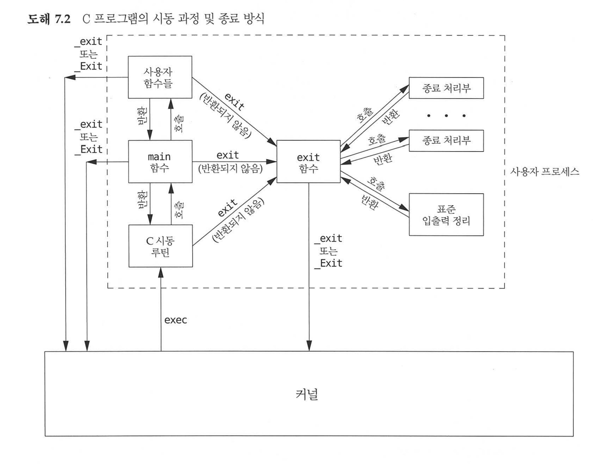

# Chapter7. 프로세스 환경

### 2. main 함수

```c
int main(int argc, char *argv[]);
```

- argc : 명렬줄 인수(command-line arguments)의 개수
- argv: 명렬줄 인수들을 가리키는 포인터들의 배열

시동루틴(start-up routine) 

- main 함수의 실행전에 필요한 사항을 준비한다. 
- C 컴파일러가 실행한 링커가 main 함수 호출 전에 먼저 호출되도록 설정되어있다 (프로그램의 시작주소)


### 3. 프로세스 종료

정상적인 종료

- main 함수 반환
- exit 호출
- _exit 또는 _Exit 호출
- 마지막 스레드를 시작한 루틴으로부터의 반환
- 마지막 스레드에서 pthread_exist 호출

비정상 종료

- abort 호출
- 종료 신호 수신
- 마지막 스레드가 취소 요청에 반응

시동루틴 : main 함수가 반환되었을 때 exit 함수를 호출하도록 작성되어있다.


#### 종료 함수들 

```c
#include <stdlib.h> // ISO C에 명시

void exit(int status);
void _Exit(int status);

#include <unistd.h>

void _exit(int status); // POSIX.1에 명시
```

exit : 표준 입출력 라이브러리를 마무리하는 작업

- 모든 열림 스트림에 대해 fclose 호출 > 모든 출력 자료가 방출(파일에 기록)

종료상태 (exit status) : 종료함수가 받는 정수 인수 - 프로세스의 종료 상태를 알 수 있다

종료상태가 정의되지 않는 경우

- 함수들중 하나가 종료 상태 없이 호출된 경우 : main 함수 반환 당시의 스택의 내용과 레지스터의 내용에 따라 다르다
- main 함수가 반환값이 없는 return 문을 통해 반환
- main 함수가 정수를 돌려주도록 선언되지 않은 경우 

main함수가 정수값을 돌려주는 것은 같은 정수값으로 exit를 호출하는 것과 동일하다 `exit(0);` = `return(0);`


#### atexit 함수

종료처리부 (exit handler) : exit 실행시 자동으로 호출될 함수

```c
#include <stdlib.h>

int atexit(void (*func)(void));
```

인자로 들어가는 다른 함수의 조건 : 어떤 인수도 받지 않으며, 아무런 값도 돌려주지 않는다 `void fun();`



- 프로그램을 실행하는 방법 : exec류 함수들 중 하나를 호출 하는 것
- 프로세스 자발적 종료 : _exit나 _Exit가 호출 되는 것
- 프로세스의 비자발적 종료 : 신호


### 4. 명령줄 인수

프로그램이 실행될 때 exec를 호출한 프로세스가 명렬줄 인수들을 프로그램에 넘겨줄 수 있다.  : `int main(int argc, char *argv[])`

`argv[argc]`가 널 포인터타입임을 ISO C, POSIX.1 에서 모두 보장해준다.

```c
for (i = 0; argv[i] != NULL; i++)
```


### 5. 환경 목록

각 프로그램에는 환경 목록 (environment list)이라는 것도 전달된다.

```C
extern char **environ;
```

extern : 다른 소스 파일의 전역변수, 함수를 사용함 (전역 변수가 외부에 있다는 것을 표시만 할 뿐 전역 변수를 선언하지 않는다)

- 환경 포인터 (environment pointer) : environ 변수
- 환경 문자열 (environment string) : 각 포인터가 가리키는 문자열. `이름=값` 과 같은 형태를 따르고있다.


특정 변수를 조회하거나, 설정할때는 getenv, putenv 사용해야한다.

환경 전체를 훑을때는 environ 포인터가 필요하긴 하다.

```c
extern char **environ;

int main()
{
    int i =0;
    while(environ[0] != NULL){
        printf("%s\n", environ[i++]);
    }
}
```


### 6. C프로그램의 메모리 배치


- 텍스트 구역(text segment) = 코드 구역 (code)

  - CPU가 실행하는 기계어 명령들로 이루어짐. 
  - 공유가 가능함 / 읽기전용
  - C컴파일러, 셸 등 자주 실행되는 프로그램에 대해 복사본 하나만 메모리에 유지한다.
- 초기화된 자료 구역 (initialized data segment)

  - `int maxCount = 99;`
- 초기화되지 않은 자료 구역 (uninitialized data segment) = bss 구역 (block started by symbol)

  - 프로그램 실행 전에 커널이 수치 0 또는 널포인터로 초기화
  - `long sum[1000];`
- 스택 (stack)

  - 함수가 호출될 때마다 호출관련 정보와 자동변수(automatic)들이 저장된다.
  - 함수의 반환 주소, 호출자의 환경에 대한 특정정보가 스택에 저장
  - 재귀 함수가 자신을 호출할 때마다 새로운 스택 프레임이 마련
- 힙 (heap) : 동적 메모리 할당이 주로 일어난다.


### 7. 공유 라이브러리

공유 라이브러리(shared libarary)  : 공통적인 라이브러리를 프로그램 실행 파일마다 담아 둘 필요없이, 라이브러리 루틴의 복사본 하나만 메모리에 담아두고 모든 프로세스가 참조하게 한다.

- 실행파일 크기 감소
- 실행시점에서 프로그램이 처음 실행될때 / 공유 라이브러리 함수가 처음 호출될 때 추가 부담이 생김


### 8. 메모리 할당

```c
#include <stdlib.h>

void *malloc(size_t size);
void *calloc(size_t nobj, size_t size);
void *realloc(void *ptr, size_t newsize);

void free(void *ptr);
```

- malloc : 메모리에서 지정된 바이트를 할당
- calloc : 지정된 개수의 바이트들을 할당하되 그 바이트들을 모두 0 바이트로 초기화
- realloc : 이미 할당된 영역의 크기를 늘리거나 줄인다.
- free : ptr가 가리키는 공간의 할당을 해제(deallocation)한다.

해제된 공간은 가용 메모리 풀(pool)로 반환. 이후 세 alloc 함수들 중 하나의 호출에서 다시 할당될 수 있다.

realloc 함수 : 이전에 할당한 영역의 크기를 바꿀 수 있음.

- (기존 영역의 끝을 넘어선 부분에) 담을 여유가 있으면? 
  realloc은 기존 영역의 끝에서 그만큼의 추가 영역을 할당한 후 자신이 받은 포인터를 그대로 돌려준다.
- 없으면? 
  원소 512개짜리 배열을 새로운 영역으로 옮기고, 기존 영역을 해제하고 새 영역을 가리키는 포인터를 돌려준다.

malloc과 free : 메모리 크기를 실제로 줄이는 것은 거의없다. > 이후 할당에 사용할 수 있는 상태가 되나, 일반적으로 해제된 공간이 커널로 반환되지 않는다. malloc 풀에 보존

메모리 누수(leakage) : 프로세스의 메모리 사용량이 계속 증가 (free가 없어서)
사용하지 않는 공간을 돌려주지 않으면, 남아있지 않는 상황에 도달함: 페이지 교체 부담이 과도하게 생겨서 성능이 떨어질 수 있다.

#### 대안적인 메모리 할당자들

- libmalloc
- vmalloc
- Quick-fit
- jemalloc
- TCMalloc
- alloca 함수


### 9. 환경변수

```c
#include <stdlib.h>

char *getenv(const char *name);

int putenv(char *str);

int setenv(const char *name, const char *value, int rewrite);
int unsetenv(const char *name);
```

- getenv : `name=value` 의 값을 가리키는 포인터를 돌려줌. environ에 직접 접근하지 말고
- putenv : name 인수에 해당하는 환경변수를 value로 설정한다.
  - rewrite 인수가 0이 아닌 값 : name의 기존 정의가 먼저 제거
  - rewirte 인수가 0 : name 기존 정의가 제거되지 않으며 name이 새 value로 설정되지 않는다.
- unsetenv : name에 해당하는 정의 제거

스택에 할당한 문자열을 putenv에 넘겨주면 오류가 발생할 수 있다.


환경 목록 : 메모리 공간의 상단, 스택보다 위에 저장된다. (공간 위에를 더 확장할 수 없다.)

1. 기존이름을 사용하는 경우
   - 새 값의 크기 <= 기존 값의 크기 : 새문자열을 기존문자열에 복사
   - 새 값의 크기 > 기존 값의 크기 : malloc 이용해서 새 문자열을 담을 영역을 마련하고, 새 문자열을 영역에 복사하고 포인터로 대체
2. 새 이름을 추가
   - 처음 추가 : malloc 호출해서 새로운 포인터 담을 영역 할당함. > 포인터들의 목록이 힙 영역으로 이동. 그러나 목록의 대부분의 포인터는 여전히 스택 최상단 위쪽에 있다.
   - 처음이 아닐 때 : realloc을 호출해서 포인터를 하나 더 저장할 영역


### 10. setjmp 함수, longjmp 함수

C에서, goto를 이용해서 다른 함수 안에 있는 이름표로 건너뛰는건 안된다. setjmp, longjmp 함수를 사용해야함

```c
#include <setjmp.h>

int setjmp(jmp_buf env); // 다시 돌아가고자 하는 지점
void longjmp(jmp_buf env, int val); // 돌아가자 호출!
```

jmp_buf 자료형식 : longjmp가 호출되었을 때 스택의 상태를 복원하는 데 필요한 모든 정보를 담는 일종의 배열

longjmp의 val 인수 : 각 setjmp 마다 여러개의 longjmp를 사용하고자 할 때

longjmp 호출 : 스택이 풀리는(unwound) 결과가 된다. (스택 프레임이 사라진다.)


#### 자동 변수, 레지스터 변수, 휘발성 변수

longjmp 호출시 변수의 상태 : 구현에 따라 다를 수 있다.

- 대부분 : 자동 변수들과 레지스터 변수들을 원래 상태로 복원함.
- volatile : 복원되지 말아야할 자동 변수
- 전역변수, 정적 변수 : 영향을 받지 않는다.

최적화가 영향을 미치지 않는 경우 : 전역변수, 정적변수, 휘발성 변수

비국소 분기를 사용하는 코드를 이식성있게 작성하려면 volatile 키워드를 활용해야한다.


#### 자동 변수의 잠재적 문제점

자동 변수를 다룰때 : 자동변수를 선언한 함수가 반환된 후에도 그 변수를 참조하는 코드가 있어서는 안된다.


### 11. getrlimit 함수 setrlimit 함수

```c
#include <sys/resource.h>

int getrlimit(int resource, struct rlimit *rlptr);
int setrlimit(int resource, const struct rlimit *rlptr);
```

프로세스의 자원 한계를 위 함수를 이용해서 조회하거나 변경할 수 있다.

```c
struct rlimit {
    rlim_t rlim_cur; /* soft limit: current limit */
    rlim_t rlim_max; /* hard limit: maximum value for rlim_cur */
};
```

자원 한계(resource limit) 변경 규칙

- 프로세스는 자신의 약한 한계를 자신의 강한 한계보다 작거나 같은 값으로만 변경할 수 있다.
- 프로세스는 자신의 강한 한계를 자신의 약한 한계보다 크거나 같은 값으로 낮출 수 있다. 보통의 사용자는 일단 낮춘 강한 한계를 다시 높일 수 있다
- 강한 한계는 오직 슈퍼사용자 프로세스만 높일 수 있다


연습문제 솔루션 : https://github.com/adalton/apue3/tree/master/Chapter07

