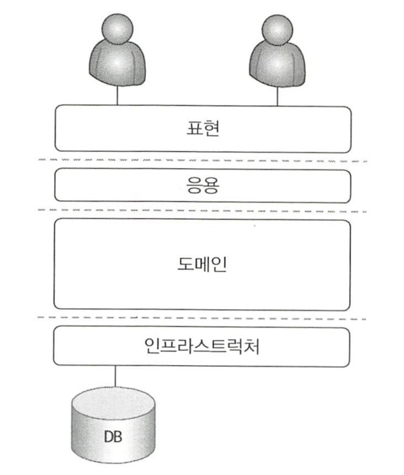

# 1. 도메인 모델 시작

### 도메인

도메인(domain) : 소프트웨어로 해결하고자 하는 문제 영역

도메인은 여러 하위 도메인으로 구성된다. (한개의 하위 도메인은 다른 하위 도메인과 연동하여 완전한 기능을 제공)

소프트웨어가 도메인의 모든 기능을 제공하지는 않는다.  (외부 업체 시스템 사용후 일부 연동)


### 도메인 모델

도메인 모델 : 특정 도메인을 개념적으로 표현 한 것 (우리의 비즈니스) 

- 도메인 모델을 사용하면 여러 관계자들이 동일한 모습으로 도메인을 이해하고 도메인 지식을 공유하는데 도움이 된다.
- 기능과 데이터를 함께 보여주는 객체 모델은 도메인을 모델링하기 적합하다
- 개념모델과 구현모델은 다르다.

도메인 모델 모델링 방법 : 객체 기반, 상태 다이어그램, 그래프, 수학공식 등.. (도메인 이해에 도움만 되면 뭐든 사용)

도메인은 다수의 하위 도메인으로 구성된다. 각 하위 도메인이 다루는 영역은 서로 달라 같은 용어여도 하위 도메인마다 의미가 달라질 수 있다.

모델의 각 구성요소는 특정 도메인을 한정할 때 비로소 의미가 완전해진다.


### 도메인 모델 패턴

도메인 모델 : 아키텍처상의 도메인 계층을 객체 지향 기법으로 구현하는 패턴

도메인 모델 패턴 : 도메인 규칙을 객체 지향 기법으로 구현하는 패턴

핵심 규칙을 구현한 코드는 도메인 모델에만 위치하기 때문에 규칙이 바뀌거나 규칙을 확장해야 할 때 다른 코드에 영향을 덜 주고 변경 내역을 모델에 반영할 수 있게 된다.



- 사용자 인터페이스(UI) or 표현(Presentation) : 사용자의 요청을 처리하고 사용자에게 정보를 보여준다. 사용자는 소프트웨어를 사용하는 사람뿐만 아니라 외부 시스템도 사용자가 될 수 있다.
- 응용(Application) : 사용자가 요청한 기능을 실행한다. 업무 로직을 직접 구현하지 않으며 도메인 계층을 조합해서 기능을 실행한다
- 도메인 : 시스템이 제공할 도메인의 규칙을 구현한다.
- 인프라스트럭처(Infrastrucuture) : 데이터베이스나 메시징 시스템과 같은 외부 시스템과의 연동을 처리한다.


### 도메인 모델 도출

모델링때 기본이 되는 작업은 모델을 구성하는 핵심 구성요소, 규칙, 기능을 찾는 것 : 요구사항

문서화: 문서화의 이유는 지식을 공유하기 위함, 코드를 보면서 도메인을 깊게 이해하게 되므로 코드 자체도 문서화의 대상이 된다.


### 엔티티와 밸류

엔티티와 밸류의 가장 큰 차이는 생명주기를 갖고있느냐. 

- 엔티티(Entity) : 식별자를 갖는다. 엔티티를 생성하고 엔티티의 속성을 바꾸고 엔티티를 삭제할 때 까지는 식별자를 유지된다.
- 밸류(Value)


### 엔티티 식별자 생성

- 특정 규칙에 따라 생성
- UUID 사용
- 값을 직접 입력

- 일련번호 사용(시퀀스나 DB의 자동 증가 칼럼 사용)


### 밸류 타입

한개의 개념을 표현하고 있다.

개념적으로 완전한 하나를 표현할 때 사용한다.

```java
int price > Money price
```

밸류객체의 데이터를 변경할 때는 기존 데이터를 변경하기 보다는 변경한 데이터를 갖는 새로운 밸류 객체를 생성하는 방식을 선호한다.

불변(immutable)타입을 사용해 안전한 코드를 작성할 수 있게한다.

참조 투명성: 함수 외부의 영향을 받지 않는 것


### 엔티티 식별자와 밸류 타입

변수명으로 이야기 하는게 아닌 타입으로 이야기를 하자.

```java
private orderNo id;
```


### 도메인 모델에 set 메서드 넣지 않기

set 메서드는 도메인의 핵심 개념이나 의도를 코드에서 사라지게 한다.

```java
public class Order{
  private ShippingAddress address;
  
  public void changeShippingAddress(ShippingAddress address){
    this.address = address; // 비즈니스적 개념을 표현한다
  }
  
  public void setShippingAddress(ShippingAddress address){
    this.address = address;	// 비즈니스적 개념을 표현하지 않는다
  }
}
```

set 메서드가 나온 이유 : 캡슐화의 부산물. 캡슐화는 비즈니스적 개념을 내포하지 않는다. 


### 도메인용어

코드를 도메인 용어로 해석하거나 도메인 용어를 코드로 해석하는 과정이 줄어든다.