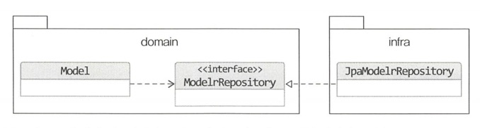

# 4. 리포지터리와 모델구현(JPA 중심)


모듈위치

리포지터리 인터페이스는 애그리거트와 같은 도메인 영역에 속하고, 리포지터리를 구현한 클래스는 인프라스트럭처 영역에 속한다.



삭제기능

삭제 요구사항이 있어도 실제 삭제는 거의 없다. 데이터 원복을 위해 일정기간 동안 보관해야할때도 있기 때문이다. 따라서 주로 삭제 플래그를 이용해 결정하는 방식이다.


### 매핑 구현

애그리거트와 JPA 매핑을 위한 기본 규칙

- 애그리거트 루트는 엔티티이므로 @Entity로 매핑 설정
- 한 테이블에 엔티티와 밸류 데이터가 같이 있으면
  - 밸류는 @Embeddable로 매핑설정
  - 밸류 타입 프로퍼티는 @Embedded로 매핑 설정

@AttributeOverrides 애노테이션을 사용해서 매핑 설정과 다른 칼럼 이름을 사용하게 할 수 있다.

```java
@Embeddable
public class ShippingInfo{
  @Embedded
  @AttributeOverrides({
    @AttributeOverrid(name="zipCode" column = @Column(name = "shipping_zipcocde")),
    @AttributeOverrid(name="address1" column = @Column(name = "shipping_address1")),
    @AttributeOverrid(name="address2" column = @Column(name = "shipping_address2")),
  })
  private Address address;
}
```


### 기본 생성자

하이버네이트는 클래스를 상속한 프록시 객체를 이용해서 지연 로딩을 구현한다. 프록시 클래스에서 상위 클래스의 기본 생성자를 호출 할 수 있어야함. 따라서 지연 로딩 대상이 되는 @Entity, @Embeddable의 기본 생성자는 private이 아닌 proteced로 지정해야한다.

kotlin은 기본이 final이기 때문에, 프록시 객체 생성문제로 인해 에러가 막 뜰 수 있다. 따라서, 코틀린에서 JPA를 사용하기 위해서는 open 키워드로 상속을 허용해야한다.


### 필드 접근 방식 사용

```
@Access(AccessType.FIELD)
```

JPA가 엔티티 데이터에 접근하는 방식을 지정함. 필드에 직접 접근(private이어도 ) > getter를 사용해 접근하는 방식도 있음.


### AttributeConverter를 이용한 밸류 매피 처리

두개 프로퍼티를 한개 컬럼에 배핑해야할 때 사용한다. 

AttributeConverter를 구현해서 사용하자.

```java
public interface AttributeConverter<ValueType, DBType>{
  public DBType convertToDatabaseColumn(ValueType attribute);
  public ValueType convertToEntityAttribute(DBType dbData);
}
```

위 Converter interface를 구현한 클래스를 만들고 그 클래스를 @Converter 애노테이션에 value로 넣어 사용한다.

```java
@Column(name ="totla_amounts")
@Convert(converter = MoneyConverter.class)
private Money totalAmounts
```


### 밸류 컬렉션 : 별도 테이블 매핑

별도 테이블로 매핑할때는 @ElementCollection과 @CollectionTable을 함께 사용함

```java
public class Order{
	@ElementCollection
  @CollectionTable(name="order_line", joinColumns = @JoinColumn(name = "order_number"))
  private List<OrderLine> orderLines;
}
```

- @CollectionTable : 밸류를 저장할 테이블을 지정할 때 사용


### 밸류 컬렉션: 한개 칼럼 매핑

주소목록을 한개 칼럼에 콤마로 구분해서 지정하고 싶을 때 : AttributeConverter

```java
@Column(name="emails")
@Convert(converter = EmailSetConverter.class)
private EmailSet emailSet;
```


### 밸류를 이용한 아이디 매핑

식별자라는 의미를 부각시키기위해 식별자 자체를 별도 밸류 타입으로 만들 수도 있다.

```java
@Entity
public class Order{
  @EmbeddedId
  private OrderNo number;
}

@Embeddable
public class OrderNo implements Serializable{
  @Column(nmae="order_number")
  private String number;
}
```


### 별도 테이블에 저장하는 밸류 매핑

애그리거트에서 루트 엔티티를 뺀 나머지 구성요소는 대부분 밸류이다.
만약 다른 엔티티가 있으면 진짜 엔티티인지 의심해봐야한다.

게시글 데이터 ARTICLE 테이블, ARTICLE_CONTENT 로 나눠서 저장

- ArticleContent는 Article의 내용을 담고있는 밸류로 생각하는 것이 맞다.

밸류를 매핑할 테이블을 지정하기위해서는 ``@SecondaryTable`` , `@AttributeOverride` 를 사용한다.

이를 사용하면 find를 실행할 때 두 테이블을 조인해서 데이터를 조회한다.


### 밸류 컬렉션을 @Entity로 매핑하기

계층 구조를 갖는 밸류 타입

상속구조를 갖는 밸류타입 사용시 @Entity를 이용한 상속 매핑으로 처리해야한다 (@Embeddable로 처리가 불가능하다.)

```java
@Entity
@Inheritance(strategy = InheritanceType.SINGLE_TABLE)
@DiscriminatorColumn(name = "image_type")
public abstract class Image
```


### ID 참조와 조인 테이블을 이용한 단방향 M:N 매핑

애그리거트간 집합연관은 성능상의 이유로 피해야한다고 했음. 그럼에도 요구사항 구현에 집합 연관을 사용하는게 유리하면 결정 가능

```java
@Elementcollection
@CollectionTable(name="product_category", joinColumns =@JoinColumn(name= "product_id"))
private Set<CategoryId> categoryIds;
```


### 애그리거트 로딩 전략

애그리거트는 개념적으로 하나이기 때문에 루트 엔티티를 로딩하는 시점에 모두 로딩해야한다고(eager) 생각 할 수 있는데, **아니다. (lazy)**

- 상태를 변경하는 기능을 실행 할 때 애그리거트 상태가 완전해야하고
- 표현 영역에서 애그리거트의 상태 정보를 보여줄 때 필요하기 때문 > 지연로딩을 사용하자 : 필요한 것들만 보여줘도 괜찮다

### 

### 애그리거트 영속성 전파

애그리거트가 완전한 상태이다 : 애그리거트 루트가 조회뿐 아니라 저장 삭제에도 하나로 처리해야한다.

- 저장 메서드 : 애그리거트 루트+ 애그리거트에 속한 모든 객체 저장
- 삭제 메서드 : 애그리거트 루트+ 애그리거트에 속한 모든 객체 삭제

함께 사용하도록. CascadeType.PERSIST, CascadeType.REMOVE 설정


### 식별자 생성 기능

- 사용자가 직접 생성
- 도메인 로직으로 생성
- DB를 이용한 일련번호 사용

자동 증가 컬럼은 DB insert 쿼리를 실행해야 식별자가 생성되므로, 도메인 객체를 리포지터리에 저장할 때 식별자가 생성된다 > 도메인 객체 생성시점에는 식별자를 알 수 없다.

### 


