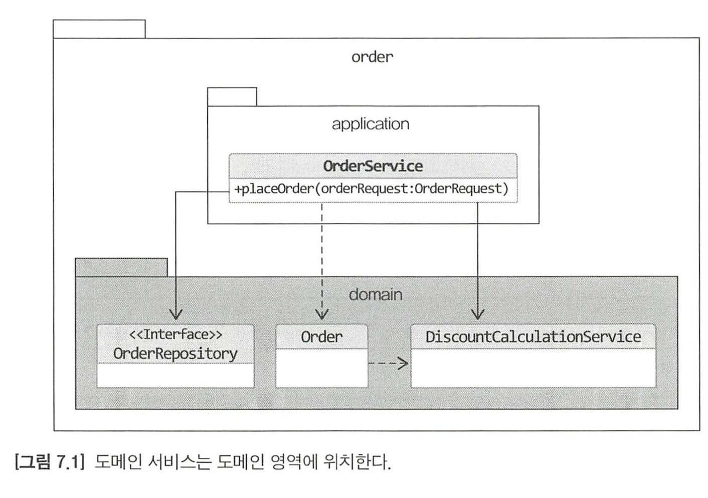

# Chapter7. 도메인 서비스

한 애그리거트로 기능을 구현할 수 없을 때 도메인 서비스가 필요하다.

한 애그리거트에 넣기에 애매한 도메인 기능을 특정 애그리거트에서 억지로 구현하면 안된다 > 의존이 높아진다.

### 도메인 서비스

- 상태 없이 로직만 구현한다.
- 필요한 상태는 애그리거트나 다른 방법으로 전달 받는다.

도메인 서비스 객체를 애그리거트에 주입하지 않기

- 애그리거트가 의존하는 도메인 서비스를 의존 주입으로 처리하고 싶어질 수 있음 > X 안된다

- 도메인 객체는 필드로 구성된 데이터와 메서드를 이용한 기능을 이용해서 개념적으로 하나인 모델을 표현함

  discountCalculationService 필드는 데이터 자체와는 관련이 없다

  Order 객체를 DB에 보관할 때 다른 필드와는 달리 저장 대상도 아니다.

  Order가 제공하는 모든 기능에서 discountCalculationService를 필요로 하는 것도 아니다.

특정 기능이 응용 서비스인지 도메인 서비스인지 감을 잡기 어려울 때 : 애그리거트의 상태를 변경하거나 애그리거트의 상태 값을 계산하는지 검사한다. (이럴 때 도메인 서비스다)

### 도메인 서비스의 패키지 위치

다른 도메인 구성요소와 동일한 패키지에 위치한다.

### 도메인 서비스의 인터페이스와 클래스

도메인 서비스의 로직이 고정되어 있지 않은 경우

도메인 서비스 자체를 인터페이스로 구현하고, 이를 구현한 클래스를 둘 수도 있다.

도메인 서비스의 구현이 특정 기술에 종속되면 인터페이스와 구현 클래스로 분리한다.