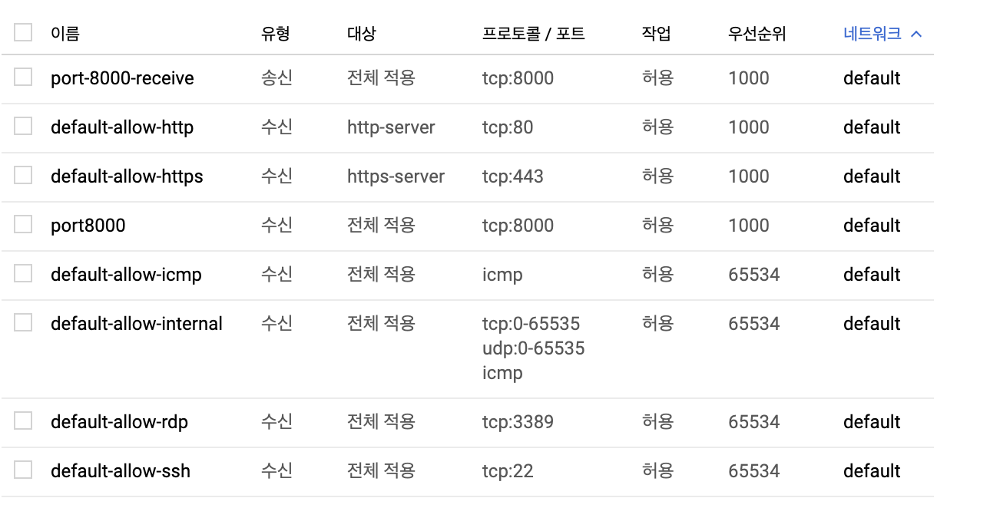

# Django Server GCE 로 실행하기

1. GCE를 만들고 방화벽 규칙을 설정해준다.

server port가 8000이니, 8000 포트의 송 수신을 열어주었다.



2. Config 폴더의 settings.py로 들어가서 ALLOWED_HOSTS에 GCE public ip 포트 주소를 열어준다.

```python
# settings.py

ALLOWED_HOSTS = [
    'localhost',
    '[public dns]',
]
```


3. local에서 django 프로젝트를 실행하듯이 실행해준다.

   ```shell
   # pip 설치
   sudo apt-get install python-pip

   # vritualenv 설치
   pip3 install virtualenv
   # virtualenv로 python3 세ㅣㅇ
   python3 -m virtualvenv venv
   source venv/bin/activate

   # 모듈 설치
   pip install -r requirements.txt
   # 포트번호 8000으로 public DNS 주소에 접속해서 runserver 실행
   ./manage.py runserver 0:8000
   ```

   > DB 설치 등의 과정은 앱 환경에 맞게 알아서.


참고 (scp 사용한 업로드)

<https://nachwon.github.io/django-deploy-1-aws/>

```shell
scp -i 키페어경로 -r 보낼폴더경로 유저명@퍼블릭DNS:받을폴더경로
```

```shell
scp -i ~/.ssh/EC2-Che1.pem -r EC2_Deploy_Project ubuntu@ec2-13-124-186-240.ap-northeast-2.compute.amazonaws.com:/srv/ 
```

