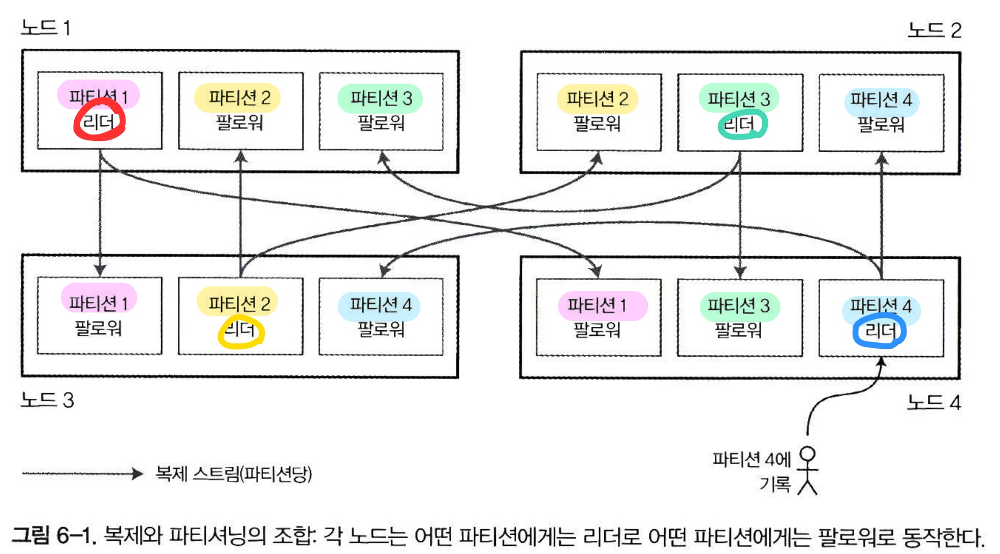

# 6. 파티셔닝

샤딩 : 데이터 셋이 매우 크거나 질의 처리량이 매우 높다면 복제만으로는 부족하고 데이터를 파티션으로 쪼갤 필요가 있다.

파티셔닝을 하는 이유 : **확장성** - 대용량 데이터셋이 여러 디스크에 분산될 수 있고 질의 부하는 여러 프로세서에 분산될 수 있다.

### 파티셔닝과 복제

master-slave 복제 / 파티셔닝 (한 노드에 여러 파티션 저장))

리더들은 모두 다른 노드에 분산되어있음

### 키-값 데이터 파티셔닝

쏠렸다(skewed) : 데이터가 많거나 질의를 많이 받는 파티션이 있다면

- 핫스팟 : 불균형하게 부하가 높은 파티션

### 키 범위 기준 파티셔닝

- 각 범위들 사이의 경계를 알면 : 어떤 키가 어느 파티션에 있는지 찾을 수 있다.
- 어떤 파티션이 어느 노드에 할당됐는지 알면 : 적절한 노드로 요청을 직접 보낼 수 있다.

키를 정렬된 순서로 저장한다 

장점

- 범위 스캔이 쉬워진다. 
- 키를 연속된 색인으로 간주하여 질의 하나로 관련 레코드 여러개 읽어올 수 있다.
- 범위스캔이 매우 유용하다

단점 

- 특정한 접근 패턴이 핫스팟을 유발하는 단점이 있다.
- 타임스탬프 (시간 범위)

#### 키의 해시값 기준 파티셔닝

키의 파티션을 정하는데 해시함수를 사용 : 쏠린 데이터를 입력으로 받아 균일하게 분산

**일관성 해싱 (consistent hashing)**

파티셔닝에 키의 해시값을 사용하여 파티셔닝하면 : 키 범위 파티셔닝의 좋은 속성을 잃어버린다 (범위 질의를 효율적으로 할 수 있는 것)

#### 쏠린 작업 부하와 핫스팟 완화

요청이 매우 쏠리는 키 : 각 키의 시작이나 끝에 임의의 숫자를 붙인다 (키들이 다른 파티션으로 분산)
이 기법은 요청이 몰리는 소수의 키에만 적용하는게 타당하다 (인플루언서 키)

### 파티셔닝과 보조색인

보조색인 : 레코드를 유일하게 식별하는 용도보다는 특정한 값이 발생한 항목을 검색하는 수단이다.

솔라나 엘라스틱 서치 같은 검색 서버에 매우 중요하다.

파티션에 깔끔하게 대응되지 않는 문제점이 있다 > 해결방법 2가지

#### 문서 기준 보조 색인 파티셔닝

**지역 색인 (local index)** : 각 파티션은 자신의 보조색인을 유지하며 그 파티션에 속하는 문서만 담당한다.

 모든 파티션으로 질의를 보내 얻은 결과를 병합해야한다. => **스캐터/개더(scatter/gather)**

> 특정 색상, 특정 제조사가 만든 자동차가 동일 파티션에 저장되리라는 보장이 없다

#### 용어 기준 보조 색인 파티셔닝

**전역색인 (global index)** : 모든 파티션의 데이터를 담당. 한 노드에만 색인 저장을 할 수는 없다 (병목)

찾고자하는 용어에 따라 색인의 파티션이 결정되어 용어기준으로 파티셔닝 되었다고 한다 (term-partitioned)

색인 파티셔닝시 용어 자체를 쓸 수도 있고, 용어의 해시값을 사용할 수도 있다.

- 전역색인 장점 / 지역색인 단점 : 읽기가 효율적이다. (모든 파티션에 스캐터,개더를 실행하지 않아도 되서)
- 전역색인 단점 / 지역색인 장점 : 쓰기가 느리고 복잡하다. (쓰기시 여러 파티션에 영향을 줄 수 있음)

전역 보조색인 - 비동기로 갱신된다.

### 파티션 재균형화

**재균형화(rebalancing)** : 클러스터에서 한 노드가 담당하던 부하를 다른 노드로 옮기는 과정

- 재균형화 후 노드가 균등 분배 해야한다
- 재균형화 도중에도 읽기, 쓰기 요청을 받아야함
- 디스크 I/O 부하를 최소화할 수 있도록 노드들 사이에 데이터가 필요 이상으로 옮겨져서는 안된다

#### 재균형화 전략

쓰면 안되는 방법 : 해시 값에 모드 N연산 실행 => 재균형화 비용이 지나치게 커진다

해결책 : 파티션을 노드 대수보다 많이 만들고, 각 노드에 여러 파티션 할당

- 파티션은 노드사이에 통째로 이동하기만 한다
- 파티션 개수 변하지 않음
- 파티션 할당 키 변하지 않음
- 노드에 어떤 파티션이 할당되는가만 변경된다

적당한 파티션의 개수 : 딱 적당하게

- 파티션이 너무 크면 : 재균형화 실행할 때, 노드 장애로부터 복구할 때 비용이 크다
- 파티션이 너무 작으면 : 오버헤드가 커진다

#### 동적 파티셔닝

파티션 경계를 수동으로 재설정하는 것은 매우 성가시다 - 파티션을 동적으로 만든다. (HBase)

> B트리의 최상위 레벨에서 실행되는 작업과 유사하다

파티션 개수가 전체 데이터 용량에 맞춰 조정된다는 이점이 있다.

#### 노드 비례 파티셔닝

파티션 개수가 노드 대수에 비례하게 한다. 

노드당 할당되는 파티션 **개수를 고정**한다 > 일반적으로 데이터 용량이 클수록 데이터를 저장할 노드도 많이 필요하다.

#### 운영: 자동 재균형화와 수동 재균형화

- 자동 재균형화 : 관리자의 개입이 전혀 없이 시스템이 자동으로 언제 파티션을 노드 사이에 이동할지 결정함
- 수동 재균형화 : 관리자가 명시적으로 파티션을 노드에 할당하도록 설정하고 관리자가 재설정할 때만 파티션 할당이 변경됨

자동화가 자동 장애 감지와 조합되면 위험해질 수도 있다. 재균형화 과정에 사람이 개입하는 게 좋을 수 있다.

### 요청 라우팅

**서비스찾기 (service discovery)**

- 클라이언트가 아무노드에나 접속 > 올바른 노드로 전달해서 응답을 받기.
- 클라이언트의 모든 요청을 라우팅 계층으로 먼저 보낸다 : 파티션 인지 로드 밸런서
- 클라이언트가 파티셔닝 방법과 파티션이 어느 노드에 할당됐는지 알고있게 한다.

주키퍼(ZooKeeper) : 코디네이션 서비스 - 파티션과 노드 사이 신뢰성 있는 할당 정보 관리.

Hbase, 솔라 클라우드, 카프카 : 파티션 할당 추적시 주키퍼를 사용한다.

### 병렬 질의 실행

대규묘 병렬 처리 (massively parallel processing, MPP) : 분석용으로 자주 사용. 더 복잡한 질의를 지원한다.

조인, 필터링, 그룹화, 집계 연산을 포함한다.