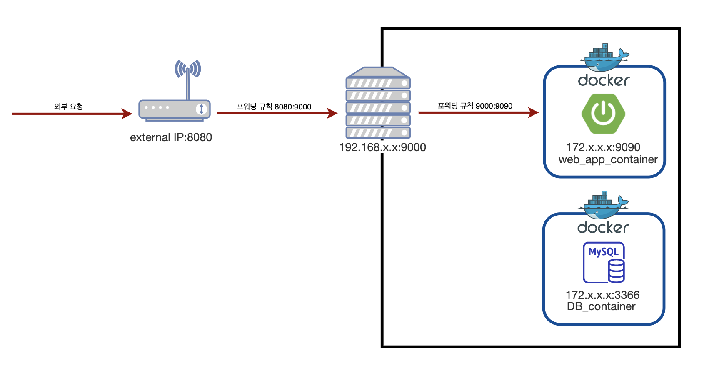
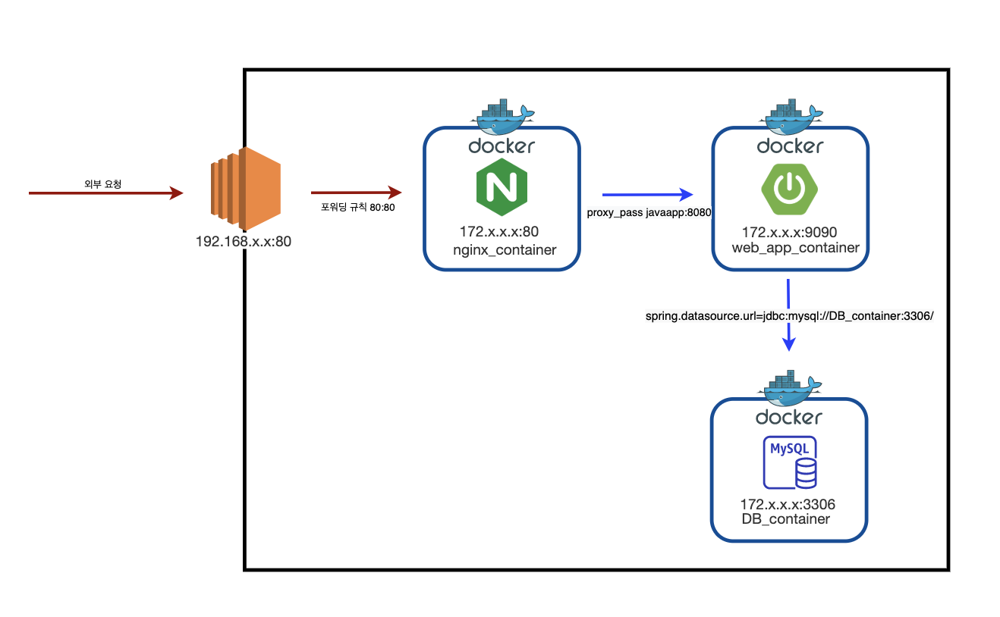

# 알아두면 언젠간 깨닫는 도커지식 2

### 가상 네트워크

아이피의 갯수는 제한적이다 우리가 사용하는 공유기는 주로 192.168.x.x 아이피 대역으로 아이피를 부여받는다. 그치만 이 아이피는 내 공유기 밖에서는 접근 할 수 없다.

그럼 이 때 외부에서 공유기 안의 특정 서버에 접근하기 위해서는 **포트 포워딩**을 사용한다. 포트포워딩이 필요한 이유는 공유기는 하나인데 비해(ip는 하나인데 비해) 내부 서버는 여러대일 수 있으니 어느 서버의 포트로 연결을 해주어야 하는지 몰라서 포트 포워딩을 사용하는 것이다. 
*외부에서 8080포트를 요청할 때 공유기 하위에 있는 서버들이 모두 8080을 쓰고 있을 때 어느 서버의 8080인지를 몰라서 서버를 지정하는게 목적이다. 추가로 서버를 지정하면서 포트도 바꿀수 있게 되었고!*

주로 사용하는 http와 tcp 요청은 ip와 포트로 타겟을 지정하는데, 외부에서 요청할 때

ip는 우리집 공유기가 가진 공인 아이피를 지정할 테고,
port는 공유기 아래 있는 여러대의 서버중에 어떤 곳에 이 요청을 전달해야 할 지 모르기 때문에 포트포워딩으로 미리 정해두고 전달하는 것이다.


### 도커의 포트포워딩

도커도 마찬가지로 -p 플래그를 사용해서 포트포워딩을 지정할 수 있다. 도커도 하나의 서버에 여러개의 컨테이너가 있어서, 서버의 포트에 컨테이너를 지정할지가 애매해서, 위에서 공유기에서 서버를 지정할 때 애매했던 것과 동일한 이유로 포트포워딩이 필요하다.

도커환경에서는 OS가 설치된 host machine이 공유기의 역할을 하고, 도커가 가상 망을 이루고 있는 것이다. 

ip는 도커가 설치된 머신을 의미하고
port는 도커 망안에서 어떤 컨테이너로 연결을 할지에 대한 의미로 생각하자 (-p)


도커 안에서는 모든 컨테이너가 전부 다른 서브넷을 가진다.

**도커 컨테이너 끼리는 통신을 하지 못한다** 
*-> 컨테이너끼리 연결해주는 작업이 도커 안에 네트워크를 다는 것*

사실 컨테이너 가상화가 각자 분리된 영역을 만들어 주기 위함이었으니 서로 통신도 분리를 해둔 것이라고 생각하면 편하다.(필요할 경우에 통신을 연결하면 되도록 만든 것)


### 도커 네트워크

하지만 컨테이너가 분리가 되어있다 하더라도 통신은 필요하다. 예를 들자면 내 springboot 서비스에 대한 컨테이너 A와 DB에 대한 컨테이너 B 둘사이에서 통신이 일어나는 경우를 생각할 수 있을 것이다.

따라서 컨테이너끼리 통신을 위해 도커 네트워크를 만들어서 여러개의 컨테이너를 하나의 가상의 망 아래에 묶을 수 있다.


이런식으로 네트워크를 만들고

```shell
docker network create test_network
```

만들어진 네트워크에 컨테이너를 등록하는 형태로 지정하면 컨테이너간 통신이 가능해진다.

```shell
docker network connect web_server_container
```


이때 문제는 컨테이너의 아이피가 랜덤으로 만들어진다는 점이다. (아이피가 컨테이너마다 부여된다) 컨테이너가 뜰 때마다 아이피가 랜덤이다.

아이피가 랜덤으로 부여되면, 아이피를 이용해서 통신을 할 수 없다. 따라서 통신을 하기위해서는 **컨테이너 네임**으로 지정하는 방식을 이용한다.

컨테이너 네임이 Container network interface(CNI)이라는 도커 내부의 가상망을 만들어주는 곳에 등록되어 있어 ip 대신 컨테이너 네임을 DNS 서버에 등록한다. 

도커 네트워크에 컨테이너가 등록될 때 컨테이너의 ip는 랜덤하게 부여되지만, CNI 덕분에 컨테이너 네임을 이용할 수 있다.

결국 도커에서 네트워크 통신을 할 때 DNS 검색 우선 순위에서 CNI가 1순위이기 때문에 컨테이너 이름으로 호출이 가능한 것이다.

컨테이너 이름을 아이피 대신 사용한다.


그래서 웹앱 컨테이너 하나랑 db 컨테이너하나 띄우고 두 컨테이너를 하나의 네트워크로 묶어서 앱에서 DB를 호출할 때.

|               | 네임스페이스      | 포트 |
| ------------- | ----------------- | ---- |
| 웹앱 컨테이너 | web_app_container | 9090 |
| DB 컨테이너   | DB_container      | 3000 |

다음과 같은 정보를 갖고있다면, 그저 springboot 에서 DB 컨테이너에 연결을 하고자 한다면 DB_container:3000 이런식으로 적어도 작동이 된다는 것이다.


### 이해를 위한 예제

Q. 집에 공유기가 있고, 그 안에 서버가 있고, 그안에 컨테이너 한경에서 9090 포트로 서비스하는앱이 있다. 이때 포트 포워딩은 몇 번 일어날까?

A. 2번일어난다 : 공유기에서 한번, 도커에서 한번 




Q. 클라우드 환경에서 nginx를 사용한 포트포워딩을 할 때, nginx는 springboot 로 연결 연결, springboot에서는 db로 연결할 때 도커 네트워크 통신은 몇번 일어날까?

A. 2번 일어난다 : nginx의 proxy_pass 1번, spring에서 mysql로의 1

container_name:portNumber 의 규칙을 사용하여 도커 네트워크 통신을 한다



