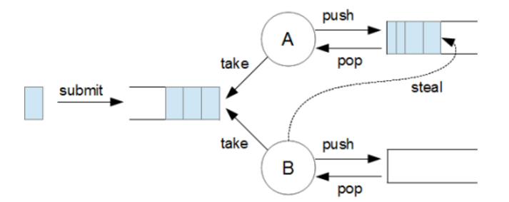
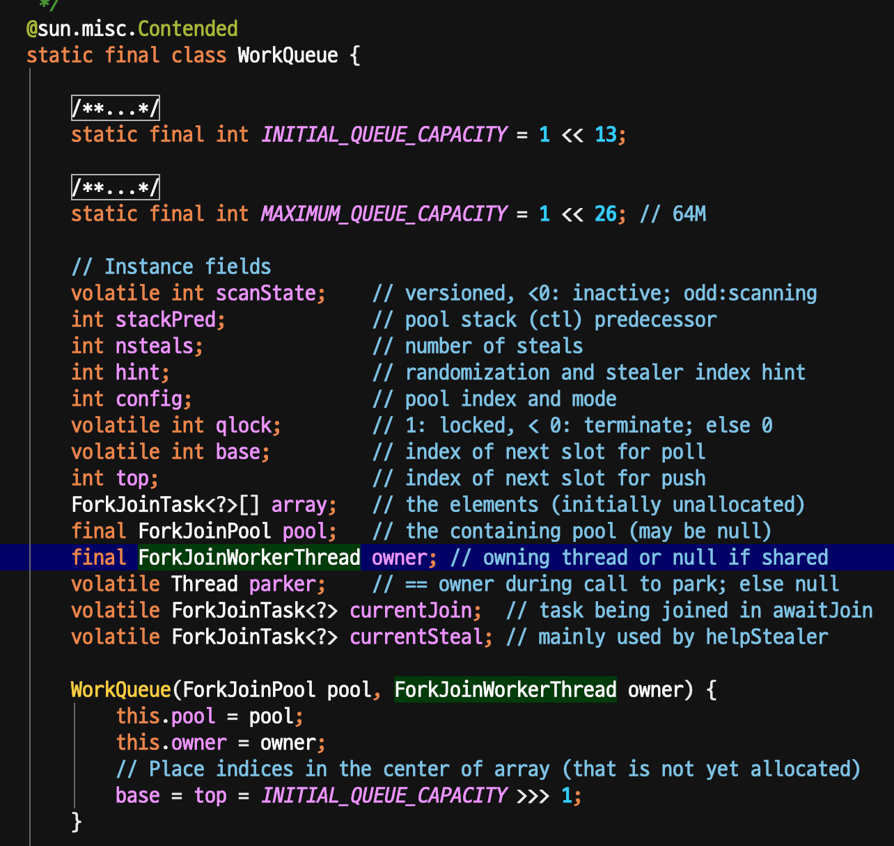
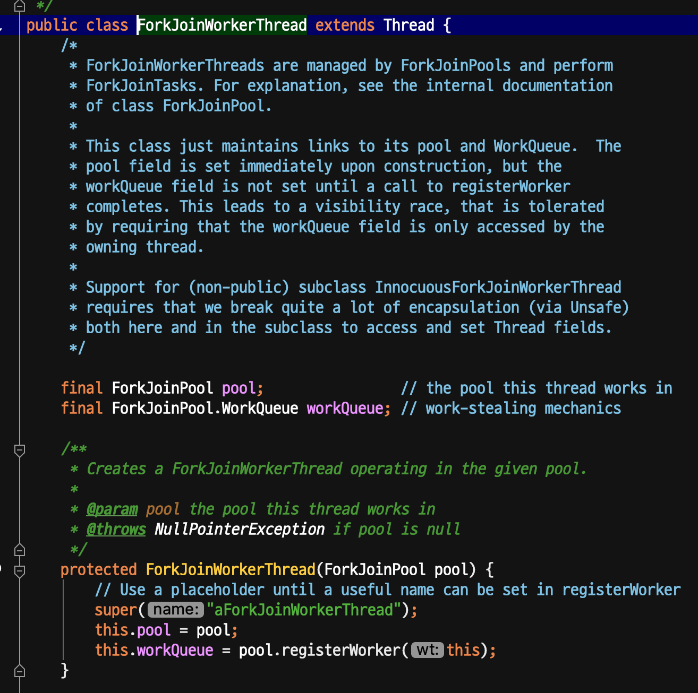
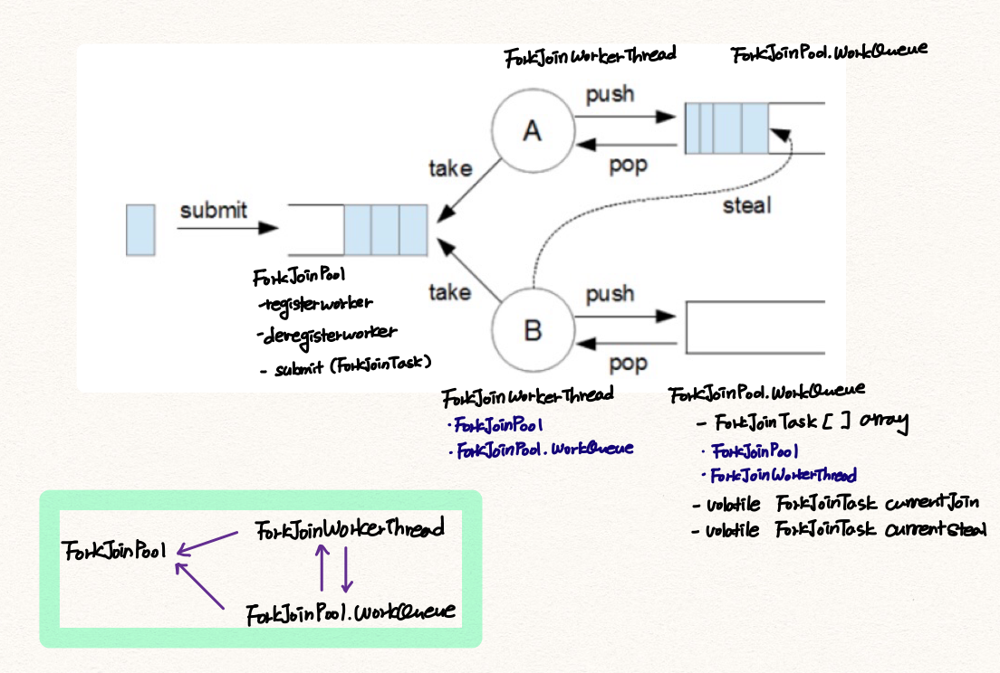

# ForkJoinPool의 이해

https://hamait.tistory.com/612

이 글을 읽고 깨달은 것을 정리한다. 읽게 된 계기는 effective-java 3/e의 concurrency 파트를 읽으면서 계속해서 찾아보다보니 흥미로워서 읽게 되었다.

### ThreadPool vs ForkJoinPool

- ThreadPool은 Thread의 생성 비용을 줄이기 위해, Thread를 갖고있는 역할을 한다.
- ForkJoinPool은 ThreadPool처럼 ForkJoinTask를 갖고있는 역할을 하면서도, 각 스레드에 분담한 업무(task)를 다른 스레드에 훔쳐가게 하기도 하는 역할을 한다 (놀고있는 쓰레드를 방지하기 위함)
- ThreadPool은 Runnable, Callable 객체를 갖지만, ForkJoinPool은 Runnable, Callable 객체를 한번 wrapping한 ForkJoinTask를 갖는다.

### ForkJoinPool

이 그림을 보면서 의문이었던 점이,
각 task를 Thread에 할당하는건 누가 하는걸까? 했는데 프로그래머가 직접 할당하는 것이었다!

이후에 steal이 일어나는 작업들은 forkjoinpool에서 알아서 해주는 것이었던 것.

이 그림을 보고 실제로 jdk를 살펴봤다.

ForkJoinPool안에 nested class로 workQueue가 존재했는데, 이안에 ForkJoinWorkerThread를 보면 대충 위 구조가 이해가 간다.

위 그림처럼 1개의 ForkJoinPool당 ForkJoinWorkerThread가 N개 생성되는데,

이 각각의 ForkJoinWorkerThread는 1개의 workQueue를 가진다.

이때 WorkQueue는 내부적으로 ``List<ForkJoinTask>`` 를 갖고있다. Thread 관계를 생각해서 ForkJoinPool 그림을 지칭하면 아래와 같다고 결론을 내렸다.

그리고 실제 코드를 보면 ForkJoinPool.WorkQueue와, ForJoinWorkerThread는 인스턴스 변수로 서로를 갖고있는데, 매우 **참조관계가 강하게** 엮여있다고 보면된다.

