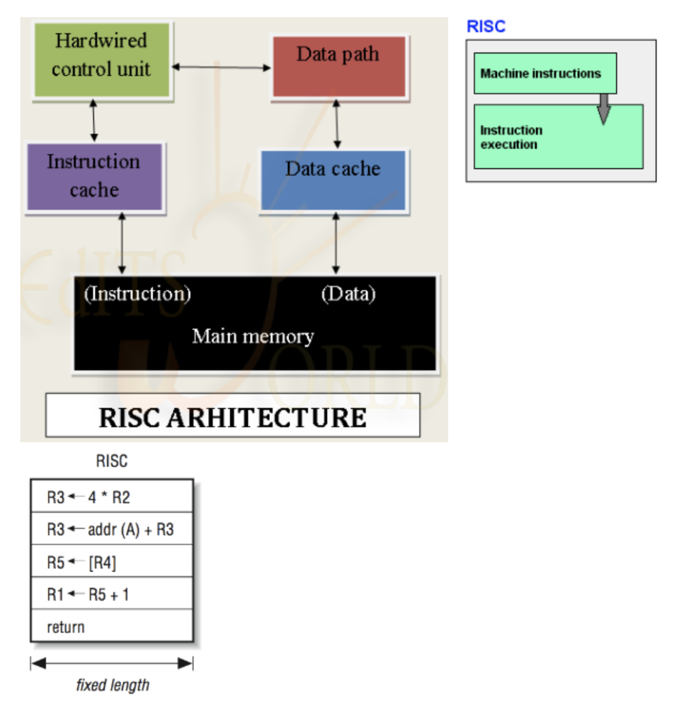
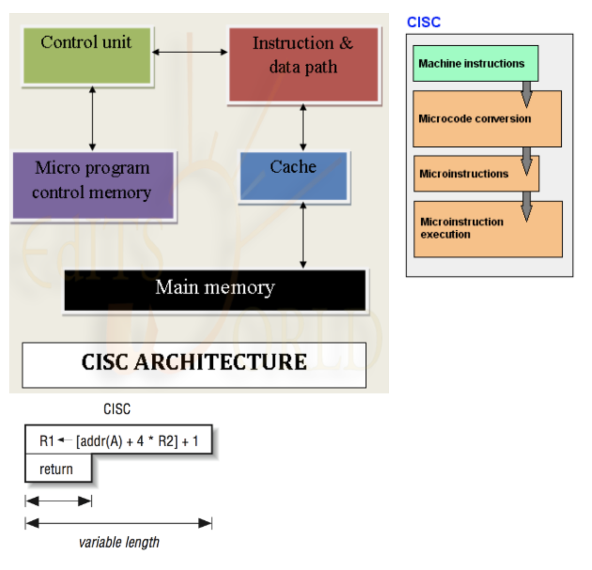

<https://aroundck.tistory.com/5569>

<https://m.blog.naver.com/PostView.nhn?blogId=scw0531&logNo=220601865340&proxyReferer=https:%2F%2Fwww.google.com%2F>

### 직교성

- 독립성(independence) 결합도 줄이기(decoupling) 
- 하나가 바뀌어도 나머지에 어떤 영향도 주지 않는다.
- 공통점이 없는 기능들이 잘 분리되어있다.
- 기능을 원자적으로 쪼개 제공한다.
- 관련 없는 것들 간에 서로 영향이 없도록한다.

#### CPU 명령어 설계 철학

##### RICS(Reduced Instruction Set Computer) : 직교성이 높다 == 직교성이 나쁘다

- CPU 명령어의 개수를 줄여 하드웨어 구조를 좀더 간단하게 만드는 방식
- 적은 수의 명령어만으로 명령어 집합을 구성한 것
- 복잡한 연산을 적은 수의 명령어들을 조합하는 방식으로 수행한다.
- 데이터의 길이가 고정적이다 (파이프라인 처리의 고속화)

##### CISC(Complex Instruction Set Computer) : 직교성이 낮다. == 직교성이 좋다.

- 복잡한 명령어 집합을 갖는 CPU 아키텍처
- 메모리 3 <= 메모리 1의 내용 * 메모리 2의 내용 (이렇게 할당하는 일을 하나의 명령어로 수행)
- 데이터의 길이가 가변적이다.
- 하나의 명령어를 수행하는 처리가 복잡하다.

#### 클래스, 패키지, 모듈 설계

##### 마이크로서비스 아키텍처 (microservice) : 직교성이 높다

- 기능별로 마이크로서비스를 개발한다.
- 해당 기능에 맞는 기술, 언어 등을 선택하여 사용이 가능하다.
- 새로 추가되거나 수정사항이 있는 마이크로서비스만 빠르게 빌드 배포가 가능하다.

##### 모놀리식 (monolithic) : 직교성이 낮다

- 많은 양의 코드가 몰려있다.
- 어떤 기능이든지 개발되어있는 환경이 같아서 복잡하지 않다.
- 한 프로젝트의 덩치가 너무 커져서 어플리케이션 빌드, 배포 시간도 길어진다 (조그마한 수정사항에도 다시 빌드 배포)

기능별로 분리했다는 점에서 대체적인 경향이 직교성에 빗대어서 이야기 한듯 하다.

