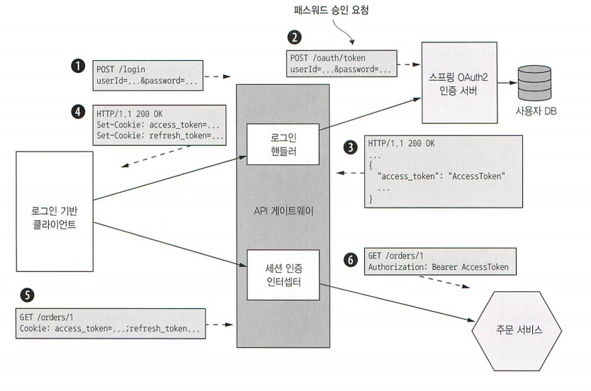

Chapter11. 프로덕션 레디 서비스 개발

### 11. 보안서비스 개발

고려할 보안 요소

- 인증
- 인가
- 감사
- 보안 IPC

#### 11.1.1. 기존 모놀리식 애플리케이션의 보안

세션과 쿠키를 사용한다.

로그인 요청 > 세션 생성, 저장 > 세션 토큰 반환 > 이후 작업 세션 토큰 넣어 보냄

#### 11.1.2. 마이크로서비스 아키텍처에서의 보안 구현

- 인메모리 보안 컨텍스트
- 중앙화 세션

##### API 게이트 웨이 인증처리

모든 개발자가 제대로 보안을 구현하기 어렵다 > API 게이트웨이에서 요청을 인증하는 것이 좋다

- API 게이트웨이에서 요청을 인증한다.
- 액세스토큰 : API 게이트웨이는 신원, 역할 등 사용자 정보가 담긴 토큰을 자신이 호출하는 서비스에 전달한다

##### 인가 처리

인가(authroization) : 해당 클라이언트가 요청한 작업을 할 수 있도록 허가되었는지 검사

인가로직은 서비스에 구현하는 것이 좋다. 

##### JWT로 사용자 신원 역할 전달

토큰 종류

- 난독화 토큰(opaque token) : UUID > 성능 가용성이 떨어지고 지연시간이 길다
- 투명토큰(transparent token) : JWT > 투명토큰의 표준 규약

##### OAuth 2.0 응용

OAuth 2.0 표준이 제대로 구현된 기성 서비스나 프레임워크를 쓰면 된다.

- 인증서버(Authorization Server)

- 액세스 토큰(Access Token)

- 리프레시 토큰(Refresh Token)

- 리소스 서버(Resource Server)

- 클라이언트

  

어떤 보안에 접근하든 아래 세가지 기본사상이 같다

- API 게이트웨이는 클라이언트 인증을 담당한다
- API 게이트웨이 및 서비스는 투명토큰을 이용해 주체 정보를 주고받는다.
- 서비스는 토큰을 이용하여 주체의 신원/역할 정보를 획득한다

### 2. 구성가능한 서비스 설계

- 푸시모델 (push model)
- 풀모델 (pull model)

#### 11.2.1. 푸시 기반의 외부화 구성

푸시 모델은 배포 환경과 서비스의 협동이 중요함. 배포 환경은 서비스 인스턴스가 생성될 때 프로퍼티 값을 제공함

스프링부트가 프로퍼티 값을 읽어올 수 있는 소스

- CLI 인수
- OS 환경변수 Ehsms JSON 포맷으로 기술된 JVM 시스템 프로퍼티
- JVM 시스템 프로퍼티
- 현재 디렉터리의 구성파일

널리 사용되지만, 이미 실행 중인 서비스를 재구성하기는 어렵다.

#### 11.2.2.풀 기반의 외부화 구성

서비스 인스턴스가 시동 시 자신이 필요한 값을 구성 전용 서버에 접속하여 읽는 방식

구성 서버 접속에 필요한 프로퍼티 값은 환경 변수 등의 푸시 구성 메커니즘을 통해 서비스 인스턴스에 제공

- 버전관리 시스템(ex. 깃, SVN)
- SQL/NoSQL DB
- 전용 구성 서버(ex. 스프링 클라우드 컨피그 서버), 자격증명 등 민감데이터를 보관하는 해시코프 볼트, AWS 파라미터 스토어

스프링 클라우드 컨피그(Spring Cloud Config) : 서버/클라이언트로 구성된, 유명한 구성 서버 기반 프레임워크 > 장점

- 중앙화 구성(centralized configuration)
- 민감한 데이터의 투명한 복호화(transparent decryption)
- 동적 재구성(dynamic reconfiguration)

### 3. 관측 가능한 서비스 설계

관측 가능한 서비스 설계 패턴

- 헬스체크(health check) API
- 로그 수집(log aggregation)
- 분산 추적(distributed tracing)
- 예외 추적(exception tracking)
- 애플리케이션 지표(application metrics)
- 감사 로깅(audit logging)

#### 11.3.1. 헬스 체크 API 패턴

서비스는 서비스 상태를 반환하는 GET /health 등의 헬스 체크 API 끝점을 표현한다

헬스 체크 요청 핸들러는 서비스 인스턴스 및 외부 서비스의 접속 상태를 테스트한다.

고려할 점

- 헬스 보고하는 끝점을 어떻게 구현할지
- 배포인프라는 이 끝점을 어떻게 호출할지 

##### 헬스 체크 끝점 구현

서비스 인스턴스의 상태를 어떻게든 판단해야한다.

##### 헬스 체크 끝점 호출

호출하는 코드가 없으면 헬스 체크 끝점은 쓸모가 없어서 서비스를 배포할 때 배포 인프라가 헬스 체크 끝점을 호출하도록 구성

#### 11.3.2. 로그 수집 패턴

전체 서비스 로그를 중앙 DB에 수집하여 검색/알림 기능을 제공한다.

모든 서비스 인스턴스가 남긴 로그를 로그 수집 파이프라인을 통해 중앙 로깅서버로 보낸다.

##### 서비스 로그 생성

적합한 로깅 라이브러리 선택, 이 항목을 어디에 출력할지 정해야한다.

로그를 남길 장소 : 로그파일, stdout

##### 로그 수집 인프라

ELK 스택(stak) : es, logstash, kibana

#### 11.3.3. 분산 추적 패턴

외부 요청마다 유일한 ID를 하나씩 부여해서 한 서비스에서 다음 서비스로 흘러가는 과정을 기록하고, 시각화/분석 기능을 제공하는 중앙화 서버에 자료를 남긴다.

모놀리식 애플리케이션의 성능 프로파일러와 비슷한 것으로, 요청을 처리할 때 마다 서비스 호출 트리정보(시작 시간, 종료 시간 등)로 기록한다.

- 인스트루멘테이션 라이브러리 : 스팬트리를 만들어 분산 추적서버로 보낸다 

  왠만하면 인스트루멘테이션 로직과 여타 비즈니스 로직이 서로 얽히므로 인터셉터나 AOP를 사용하는 것이 깔끔하다

- 분산 추적 서버 : 트레이스 저장하고 UI로 시각화해 표시하는 기능 제공

#### 11.3.4. 애플리케이션 지표 패턴

모니터링 시스템은 기술 스택의 모든 부분에서 지표를 수집하여 중요한 애플리케이션 헬스 정보를 제공한다

##### 서비스 수준의 지표 수집

지표 수집 기능 구현에 필요한 작업 공수는 프레임워크와 수집하려는 지표 종류마다 다르다

##### 지표 서비스에 지표 전달

푸시(push) 풀(pull) 방식으로 매트릭 서비스에 전달

- 푸시모델 : 서비스 인스턴스가 API를 호출하여 메트릭스 서비스에 지표를 밀어넣는 방법
- 풀모델 : 메트릭스 서비스가 서비스 API를 호출하여 서비스 인스턴스에서 지표를 당겨오는 방법

#### 11.3.5. 예외 추적 패턴

예외는 문제의 근본 원인을 식별하는 데 중요한 단서가 된다.

- 로그 파일은 대부분 한줄짜리지만 예외는 보통 여러줄
- 로그 파일에 잇는 예외의 해결과정을 추적할 메커니즘이 없다
- 중복된 예외를 자동으로 하나로 식별해 처리할 방법이 없다.

예외 추적 : 중복된 예외를 제거하고, 알림을 생성하고, 예외 해결 과정을 관리하는 중앙 서비스에 예외를 보고한다.

#### 11.3.6. 감사 로깅 패턴

감사 로깅(audit logging) : 사용자의 액션을 기록

서비스 비즈니스 로직 곳곳에 심둔다. 

- 감사 로깅 코드를 비즈니스 로직에 추가한다
- AOP를 활용한다
- 이벤트 소싱을 이용한다.

### 4. 서비스 개발 : 마이크로서비스 섀시 패턴

예외 추적, 로깅, 헬스 체크, 외부화 구성, 분산 추적 등의 횡단 관심사를 처리하는 프레임워크를 기반으로 서비스를 구축한다.

마이크로서비스 섀시(microservice chassis) : 횡단 관심사 처리에 특화된 프레임워크들

##### 서비스 메시

마이크로서비스 섀시 - 사용하는 프로그래밍 언어마다 하나씩 필요함

서비스 메시: 한 서비스와 다른 서비스, 그리고 외부 애플리케이션 간의 소통을 조정하는 인프라

- 이 경우 마이크로서비스 섀시: 외부화 구성, 헬스 체크와 같은 애플리케이션 코드와 단단히 결합된 관심사만 구현하면 되기 때문에 훨씬더 단순

##### 

