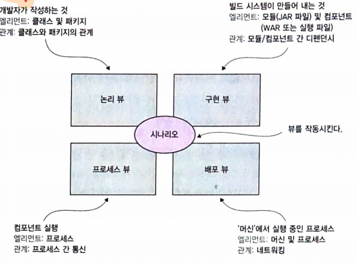

# Chapter 2. 분해전략

### 1) 마이크로 서비스 아키텍처란?

##### SW Archtecture

소프트웨어 아키텍처는 구성 요소 및 그들간의 디펜던시(dependency, 의존관계)로 엮인 고수준의 구조물
관리성, 테스트성, 배포성

#### 2.1.1 SW Archtecture 정의와 중요성

정의 : 여러 파트(엘리먼트)로의 분해와 이런 파트 간의 관계(연관성)

##### 4+1 뷰모델

4가지 뷰와 1가지 시나리오

- 논리뷰 (logical view)

- 구현뷰 (implementation view)

- 프로세스 뷰 (process view)

- 배포 뷰 (deployment view)

  

##### 아키텍처의 중요성

1) 애플리케이션이 해야 할 일을 정의한 기능 요건 : 기능요건은 아키텍처와 무관하다.

2) ~성으로 끝나는 서비스 품질요건 : 어떤 아키텍처로 품질을 강화할 것인가

#### 2.1.2. 아키텍처 스타일 개요

##### 계층형 아키텍처

- 표현(프레젠테이션) 계층 - presentation layer
- 비즈니스 로직 계층 - business logic layer
- 영속화(퍼시스턴스) 계층 - persistence layer

단점 

- 표현 계층이 하나 뿐이다
- 영속화 계층이 하나 뿐이다 : MySQL, AWS, PostSQL 등등 각각의 DB별로 인터페이스가 여러개, 도메인별로 인터페이스가 여러개 있던 중요하지 않음. (DB를 하나만 씀 대부분 (Oracle 하나만 들고있는 것)) 이때 주로 이 계층을 하나만 쓸 수 있다.
- 비즈니스 로직 계층을 영속화 계층에 의존하는 형태로 정의한다

##### 육각형 아키텍처

육각형 면 별로 나누어져있다. 

| 인바운드 어댑터                               | 아웃바운드 어댑터                        |
| --------------------------------------------- | ---------------------------------------- |
| 비즈니스 로직을 호출                          | 비즈니스 로직에서 호출                   |
| 외부 시스템의 요청을 처리한다 (인바운드 포트) | 외부 시스템을 호출한다 (아웃바운드 포트) |

인바운드 어댑터

- 비즈니스 로직을 호출
- 외부 시스템의 요청을 처리한다 (인바운드 포트)

아웃바운드 어댑터

- 비즈니스 로직에서 호출
- 외부시스템을 호출한다 (아웃바운드 포트)

육각형의 선을 보면 그 선이 레이어 이다.

- 어댑터와 통신하는 비즈니스 로직의 인터페이스
- 어댑터 레이어

이렇게 함으로써 영속화 계층을 바깥으로 밀어낼 수 있다 : 외부에 변경이 있을 때 비즈니스 로직의 변경을 최소화한다.
비즈니스 로직이 표현/데이터 접근 로직 어디에도 의존하지 않는다.

바깥에 있는건 안에있는걸 맘대로 알 수 있어서 

#### 2.1.3. 마이크로 서비스 아키텍처는 일종의 아키텍처 스타일이다.

##### 서비스란?

어떤 기능이 구현되어 단독 배포가 가능한 소프트웨어 컴포넌트 : 커맨드 + 쿼리

캡슐화 : 외부에 인터페이스를 제공하여 내부 구현을 숨겨서 애플리케이션 모듈성을 보장

- 작업 어댑터 : 비즈니스 로직을 호출
- 이벤트 어댑터 : 비즈니스로직이 내어준 이벤트 발행

##### 느슨한 결합이란?

클라이언트에 영향을 끼치지 않고 서비스 내부 구현 코드를 바꿀 수 있다.
유지보수성 높임 + 테스트성을 높임

##### 공유 라이브러리의 역할

바뀔일이 없는 기능을 하나의 라이브러리로 만들어서 중복코드를 제거한다.

의도치 않은 서비스간 결합도를 유발하지 않도록 조심해야 한다.

##### 서비스 규모는 별로 중요하지 않다

### 2) 마이크로 서비스 아키텍처 정의

##### 정의를 위한 3단계

- 1단계 : 시스템 작업 식별
- 2단계 : 서비스 식별
- 3단계 : 서비스 API 및 협동 정의

##### 분해 과정 장애물

- 네트워크 지연
- 동기통신으로인한 가용성
- 데이터 일관성
- 만능 클래스

#### 2.2.1. 시스템 작업 식별

##### 고수준 도메인 모델 생성 (1단계)

사용자 시나리오를 작성하고, 관련 도메인 클래스 아키텍처를 그림

##### 시스템 작업 정의 (2단계)

- 커맨드 : CUD - 다른 관계는 볼 필요 없다 + 최대한 간단하게 표현 
- 쿼리 : R - 다른 관계도 좀 더 봐야한다 + 복잡해질 수 밖에 없다

#### 2.2.2. 서비스 정의 : 비즈니스 능력 패턴별 분해

비즈니스 능력은 곧 조직이 하는 일이다

#### 2.2.3. 서비스 정의 : 하위 도메인 패턴별 분해

DDD는 도메인을 구성하는 각 하위 도메인 마다 도메인 모델을 따로 정의 / DDD와 마이크로서비스 아키텍처는 찰떡궁합이다

| MSA                | DDD                                   |
| ------------------ | ------------------------------------- |
| 서비스             | 하위도메인, 경계 컨텍스트             |
| 서비스 자율팀 개념 | 도메인 모델을 개별 팀이 소유/개발한다 |

#### 2.2.4. 분해지침

- 단일책임 원칙 (SRP)
- 공동 폐쇄 원칙 (CCP)

#### 2.2.5. 서비스 분해의 장애물

- 네트워크 지연
- 동기 통신으로 인한 가용성 : 비동기 메시징으로 강한 결합도 제거하고 가용성 높임
- 여러 서비스에 걸쳐 데이터 일관성 유지 : 사가라는 방식으로 트랜잭션 관리
- 데이터의 일관된 뷰 확보 
- 분해를 저해하는 만능 클래스

#### 2.2.6. 서비스 API 정의

- 시스템 작업을 서비스로 배정 : 어떤 작업이 제공하는 정보가 필요한 서비스에 그 작업을 배정하는 것이 더 합리적이다. 
- 서비스 간 협동 지원에 필요한 API 확정 : 후행 조건 충족을 위한 추가 Relay