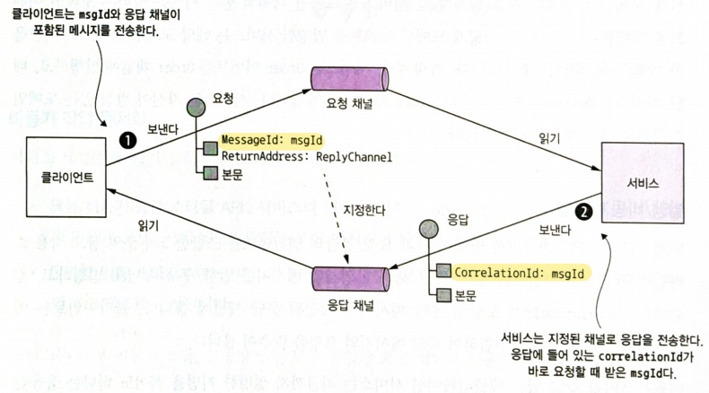
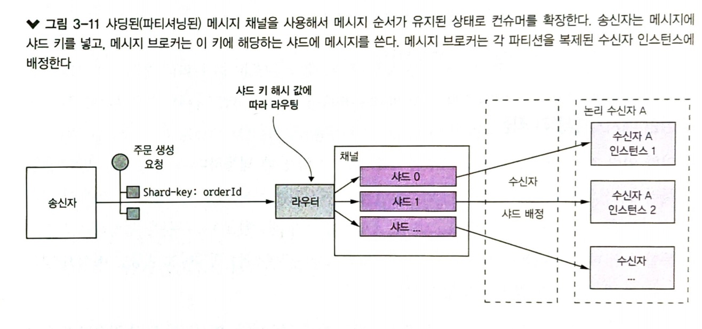
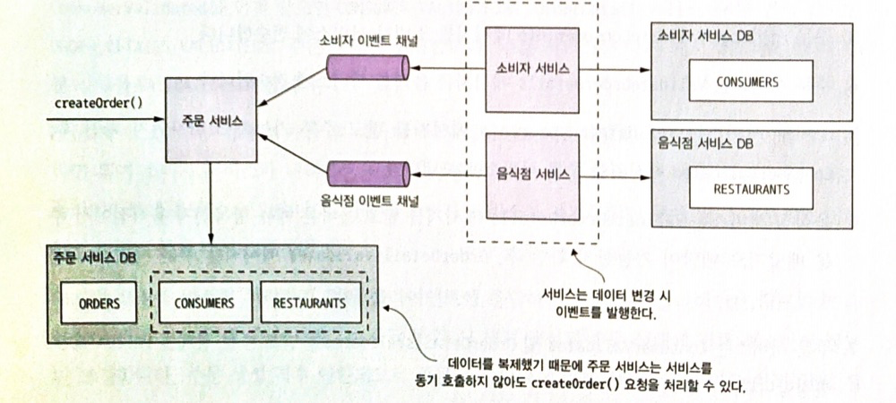

# Chapter 3. 프로세스 간 통신

### 1) 마이크로 서비스 아키텍처 IPC 개요

#### 3.1.1 상호 작용 스타일

##### 클라이언트/서비스 상호 작용 스타일의 기준 분류

- 일대일/일대다 여부
  - 일대일 상호작용의 종류
    - 요청/응답
    - 비동기 요청/응답
    - 단방향 알림
  - 일대다 상호작용의 종류
    - 발행/구독
    - 발행/비동기 응답
- 동기/비동기 여부

#### 3.1.2. 마이크로 서비스 API 정의

마이크로 서비스 아키텍처에서의 API = 인터페이스 (서비스와 클라이언트 간의 약속)
서비스 API를 IDL(Interface Definition Language)로 정확하게 정의해야함 : 선 설계 후 구현

메시징 통신 API의 정의 : 메시지 채널 + 메시지 타입 + 메시지 포맷

#### 3.1.3. API 발전시키기

API 변경시 문제 해결을 위한 전략을 잘 세워야한다

##### 시맨틱 버저닝

시맨틱 버저닝 명세(Semantic Versioning specification) : API 버저닝에 대한 유용한 지침서

버전 번호

- MAJOR : 하위 호환되지 않는 변경분 API 적용 시
- MINOR : 하위 호환되는 변경분을 API 적용 시
- PATCH : 하위 호환되는 오류 수정 시

##### 하위 호환되는 소규모 변경

하위 호환 가능 : 옵션 속성을 요청에 추가 / 속성을 응답에 추가 / 새 작업을 추가

견고성의 원칙 : 당신이 하는 일은 보수적으로, 다른 사람들이 하는 일은 관대하게 바라보라

##### 중대한 대규모 변경

기존 버전과 호환이 안되는 변경

여러 버전의 API 사용할 때 신구 버전을 올바르게 중계 > API 게이트웨이에서 버저닝된 API 사용

#### 3.1.4. 메시지 포맷

데이터 포맷은 범 언어적 메시지 포맷을 선택

##### 텍스트 메시지 포맷

JSON, XML : 자기 서술적 (self describing : 그 차제만으로도 의미가 분명한)
그러나 메시지가 다소 길다. 속성명이 추가되는 오버헤드가 있다

##### 이진 메시지 포맷

종류 : 프로토콜 버퍼, 아브로, 스리프트(Thrift)

### 2) 동기 RPI 패턴 응용 통신

RPI(Remote Procedure Invocation : 원격 프로시저 호출) 패턴
클라이언트가 서비스에 요청을 보내면 서비스가 처리 후 응답을 회신하는 IPC

프록시 인터페이스 : 하부(underlying) 통신 프로토콜을 캡슐화 / 서비스 인터페이스

#### 3.2.1. 동기 RPI 패턴 : REST

- 리소스 : 비즈니스 객체
- HTTP 동사(verb) : URL로 참조되는 리소스를 가공(조작) - GET, POST, PUT, DELETE ...

##### REST 성숙도 모델

|             | 레벨0 | 레벨1 | 레벨2 | 레벨3 |
| ----------- | ----- | ----- | ----- | ----- |
| 리소스 개념 | X     | O     | O     | O     |
| HTTP 동사   | X     | X     | O     | O     |
| HATEOAS     | X     | X     | X     | O     |

REST API의 IDL : 스웨거

요청 한번으로 연관된 객체를 모두 가져오고 싶다 > GraphQL, Netflix Falcor

##### HTTP 동사 멱등성

멱등성 ) 여러번 호출해도 요청의 결과는 같아야한다

- GET/ PUT/ DELETE : 멱등성 보장
- POST : 멱등성 보장 X

#### 3.2.2. 동기 RPI 패턴 : gRPC

gRPC : 다양한 언어로 클라이언트/서버를 작성할 수 있는 프레임워크

- 이진 메시지 기반의 프로토콜임. 
- 프로토콜 버퍼 기반의 IDL :  필드마다 번호가 매겨지고 타입 코드가 할당 됌
- 단순 요청/응답 RPC 지원 + 스트리밍 RPC 지원
- HTTP/2로 교환

#### 3.2.3. 부분 실패 처리 : 회로 차단기 패턴

호출시 부분 실패할 가능성

회로 차단기 패턴(circuit breaker) : 연속 실패 횟수가 주어진 임계치를 초과하면 일정 시간 동안 즉시 거부하는 RPI 프록시 (ex. Hystrix)

무한정 블로킹 : ConnectionPool이 확보가 안됌 > 스레드같은 주요 리소스가 고갈

##### 견고한 RPI 프록시 설계

- 네트워크 타임아웃
- 미처리 요청(outstanding request) 개수 제한
- 회로 차단기 패턴

##### 불능 서비스 복구

부분 실패 > 미리 정해진 기본값이나 캐시된 응답 등 대체 값을 반환하는 방법도 있음
서비스 불능이어도 캐시된 버전의 데이터 또는 에러를 반환

#### 3.2.4. 서비스 디스커버리

마이크로서비스 애플리케이션은 네트워크 위치가 훨씬 동적이다

서비스 레지스터리 (service registry) : 애플리케이션 서비스 인스턴스의 네트워크 위치를 DB화
여기서 가용 서비스 인스턴스 목록을 가져오고 그중 하나로 요청 라우팅

##### 애플리케이션 수준의 서비스 디스커버리 패턴 적용

아래 두가지 패턴을 접목함

- 자가등록(self registration) 패턴 : 서비스 인스턴스는 자신의 네트워크 위치를 서비스 레지스트리 등록 API를 호출해서 등록함

- 클라이언트 쪽 디스커버리 패턴 : 서비스를 호출 할 때 먼저 서비스 레지스트리에 서비스 인스턴스 목록을 요청해서 넘겨받음 (캐시하면 성능 업)

  > 죽으면 어떻게할까? health check 로직이 있지 않을까

유레카, 스프링 클라우드, 쿠버네티스 (쿠버네티스 내부에서만 동작함)

서비스 레지스트리를 직접 설정/관리하는 업무가 가중되는 부담

##### 플랫폼에 내장된 서비스 디스커버리 패턴 적용

도커, 쿠버네티스 

- 서비스 레지스트리 + 서비스 디스커버리 메커니즘 탑재
- DNS명 + 가상 IP 주소 + 서비스 DNS명(서비스 VIP로 해설)

아래 두가지 패턴을 접목함

- 서드파티 등록 패턴 : 서드파티가 서비스 인스턴스를 서비스 레지스트리에 자동 등록
- 서버 쪽 디스커버리 패턴 : 클라이언트가 서비스 디스커버리를 담당한 라우터에 요청

### 3) 비동기 메시징 패턴 응용 통신

메시징 : 클라이언트는 비동기 메시징을 통해 서비스를 호출한다.

#### 3.3.1. 메시징 개요

##### 메시지

메시지 = 헤더(header) + 본문(body)

- 헤더 = 메시지ID + 응답이 출력될 메시지 채널을 가리키는 반환주소(옵션)
- 본문 = 실제 송신할 텍스트 / 이진 포맷의 데이터

메시지 종류

- 문서(document) : 데이터만 포함된 제네릭한 메시지(커맨드에 대한 응답)
- 커맨드(command) : 호출할 작업과 전달할 매개변수가 지정
- 이벤트(event) : 도메인 객체의 상태 변화를 나타내는 도메인 이벤트

##### 메시지 채널

- 점대점 채널 : 채널을 읽는 컴슈머 중 딱 하나만 지정 (일대일 상호 작용 스타일의 서비스)
- 발행-구독 채널 : 같은 채널을 바라보는 모든 컨슈머에 메시지를 전달 (일대다 상호 작용 스타일)

#### 3.3.2. 메시징 상호 작용 스타일 구현

##### 요청/응답 및 비동기 요청/응답

메시징은 원래 성격 자체가 비동기적이라서 비동기 요청/응답만 제공하지만 응답을 수신할 때까지 클라이언트를 블로킹할 수도 있다

##### 단방향 알림

단방향이므로 서비스는 응답을 반환하지 않는다

##### 발행/구독

서비스는 도메인 객체의 변경 사실을 알리는 도메인 이벤트를 발행.
서비스는 자신이 관심 있는 도메인 객체의 이벤트 채널을 구독

##### 발행/비동기 응답

#### 3.3.3. 메시징 기반 서비스 API 명세 작성

비동기 API 명세 : 메시지 채널명 + 메시지 타입 + 메시지 포맷(JSON, XML, 프로토콜 버퍼 등)

##### 비동기 작업 문서화

- 요청 /비동기 응답 스타일 API : 메시지 채널 + 커맨드 메시지의 타입과 포맷 + 응답 메시지의 타입과 포맷
- 단방향 알림 스타일 API : 메시지 채널 + 커맨드 메시지의 타입과 포맷

##### 발행 이벤트 문서화

이벤트 채널 + 이벤트 메시지의 타입과 포맷

#### 3.3.4. 메시지 브로커

메시지 브로커 : 서비스가 서로 통신할 수 있게 해주는 인프라 서비스

##### 브로커리스 메시징

메시지를 서로 직접 교환
ZeroMQ : TCP, 유닉스형 도메인 소켓, 멀티 캐스트

- 장점 : 네트워크 트래픽 가벼움 / 성능 병목점이 될 일 없음
- 단점 : 서비스 디스커버리 메커니즘 중 하나 사용해야함 / 전달 보장 메커니즘 구현 어려움

##### 브로커 기반 메시징 개요

송신자가 송신자가 컨슈머의 네트워크 위치를 몰라도 된다

- ActiveMQ, RabbitMQ, Kafka

##### 브로커 기반 메시징의 장단점

장점 : 느슨한 결합 / 메시징 버퍼링 / 유연한 통신 / 명시적 IPC

단점 : 성능 병목 가능성 / 단일 장애점 가능성 / 운영 복잡도 부가

#### 3.3.5. 수신자 경합과 메시지 순서 유지

메시지 수신자 수평확장(scale-out) : 다수의 스레드와 서비스 인스턴스를 동원하여 애플리케이션 처리율 증가

- 메시지 헤더에 샤드키를 지정하고, 샤드 키별로 샤드/파티션에 배정
- 메시지 브로커는 각 샤드당 하나의 수신자에 배정함

#### 3.3.6. 중복 메시지 처리

##### 멱등한 메시지 핸들러 작성

멱등하다(idempotent) : 동일한 입력 값을 반복 호출해도 아무런 부수 효과가 없을 때
멱등하면 중복 메시지가 해롭지 않음

##### 메시지 추적과 중복 메시지 솎아 내기

멱등하지 않을 때는 중복 메시지는 솎아내야함.

컨슈머는 처리된 메시지 ID를 DB테이블에 기록해서 중복 메시지를 솎아냄 (중복이라면 INSERT 쿼리가 실패가 날 것)

#### 3.3.7. 트랜잭셔널 메시징

작업이 서비스에서 원자적으로 수행해야 함

##### DB 테이블을 메시지 큐로 활용

트랜잭셔널 아웃박스패턴 : 이벤트나 메시지를 DB에 있는 OUTBOX에 저장해서 DB 트랜잭션의 일부로 발행

##### 이벤트 발행: 폴링 발행기 패턴

DB에 있는 아웃박스를 폴링해서 메시지를 발행한다.
메시지 릴레이로 테이블을 폴링해서 미발행 메시지를 조회

조회 후 테이블에서 메시지를 삭제

##### 이벤트 발행 : 트랜잭션 로그 테일링 패턴

트랜잭션 로그를 테일링하여 DB에 반영된 변경분을 발행

- 트랜잭션 로그 : DB 트랜잭션 로그 항목(log entry)으로 남는 커밋들이다
- 트랜잭션 로그마이너(transaction log miner) :랜 잭션 로그를 읽어 메시지 브로커에 발행

> 디비지움 / 링크드인 데이터버스 / DynamoDB 스트림즈 / 이벤추에이트 트램

### 4) 비동기 메시징으로 가용성 개선

#### 3.4.1. 동기 통신으로 인한 가용성 저하

동기 프로토콜로 통신하면 애플리케이션 가용성은 저하될 수 밖에 없다

#### 3.4.2. 동기 상호 작용 제거

##### 데이터 복제

비동기 상호작용을 이용하면 더 빠르게 통신이 가능하다. 그러나 REST 같은 동기 프로토콜을 사용해서 요청 즉시 응답해야하는 외부 서비스도 있을 것

서비스 요청에 필요한 데이터의 레플리카를 유지 (레플리카를 가지면 상호작용 필요가 없음.)

