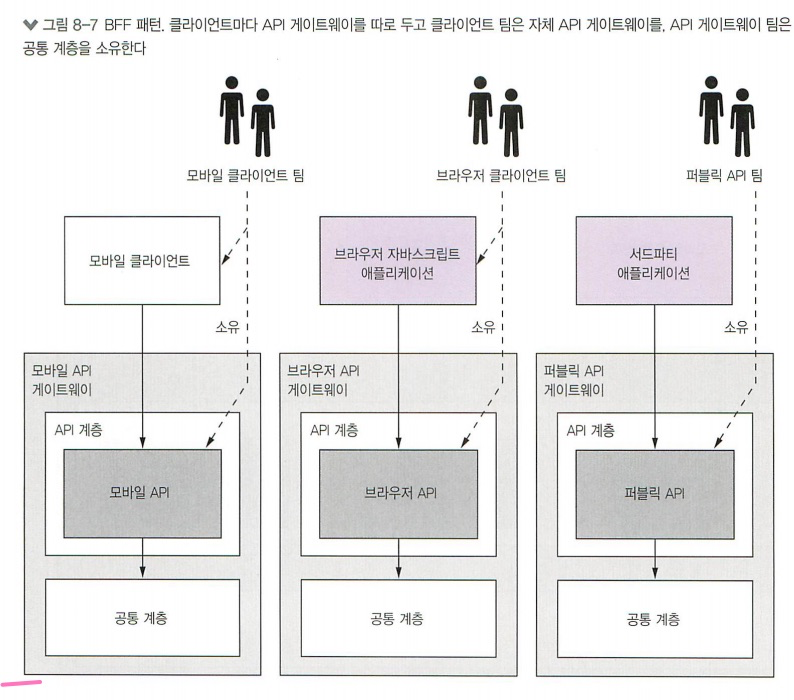

# Chapter8. 외부 API 패턴

### 8.1.외부 API 설계 이슈

웹 애플리케이션 : 방화벽 내부에서 실행 - 대역폭이 높고 지연시간이 짧은 LAN으로 서비스 접속

다른 클라이언트 : 방화벽 외부에서 진행 - 대역폭이 낮고 지연이 높은 환경에서 서비스 접속

#### 8.1.1. API 설계 이슈 : FTGO 모바일 클라이언트

1. 클라이언트가 요청을 여러번 전송해서 UX가 나빠진다
2. 캡슐화가 되지 않아 프런트엔드 개발자가 백엔드와 맞물려 코드를 변경해야한다
3. 클라이언트에 비 친화적인 IPC를 사용중인 클라이언트도 있다.

... 외에도 여러개 있다.

### 8.2. API 게이트웨이 패턴

마이크로서비스 애플리케이션에 외부 API 클라이언트의 진입점에 해당하는 서비스를 구현한다.

퍼사드(Facade) 패턴 : https://jusungpark.tistory.com/23

API 게이트웨이 : 요청 라우팅, API 조합, 프로토콜 변환(protocol translation)

##### 요청 라우팅

라우팅 맵을 찾아보고 어느 서비스로 요청을 보낼지 결정 : nginx 리버스 프록시

##### API 조합

여러 서비스에서 API 조합 패턴으로 데이터를 가져온다.

##### 프로토콜 변환

REST, gRPC를 혼용할 경우에도 사용을 할 수 있음 : API 변환

##### API 게이트웨이는 클라이언트마다 적합한 API 제공한다 (BFF 패턴)

##### 엣지 기능 구현

엣지기능 : 애플리케이션 주변에 구현된 요청 처리 기능

- 인증, 인가, 사용량 제한, 캐싱, 지표 수집, 요청 로깅
- 백엔드 서비스 , 직접 맞닿은 API 게이트웨이의 upstream, 전용 엣지 서비스(dedicated edge service)
- 요청이 서비스에 도달하기 전에 미리 애플리케이션이 요청을 인증하는 것이 더 안전하다. 

##### API 게이트웨이 아키텍처 

클라이언트별 API는 별도 모듈로 구현하고 인증처럼 전체 API에 필요한 기능은 계층에 구현한다

여러 서비스를 호출하여 결과를 조합하는 방법

##### API 게이트웨이 소유권 모델

API 게이트웨이 전담 팀 따로 신설 : 공통 모듈 개발 및 게이트웨이 운영이슈에 집중
매끄럽게 협업 진행을 위해 API 게이트웨이 배포 파이프라인이 완전히 자동화해야한다.

##### 프런트엔드 패턴을 위한 백엔드(BFF)

Backends For Frontends : 각 클라이언트 종류마다 게이트웨이를 따로 구현한다.
공통 기능은 API 게이트웨이 팀이 개발한 공유 라이브러리

#### 8.2.2. API 게이트웨이 장단점

장점 : 내부구조 캡슐화 / 코드 단순

단점 : 개발, 배포 관리를 해야하는 고가용 컴포넌트가 하나 더 늘어나는 부담 감수 / 병목지점 우려

#### 8.2.4. API 게이트웨이 설계 이슈

##### 성능과 확장성

동기 I/O를 사용할 것인가 비동기 I/O를 사용할 것인가.

CPU 집약적 로직을 수행 : 비동기 개선X / IO 집약적로직 (요청라우팅) : 비동기 개선 O

##### 리액티브 프로그래밍 추상체

리액티브하게 선언형 스타일로 작성한다. 

- 자바 CompletableFutures
- 리액터 프로젝트(Project Reactor)
- RxJava
- 스칼라 Future

##### 부분 실패처리

부하 분산기 후면에 여러 게이트웨이 인스턴스를 두고 가동함. 게이트웨이 하나가 실패하면 다른 인스턴스에 라우팅 > 회로 차단기 패턴으로 문제 해결 가능

##### 아키텍처의 선량한 시민 되기

서비스 디스커버리 패턴 : 클라이언트가 서비스의 위치를 알아낼 수 있는 기능이 필요할 때 사용

관층성 패턴(observability pattern) : 애플리케이션 동작 상태를 모니터링하고 문제를 진단하는데 도움

### 3. API 게이트웨이 구현

##### API 게이트웨이 역할

- 요청 라우팅
- API 조합
- 엣지 기능
- 프로토콜 변환

##### 구현 방법 2가지

- 기성 API 게이트웨이 제품/서비스를 활용
- API 게이트웨이 프레임워크 또는 웹 프레임워크를 기반으로 API 게이트웨이를 직접 개발

#### 8.3.1. 기성 API 게이트웨이 제품/서비스 활용

##### AWS API 게이트웨이

- 하나이상의 HTTP 메서드를 지원하는 REST 리소스 세트
- 각각의 백엔드 서비스로 라우팅할 수 있게 구성함
- 요청 인증 기능도 내장
- API 조합 지원 X

##### AWS 애플리케이션 부하분산기

AWS ALB (Application Load Balancer) : 가동중인 백엔드 서비스로 요청을 라우팅

##### 다른 API 게이트웨이 제품

콩(Kong), 트래픽(Trafik) : 직접 설치/운영할 수 있는 오픈 소스 제품

API 조합은 지원하지 않는다.

#### 8.3.2. API 게이트웨이 자체 개발

##### 넷플릭스 주울

라우팅 사용량 제한, 인증같은 엣지 기능이 탑재된 프레임워크

##### 스프링클라우드 게이트웨이

- 요청을 백엔드 서비스로 보낸다
- API를 조합하는 요청 핸들러 역할을 함
- 인증 등의 엣지 기능 처리

겸사겸사 같이 읽은 블로그 : https://cheese10yun.github.io/spring-cloud-gateway/

#### 8.3.3. API 게이트웨이 구현 : GraphQL

데이터를 효율적으로 가져오도록 설꼐된 그래프 기반의 API 프레임워크를 찾게 된다.

##### GraphQL 스키마 정의

GraphQL API는 스키마 중심적 : 서버 쪽 데이터 모델과 작업의 구조를 정의한 타입들로 구성된다.

##### 스키마를 데이터에 연결

쿼리 실행 시 하나 이상의 데이터 저장소에서 요청한 데이터를 가져와야함
resolver : GraphQL에서 데이터를 가져오는 구체적인 과정을 담당

스키마 필드에 리졸버 함수를 붙이고, 

##### 배칭/캐싱으로 로딩 최적화

- 배칭 : 서비스를 N번 호출 할 것을 N개 객체를 일괄 조회하는 호출 한 번으로 전환
- 캐싱 : 불필요한 중복 호출을 방지하기 위해 동일한 객체를 가져왔던 이전 결과를 재 사용하는 개술

