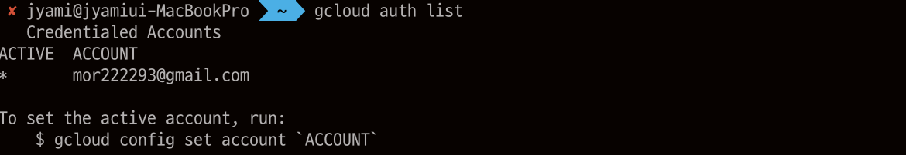

## 2. 가상 머신 만들기

### 0. gloud 

gloud : Google Cloud Platform의 명렬줄 도구 (CLI), Cloud Shell에 사전 설치 되어있다.

- 사용중인 계정 이름 목록 표시

```shell
gcloud auth list
```

- 프로젝트 ID 목록 표시

```shell
gcloud config list project
```


##### **추가**. Google Cloud SDK 설치 후 local에서 gcloud 명령줄 사용하기

패키지를 다운받고 나면 두가지 스크립트를 실행한다.

```shell
./google-cloud-sdk/install.sh
```

이 스크립트는 shell의 경로에 Cloud SDK 도구를 추가하는 것이다. 또 shell 및 사용 통계 수집을 위한 명령어 완료 옵션을 적을 수 있다. (변경사항 적용을 위해 새 터미널을 연다)

```shell
./google-cloud-sdk/bin/gcloud init
```

gcloud init 명령어를 사용하여 SDK를 초기화 한다.


패키지를 다운받고, path 설정도 올바르게 해주었기 때문에 앞으로는 실제 나의 local shell에서 곧바로 gcloud 명령어를 사용할 수 있다.

> 사용 통계 전송을 중지하는 명령어를 사용하였음.


처음 gcloud 세팅을 할 때 로그인할 계정으로 redirect를 시키는데, GCP를 사용하는 내 계정으로 로그인을 하면 된다

> auth list 명령어를 통해 현재 로그인한 계정을 확인한다.




### 1. 리전과 영역(zone)의 이해

일부 Compute Engine 리소스는 region이나 zone에 있다. 
리전 : 리소스를 실행할 수 있는 특정 지리적 위치 
영역(zone) : 각 리전에는 여러개의 영역이 존재한다.


리전 : us-central1
영역 : us-central1-a, us-central1-b, us-central1-c, us-central1-f

> zone을 알면 region도 알 수 있다. <region>-<zone>으로 이름이 구성되기 때문!

영역별 리소스 : 영역내에 상주하는 리소스 - 가상머신 인스턴스와 영구 디스크가 영역에 상주

> 영구디스크를 가상머신 인스턴스에 연결 / 인스턴스에 정적 IP 주소 할당 - 모두 같은 영역에 상주해야 한다.


### 2. Cloud Console에서 새로운 인스턴스 만들기

이름 / 리전-영역 지정 / 머신 유형 / 부팅디스크 / 방화벽 생성


머신 유형 : 마이크로 인스턴스부터 32코어/208GB 램 인스턴스까지 다양하다.

부팅디스크 : Ubuntu는 물론 Windows Server와같은 다양한 이미지를 선택 할 수 있다.

방화벽 : HTTP 트래픽 - 나중에 설치할 웹 서버에 액세스 할 수 있도록 선택함 (Http 선택하면 포트 80에서 http 트래픽을 허용하는 방화벽 규칙이 자동으로 만들어진다.)


**+ 추가 SSH로 접근하기** 


오른쪽의 SSH 버튼을 누를경우 SSH를 실행한 browser가 실행된다. 


그 옆의 화살표에서 view.. 를 누를경우 ssh 연결주소가 나오는데 그것을 내 local 터미널에 복사 붙여넣기를 하면 ssh 연결을 할 수 있다.


### 3. Cloud Console에서 새로운 인스턴스 만들기

GCP 웹 콘솔을 사용해서 가상머신 인스턴스를 만들수도 있지만, gloud CLI를 사용할 수도 있다.

```shell
gcloud compute instances create gcelab2 --machine-type n1-standard-2 --zone [your_zone]
```

위와 같이 입력하면 새로운 가상머신이 만들어지는데 

이름은 gcelab2로 machine-type을 위에 만들었던 것과 똑같이 지정했기 때문에, 2 vCPU에 7.5GB Memory를 지니며, zone을 입력하면 간단하게 gce(google compute machine) 인스턴스를 만들 수 있다.


```shell
gcloud compute instances create --help
```

기본 값을 보기위해서 위와 같이 실행하니 compute engine을 만들 때 사용할 수 있는 여러 옵션을 gcloud CLI 로 모두 지정할 수 있음을 알 수 있다.


```shell
gcloud config set compute/zone
gcloud config set compute/region
```

위 커맨드는 항상 하나의 리전/영영(zone)내에서 작업해서 —zone 옵션을 사용하고 싶지 않을 때 gcloud에서 사용할 default 값을 지정할 수 있다.


```shell
gcloud compute ssh gcelab2 --zone [your-zone]
```

위 커맨드는 gcloud를 사용해 SSH를 통해 인스턴스를 연결 할 수 있다는 것이다. 만약 내 로컬에 gcloud를 설치해 두었다면, 내 local shell에서도 ssh를 이용한 연결이 가능함을 알 수 있다.


출처

https://cloud.google.com/sdk/docs/#install_the_latest_cloud_tools_version_cloudsdk_current_version

<https://cloud.google.com/compute/docs/instances/connecting-to-instance>