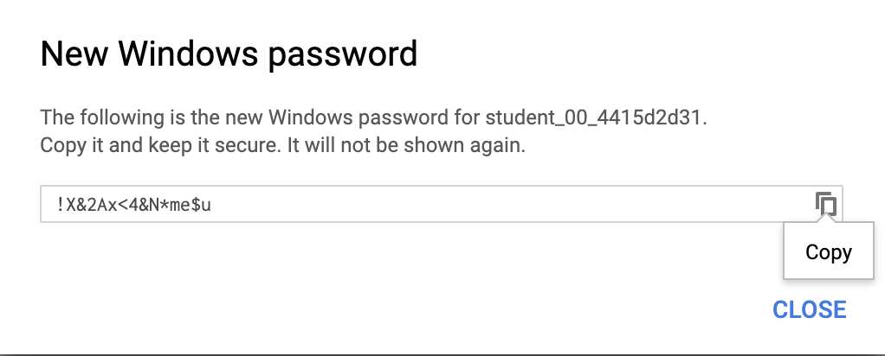

# 3. Compute Engine: Qwik Start - Windows

Google Compute Engine에서 boot disk type에 따라서 내가 원하는 운영체제로 가상머신을 만들고 실행할 수 있다. 이번 실습에서는 Window Server 인스턴스를 실행하고 원격 데스크톱 프로토콜을 사용해서 연결하는 방법을 알려준다.


### 1. Compute Engine VM 인스턴스 만들기


Boot Disk의 타입을 설정해준다. Operating System을 Window로 해주고, 버전은 Window Server 2012 R2 Datacenter를 선택했다.


### 2. Google Cloud Shell 활성화

Google Cloud Shell은 다양한 개발 도구가 탑재된 가상머신이다. 5GB의 영구 홈 디렉토리를 제공하며 Google Cloud에서 실행된다. 

Google Cloud Shell을 사용하면 CLI를 통해 GCP 리소스에 접근할 수 있다.

사용중 계정 이름 목록 표시 ```gcloud auth list```

프로젝트 ID 목록 표시 ```gcloud config list project```


### 3. Window 시작상태 테스트

Window Server 인스턴스의 프로비저닝이 완료되어 녹색상태의 아이콘이 뜨더라도 모든 OS 구성요소를 초기화하는데 다소 시간이 걸려서 아직 서버에서 RDP(Remote Desktop Protocol) 연결을 수락할 준비가 안 되 있을 수 있다.

서버에서 RDP 연결을 수락할 준비가 되었는지 확인

```shell
gcloud compute instance get-serial-port-output [instance 이름] --zone [zone 이름]
```

출력 명령어 - OS 구성요소 초기화 완료 (Window Server가 RDP 연결을 수락할 준비가 되었다.)

```shell
Finished running startup scripts.
```


### 4. 인스턴스 연결

Name을 클릭해서 들어가고, **Remote Acess**에서 **Set Window Password** 버튼을 클릭한다.


이때 사용자 이름이 생성되고, 이 window 인스턴스의 비밀번호를 생성한다. 이 비밀번호는 인스턴스에 로그인할 때 사용되므로 비밀번호를 복사해둔다.





### 5. 원격 데스크톱(RDP)을 통해 Window Server에 접속하기

RDP를 통한 Window Server 접속을 위해 Google Cloud Platform용 Chrome RDP 확장프로그램을 설치한다. 

[확장프로그램 앱스토어 링크](https://chrome.google.com/webstore/detail/chrome-rdp-for-google-clo/mpbbnannobiobpnfblimoapbephgifkm)


설치가 끝나면 RDP 버튼을 눌러서 데스트탑에 로그인할 수 있다.


로그인 할 때 앞써 저장해둔 비밀번호를 사용해서 들어간다.

