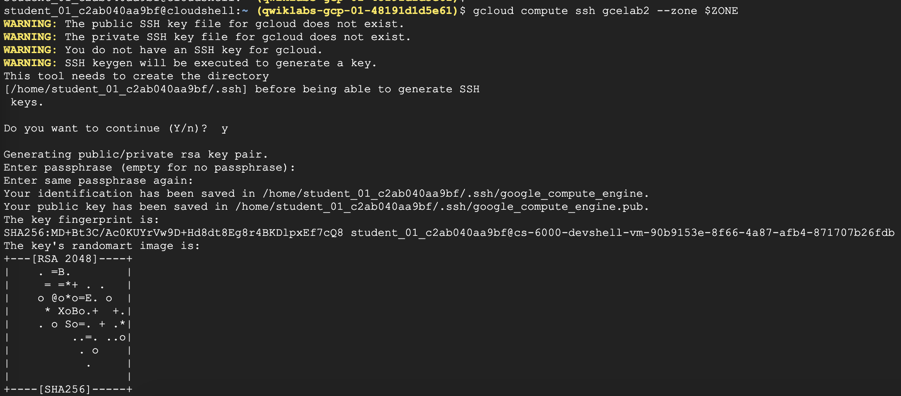

# 4. Cloud Shell 및 gcloud 시작하기

Cloud Shell : Debian 기반 가상 머신, 영구적인 5GB 홈디렉터리 제공하여 GCP 프로젝트와 리소스를 원활하게 관리할 수 있도록한다.

gcloud 명령어나 가상 머신 인스턴스에서 사용할 수 있는 다른 도구를 호출 할 수 있다.

linux shell과 마찬가지로 cloud shell도 $HOME 과같은 환경변수를 설정 및 사용할 수 있다.


### 1. 리전 영역의 이해

영역별 리소스 : 영역(zone)내에 상주하는 resource

가상머신 인스턴스, 영구 디스크는 모두 zone에 상주해야한다.
영구 디스크를 가상머신 인스턴스에 연결하려면 모두 같은 zone에 있어야한다
인스턴스에 정적 IP 주소를 할당하려는 경우 인스턴스가 정적 IP와 같은 region에 있어야한다.

#### 기본 리전과 영역

```google-compute-default-zone```

```google-compute-default-region```

기본 리전, 영역 설정을 확인하는 명령어

```shell
gcloud compute project-info describe --project [Project ID]
```


### 2. 환경 변수 설정

프로젝트 ID 환경변수 설정

```shell
export PROJECT_ID=<your_project_ID>
```

ZONE 환경변수 설정

```shell
export ZONE=<your_zone>
```

변수가 제대로 설정되어있는지 확인

```shell
echo $PROJECT_ID
echo $ZONE
```


### 3. gcloud로 VM instance 만들기

```gcloud compute``` : Compute Engine API를 사용할 때 익숙한 형식으로 리소스 관리가능

```gcloud compute instances create``` : 새 인스턴스를 만든다

```gcloud compute instances create —help``` : 인스턴스 생성시의 도움말 참고 가능

```shell
gcloud compute instances create gcelab2 --machine-type n1-standard-2 --zone $ZONE
```

가상머신 이름 : gcelab2
머신유형 : n1-standard-2 (—machine-type 옵션)
영역 : 환경변수로 지정한 영역 (—zone 옵션)


### 4. gcloud 명령어 사용

```gcloud -h``` : 간단한 사용 안내

```gcloud help```, ```—help``` : 더 상세한 상세 안내  

config 와 관련한 상세 안내

```shell
gcloud config --help 
gcloud help config
```


gcloud 전역 플래그 : 호출 레벨에 따른 명령어 동작을 제어한다.

환경에서 config를 본다

```shell
gcloud config list
```

설정된 다른 config를 보기 위해 플래그로 호출 레벨을 지정하였다.

```shell
gcloud config list --all
```

```components``` 목록 표시

```shell
gcloud components list
```


### 5. 자동완성

```gcloud interactive``` : 명령어 및 플래그를 자동으로 추천하고 명령어 입력 시 하단에 도움말을 표시해 준다.

1) 베타 구성요소를 설치한다.

```shell
gcloud components install beta
```

2) ```gcloud interactive``` 모드로 전환한다.

```shell
gcloud beta interactive
```

이 모드를 사용할 때 드롭다운 메뉴가 나타나면 Tab 키를 이용해서 목록을 이동하고 스페이스바로 원하는 항목을 선택한다.


### 6. VM 인스턴스에 SSH 사용

```gcloud compute``` : 쉽게 인스턴스에 연결 할 수 있다.

```gcloud compute ssh``` : 래퍼기능을 제공해서 인스턴스 이름과 IP 주소 매핑을 처리한다.

가상머신에 SSH 사용하기

```shell
gcloud compute ssh gcelab2 --zone $ZONE
```




