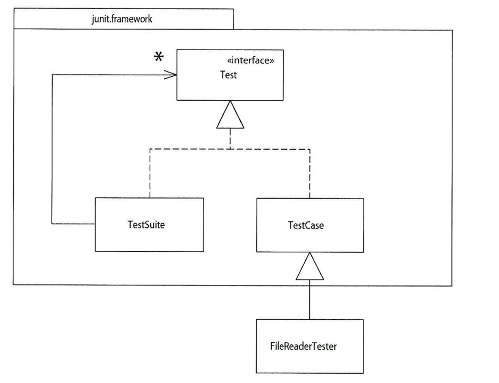

# Chapter4. 테스트 작성

리팩토링을 실시하기 위한 필수 전제조건은 반드시 견고한 테스트를 해야한다는 것이다.

### 자가 테스트 코드의 가치

모든 테스트를 완전히 자동화하고 결과를 자체적으로 검사하게 하자.

컴파일마다 테스트를 실행하는 습관을 들였고, 테스트 스위트는 버그를 찾는 시간을 획기적으로 줄여주는 강력한 버그 감지 도구다.

테스트를 작성하기 가장 적합한 시점 중 하나는 프로그래밍을 시작할 때다. 기능을 추가해야 할 때는 우선 테스트부터 작성하자.

### JUnit 테스트 프레임 워크

테스트를 실습하는 데 필요한 주요 기능은 다 들어 있다. 

Junit = 콤퍼지트 패턴 사용

테스트 픽스쳐(text fixture) : 기본적으로 테스트의 샘플 역할을 하는 객체

자동 테스트는 assert 메서드가 담당한다. 

JUnit은 실행되는 각 테스트마다 걸린 시간을 출력하므로 테스트 과정을 볼 수 있다. 

테스트를 자주 실행하자. 적어도 하루에 한 번은 테스트를 실시하고, 컴파일할 때 마다 테스트를 구소화하자.

#### 단위 테스트 기능 테스트

이 프레임워크는 단위 테스트용이다.

단위 테스트의 목적은 프로그래밍 생산성 향상이다. 프로그래밍 생산성이 높아지면 부수적으로 품질 보증 부서의 업무 효율도 향상된다.

기능테스트의 목적은 소프트웨어 전반이 제대로 돌아가는지 확인하는 것이다. 고객에게 품질 보증만 할 뿐 프로그래머의 생산성과는 무관하다. > 최대한 블랙박스처럼 취급한다.

버그 리포트를 받으면 우선 그 버그를 한눈에 볼 수 있게 출력하는 단위 테스트부터 작성하자.

### 테스트 추가

완벽한 테스트를 작성하려다 아예 테스트를 포기하느니, 차라리 불완전한 테스트를 작성해 실행하는 편이 낫다.

너무 많은 테스트를 작성하려다 보면 초반에 질려서 오히려 테스트를 필요한 만큼도 작성하지 못하게 되므로, 버그 가능성이 거의 없는 부분은 애시당초 테스트 작성 대상에서 제외해야한다.

잘못될 수 있는 경계 조건을 생각한 후, 그 상황에서의 테스트에 집중하자. > 경계 찾기에는 테스트 실패가 가능한 특수 조건을 찾는 작업도 포함이다.

에러가 있으리라 예상될 땐 그 예외가 정말로 발생하는지 꼭 테스트하자.

테스트가 모두는 아니더라도 대부분의 버그는 잡아내므로 테스트 작성을 중단해선 안 된다.

객체의 한가지 단점은 상속과 재정의로 인해 테스트할 조합이 너무 많아져서 테스트가 어려워질 수 있다.

