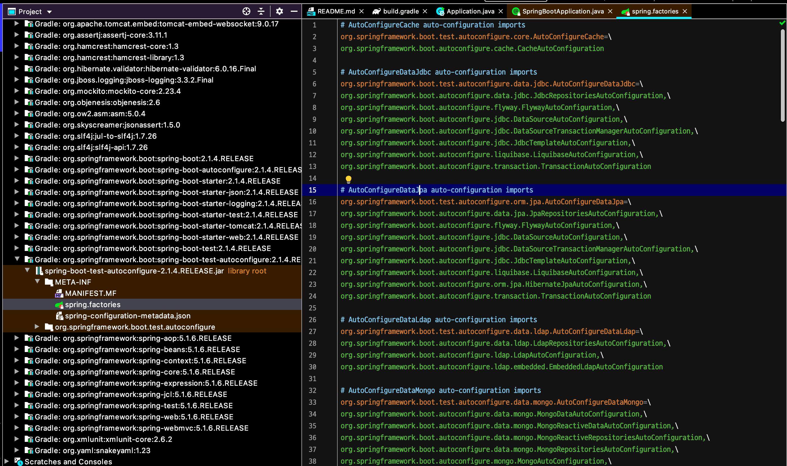

# 3. 스프링 부트 원리

### 1. 의존성 관리 이해

의존성이 2개 밖에 없다. 버전 명시도 안되있다.(적절한 버전을 알아서 가져옴)
스프링 부트가 제공하는 **의존성 관리 기능** 덕분이다

parent >. Spring-boot-dependencies가 가장 상위에 있고 > 이걸보면 버전이 잔뜩 있다. 이곳에 각종 의존성들을 관리함 : spring-boot-dependencies폼 안에 들어가면 실질적으로 버전을 명시중이다. 이 버전을 가져와서 사용한다.

intellij의 우측 projects 탭을보면 계층구조로 가져오는 의존성들을 확인할 수 있다.

> gradle에서는 apply plugin: 'io.spring.dependency-management' 덕분인 것 같다.


##### 스프링 부트가 제공하는 의존성 관리 기능의 장점

- 우리가 관리해야하는 의존성이 줄어든다 (일이 줄어든다.)
- 스프링 부트 dependencies에서 관리하지 않는 의존성은 버전을 명시하지 않아도 된다. (만약 버전을 명시하면 overriding되듯이 기술한 버전을 가져온다.)


##### parent / dependencyManagement

둘다 이용하여 boot dependencies를 넣어줄 수 있다. 하지만 차이점이 존재한다.

parent : 의존성만 가져오는게 아니라, properties, 스프링 부트가 사용하는 yml 파일 등을 리소스를 추가 시켜주고 플러그인 설정도 자동으로 해주는 등 편리하게 시작할 수 있다.

- Java 1.8  컴파일 설정
- Utf-8 인코딩
- Dependency management section을 이용한 버전관리
- resource filtering
- plugin configuration
- Resource filterfing : application.properties , application.yml

dependencyManagement : parent로 받아서 사용할 수 있는 기본 세팅을 포기해야한다.


### 2. 의존성 관리 응용

https://mvnrepository.com/

##### 의존성을 추가하는 방법

```xml
<dependency>
  <groupId></groupId>
  <artifactId></artifactId>
  <version></version>	
</dependency>
```

마찬가지로 spring-boot-starter-parent안의 dependencyManagement가 관리하고 있는 의존성이라면 버전 정보를 명시하지 않아도 자동적으로 매핑된다. (IntelliJ 아이콘 사용)

그래도 버전을 명시하는 것이 best practice이다. (무슨 버전을 받을지 모르기 때문에)


##### 스프링 부트가 관리하는 의존성의 버전을 바꾸고 싶을 때

properties에 각각의 version을 일괄적으로 적용해두었다. 이것을 복사해서 우리 프로젝트에 properties를 추가하여 버전을 변경한다.

```xml
<properties>
	<spring.version>5.0.6.RELEASE</spring.version>
</properties>
```

마찬가지로, springboot의 기본 의존성을 변경하고 싶은 경우, plugin이든 아니든 override 형식으로 추가해주면 된다.


### 3. 자동 설정 이해

@SpringBootApplication 안에있는 @EnableAutoConfiguration 덕분에 스프링의 여러가지 설정과 함께 런이 된다.

##### @SpringBootApplication 구성 요소

- @SpringBootConfiguration : 사실상 @Configuration
- @ComponentScan
- @EnableAutoConfiguration


##### Springboot의 Bean을 읽는 방법 (2단계)

1단계 : @CompoentScan
2단계 : @EnableAutoConfiguration

먼저 ComponentScan으로 빈을 등록하고, 그 이후에 EnableAutoConfiguration으로 나머지 빈들을 설정함.

>  현재 WebApplication설정때문에 그런데, 이 설정을 None으로 한다면 @EnableAutoConfiguration 만으로도 스프링 애플리케이션을 동작시킬 수 있다.


##### @ComponentScan 

@Component라는 애너테이션을 가진 애너테이션을 Bean으로 등록한다.

애노테이션이 달려있는 **현재 클래스의 경로**부터 시작해서, 하위 디렉토리까지 싹 뒤져서 빈으로 등록한다.

- @Component 
- @Configuration @Repository @Service @Controller @RestController


##### @EnableAutoConfiguration



spring.factories > org.springframework.boot.autoconfigure.EnableAutoConfiguration

여기에 있는 클래스들은 @Configuration이 달려있어, 모두 자바 설정 파일이다. 그런데 조건이 있다.

가끔 보면 **@Conditaional** 이라는게 있다 : 조건에 따라서 빈을 등록하기도 하고 안하기도한다. 
설정 파일자체를 사용할지 안할지도 결정한다. @ConfigurationOnWebApplication(type = type.SERVLET) 등등 과같이 조건에 따라서 해당 Bean 설정을 사용할지 안할지를 결정ㅎ나다.

``@ConditionalOnXxxYyyZzz`` : 이라는 컨벤션을 따른다.


애플리케이션에 붙인 @SpringBootApplication 그리고 이 안에있는 @EnableAutoConfiguration 덕분에 spring.factory에 들어있는 수많은 자동설정이 조건에 따라 적용이되고 수많은 빈이 생성된다.
덕분에 이 애너테이션 하나로 웹 애플리케이션이 내장 톰캣을 사용하여 동작한다는 것을 쉽게 설정할 수 있다.