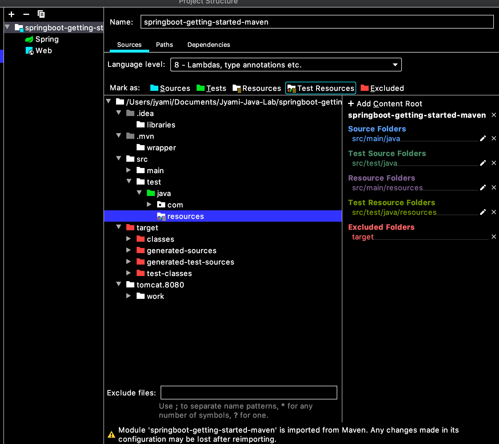

# 4-1. 스프링 부트 활용 - 스프링 부트 핵심 기능

| **스프링 부트 핵심 기능**                         | **각종 기술 연동**                             |
| ---------------------------------------- | ---------------------------------------- |
| SpringApplication<br />외부 설정<br />프로파일<br />로깅<br />테스트<br />Spring-Dev-Tools | 스프링 웹 MVC<br />스프링 데이터<br />스프링 시큐리티<br />REST API 클라이언트<br />다루지 않은 내용들 |


### 1. SpringApplication

```java
public static void main(String[] args) {
  SpringApplication.run(SpringbootGettingStartedMavenApplication.class, args);
}
```

SpringApplication이 제공하는 다양한 기능, 설정을 사용하기 어렵다.

```java
public static void main(String[] args) {
  SpringApplication springApplication = new SpringApplication(SpringbootGettingStartedMavenApplication.class);
  springApplication.run(args);
}
```

이렇게 사용하면 결과는 같은데, 확장성이 다름!


##### 기본 로그 레벨 INFO

실행 옵션에서 vm 옵션이랑 program argument를 설정할 수 있음

로그레벨 출력을 Debug로 하기 위해서 argument로!

```shell
vm : -Ddebug
program argument : --debug
```

어떤 자동 설정이 적용이 되었는지, 적용이 안되었는지 확인할 수 있다.


##### FailureAnalyzer

레퍼런스를 보면, application error가 났을 때 좀더 이쁘게 보여주는 기능 (여러가지가 등록되어 있지만,,, 우리가 등록하진 말고 그냥 잘 쓰자)


##### 배너

맨처음에 뜨는 <<<spring>>> 이거다ㅋㅋㅋ
뭐 굳이 넣고싶으면 banner.txt 를 생성해서 넣으면 된다. (gif, jpg, png도 사용가능ㅋㅋㅋ)

배너의 위치는 resources 바로 안에 넣어야하고, 다른 위치에 넣고싶다면

```properties
spring.banner.location=classpath:banner.txt
```

이런 프로퍼티를 사용하도록 하자.

banner 커스텀시에 ${spring-boot.version} 등의 인자를 사용해서 배너에 넣을 수 잇다.

일부는 menifest 파일이 생성되어야만 생성되는 것들이 있다. ${application.version} 
mvn package를 이용하여 jar 파일 안에 menifestfile을 읽을 때 고고 (pom file에 있는 version 정보가 나온다.)

Banner를 코딩으로 구현하고 싶다. ``app.setBanner()`` ``app.printBanner``  ``SpringApplicationBuilder``

코딩이 이길까 text 파일이 이길까 ? => text 파일이 이긴다


##### ApplicationEvent

스프링에서 기본적으로 제공하는 이벤트

애플리케이션이 시작될 때, 애플리케이션 컨텍스트가 잘 구동이 됐을 때, 애플리케이션이 떠서 준비가 다 됐을 때, 실패했을 때

Application Event Listener를 만드는 건 쉽다.

```java
// @Component
public class SampleListener implements ApplicationListener<ApplicationStartingEvent> {
    @Override
    public void onApplicationEvent(ApplicationStartingEvent applicationStartingEvent) {
        System.out.println("================");
        System.out.println("Application is Starting");
        System.out.println("================");
    }
}
```

이 이벤트가 언제 발생을 하느냐가 중요해진다.

@Component를 했을 때 Application Context가 만들어졌는가 여부

- 만들어진 다음 : Bean을 잡는다.
- 만들어지기 이전에 발생한 이벤트 : Bean으로 등록을 해도 리스너가 동작을 안한다.

> 이 ApplicationListener<ApplicationStartingEvent> 이거는 컨텍스트 만들어지기 이전에 시작되는 이벤트이다.

직접 등록을 해주어야한다.

```java
public static void main(String[] args) {
  SpringApplication springApplication = new SpringApplication(SpringbootGettingStartedMavenApplication.class);
  springApplication.addListeners(new SampleListener());
  springApplication.run(args);
}
```

이때에는 ApplicationListener<ApplicationStartedEvent>이거는 Context 만들어지고 나서이기 때문에 직접 등록을 안해주어도 된다.


##### WebApplicationType 설정

```java
springApplication.setWebApplicationType(WebApplicationType.NONE);
```

setWebApplicationType 에 있는 타입들 : NONE, REACTIVE, SERVLET

spring webflex가 있으면 reactive
servlet이 없으면 reactive로 돈다. 

spring mvc있고, spring webflex도 있다 : 이경우엔 servelt 으로 돈다.

spring webflex만 있다. reactive

둘다 없다 : none

spring mvc있고, spring webflex도 있다 : 근데 reactive로 하고싶다. 그러면 set해주어야한다.


##### 애플리케이션 아규먼트 사용하기

``—`` : program argument

``-D`` : JVM option

어떤 빈에 생성자가 1개고 그 파라미터가 빈일경우엔 알아서 스프링이 주입을 해준다.

현재 jvm option을 -Dfoo —bar 넣어주면?

```java
@Component
public class ArgumentPrinter {
    public ArgumentPrinter(ApplicationArguments arguments){
        System.out.println("foo: " + arguments.containsOption("foo"));
        System.out.println("bar: " + arguments.containsOption("bar"));
    }
}
```

```shell
foo: false
bar: true
```

Program argument만을 가져온다.

argument에 있는 유용한 메서드들을 사용해보자


##### 애플리케이션 실행한 뒤 뭔가 실행하고 싶을 때

- ApplicationRunner(추천) or CommandLineRunner

  둘다 JVM option을 받지 못한다.

  ApplicationRunner는 좀더 추상화가 높은 인자(``ApplicationArguments args``)로 받고, CommandLineRunner는 그냥 인자 배열로 받는다 (``String[] args``)

- 순서 지정 가능 @Order

  숫자 낮은게 우선순위가 높은 것이다.

  ``@Order(1)``


### 2. 외부 설정

어플리케이션에서 사용하는 설정들을 정의할 수 있음.

##### 사용할 수 있는 외부 설정

● properties

● YAML

● 환경 변수

● 커맨드 라인 아규먼트

application.properties에 있는 기본적인 값을 출력하는 방법

```properties
jyami.name = minjeong
```

```java
@Values("${jyami.name}") // 15위
private String name;

public void(ApplicationArguments args){
  System.out.println(name);
}
```


##### 프로퍼티 우선 순위

높은 순위 위주로 오버라이딩이 된다.

1. 유저 홈 디렉토리에 있는 spring-boot-dev-tools.properties

   

2. 테스트에 있는 @TestPropertySource

   ```java
   @TestPropertySource(properties="jyami.name=hello")
   ```

   ```java
   @TestPropertySource(locations = "classpath:/test.properties")
   ```

3. @SpringBootTest 애노테이션의 properties 애트리뷰트

   테스트에 있는 프로펄티를 정의하는 방법

   테스트용으로 프로펄티를 바꿀때

   test > resources > application.properties를 넣는다.

   그리고 project structure에서, testResources로 추가해준다.

   

   ```java
   @RunWith(SpringRunner.class)
   @SpringBootTest
   public class SpringinitApplicationTestP{
     @Autowired
     Environment environment;
     
     @Test
     public void contextLoads(){
       assertThat(environment.getProperty("jyami.name")).isEqualTo("devLog");
     }
   }
   ```

   gradle build를 하면

   - 우선적으로 src 아래있는 폴더목록을 컴파일해서 클래스 로더로 로딩한다
   - 이후 테스트를 진행할 때는 test 아래 있는 폴더 목록을 컴파일해서 클래스 로더로 로딩하면서 application.properties가 오버라이드 된다.
   - test용 프로퍼티도 같이 맞춰주도록 해주자!

4. 커맨드 라인 아규먼트

   ```shell
   java -jar target/springinit-0.0.1-SNAPSHOT.jar --jyami.name=minjeong
   ```

5. SPRING_APPLICATION_JSON (환경 변수 또는 시스템 프로티) 에 들어있는 프로퍼티

6. ServletConfig 파라미터 7. ServletContext 파라미터

7. java:comp/env JNDI 애트리뷰트

8. System.getProperties() 자바 시스템 프로퍼티

   아무것도 안쓰고 자동으로 들어오는 것들

9. OS 환경 변수

10. RandomValuePropertySource

11. JAR 밖에 있는 특정 프로파일용 application properties

12. JAR 안에 있는 특정 프로파일용 application properties

13. JAR 밖에 있는 application properties

14. JAR 안에 있는 application properties

15. @PropertySource

16. 기본 프로퍼티 (SpringApplication.setDefaultProperties)


##### application.properties 자체의 우선 순위 (높은게 낮은걸 덮어 씁니다.)

1. file:./config/
2. file:./
3. classpath:/config/
4. classpath:/


##### 랜덤값 설정하기 ● ${random.*}

```properties
jyami.age = "${random.int}" # random 값 지정
port = 0 #random 값 지정
```

port에는 random.int를 넣지 말고 0을 사용하자, 0의 의미는 가용 가능한 포트 번호중에 랜덤한 것을 의미하기 때문이다. (random.int는 그걸 고려하지 않는다.)


##### 플레이스 홀더

```properties
name = keesun
fullName = ${name} baik
```

재사용이 가능하다.


##### 여러 프로퍼티를 묶어서 읽어오는 방법

```properties
jyami.name=minjeong;
jyami.age=23;
```

```java
@Getter
@Setter
@ConfigurationProperties("jyami") // 프로퍼티 불러오기
@Component  // 빈으로 등록
public class MinjeongProperties{
  private String name;
  private int age;

}
```

> 프로젝트를 빌드할 때 메타 정보를 생성하는 플러그인을 추가하라는 알람이 뜨는데, 사실 안해도 상관 없음

@ConfigurationProperties : 값을 바인딩 받기만 한상태 : jyami로 시작하는 관련 프로퍼티들을 아래 멤버 변수에 저장을 해준다.

실제 빈으로 등록되어있지는 않다. 

- 빈으로 등록하는 방법
- ``@EnableConfigurationProperties(MinjeongProperties.class)`` : 자동으로 등록해준다. 
- ``@Component``를 사용하여 빈으로 등록 : ``@AutoWired MinjeongProperties minjeongProperties` 로 사용이 가능하다.
- ``@Bean`` 

이렇게 하면 **타입-세이프**하게 프로퍼티를 사용할 수 있다.

```java
@Bean // jar 파일 안에 있거나 프로젝트 외부에 있을 때 의 방법
public ServerProperties serverProperties{
  return new ServerProperties();
}
```


##### 융통성 있는 바인딩(relaxed binding)

아래 네가지 방식중 어떤것으로 적어도 바인딩을 해준다.

- context-path (케밥)
- context_path (언드스코어)
- contextPath (캐멀)
- CONTEXTPATH


##### 프로퍼티 타입 컨버전

사실 프로퍼티는 <String, String> 인데, 스프링 부트가 제공하는 타입 컨버젼에 의해 자동적으로 타입을 변환해준다.

```properties
jyami.sessionTimeout = 25 
```

아래 타입으로 인해 25가 25초로 인식하도록 한다.

```java
@DurationUnit(ChronUnit.SECONDS)
private Duration sessionTimeout = Duration.ofSeconds(30);
```

> @DurationUnit을 사용하지 않더라도, suffix만 잘쓴다면 할 수 있는 방법이 있다. 
>
> Jyami.sessionTimeout = 25s

추가로 @Validated를 사용해서 @NotEmpty와 같이 제약사항을 넣어줄 수도 있다.

@Value에서는 Spring Expression Langauage를 사용할 수 있다. 그러나 위에 있는 기능들은 사용하지 못한다.


### 3. 프로파일

##### @Profile 애노테이션

특정한 프로파일에서만 특정 빈을 동작하고 싶을때.

설정 파일 자체가, Profile이 내가 지정한 것일 때만 사용이 가능하다.

```java
@Profile("prod")
@Configuration
public class BaseConfiguration {

    @Bean
    public String hello(){
        return "hello base";
    }

}
```

```java
@Profile("test")
@Configuration
public class TestConfiguration {

    @Bean
    public String hello(){
        return "hello test";
    }

}
```

```java
@Autowired
String hello; 
// 그냥 하면 에러가 난다.
```


##### Profile 설정

application.properties 에서 profile을 적용해 준다.

```properties
spring.profiles.active=test
```

> application properties 에서의 우선순위가 적용!!
>
> 즉, active는 test로,
>
> 실제 필드할때는 --spring.profiles.active=prod
>
> 로 해서 application.properties의 내용을 오버라이딩 하도록한다.


##### profile용 프로퍼티

application-{profile}.properties

```properties
spring.profiles.include=test,prod
```

