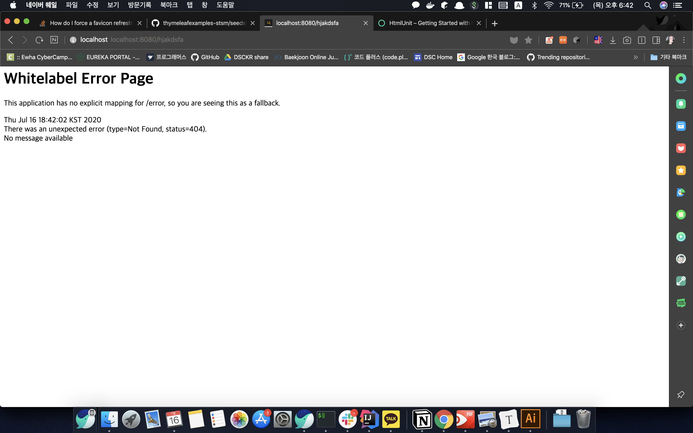
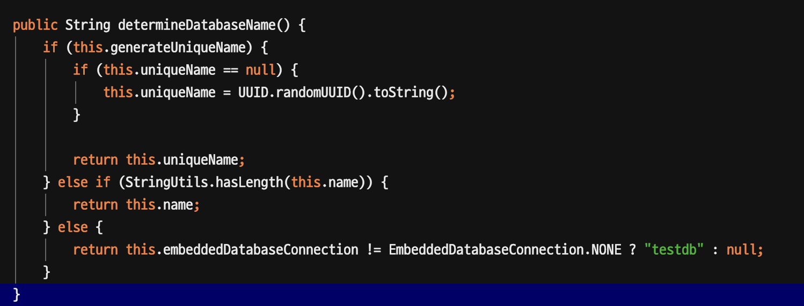
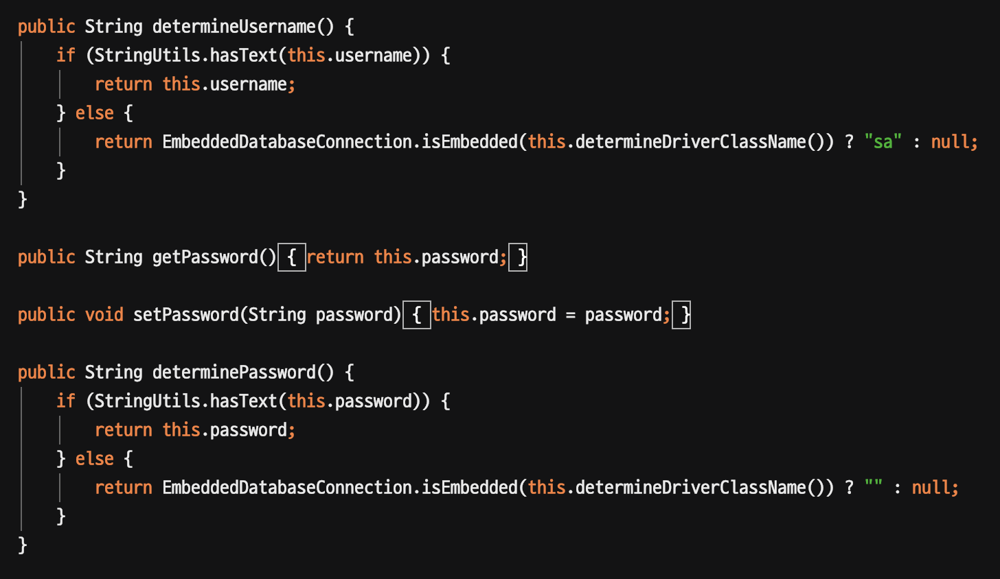
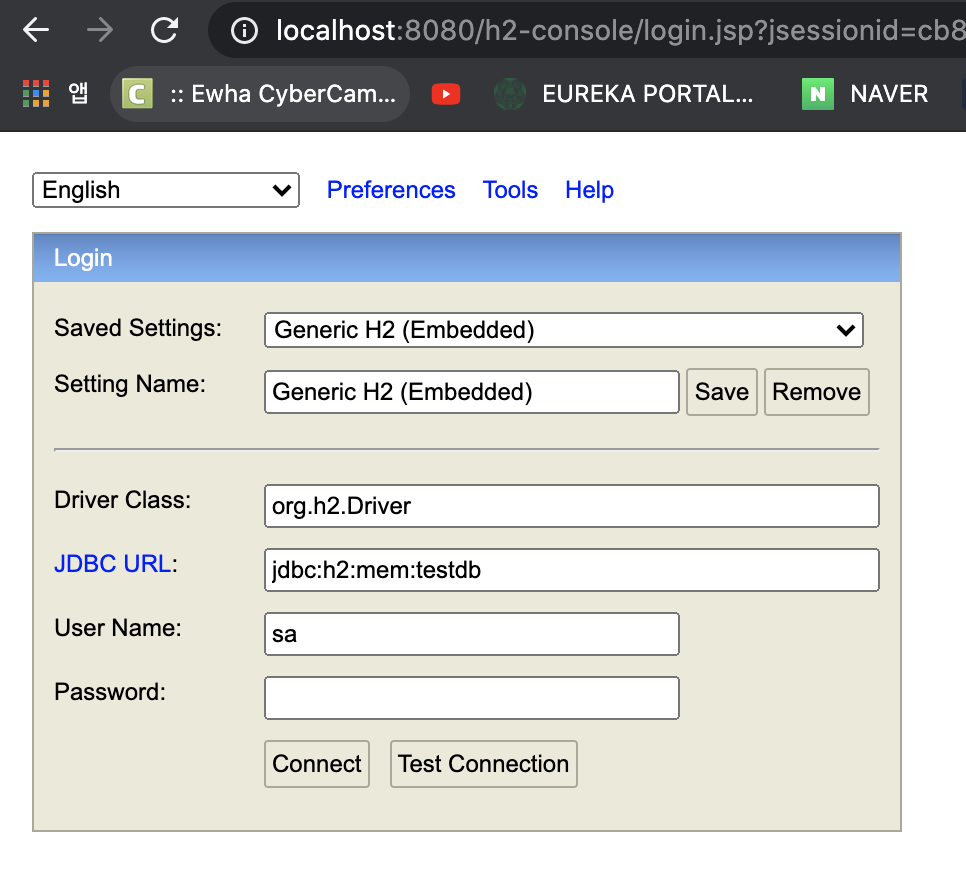
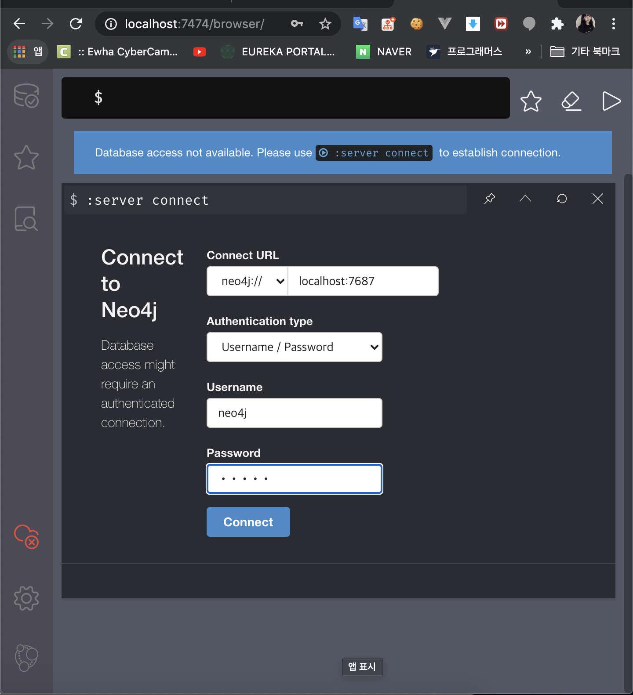

# 4-2. 스프링 부트 활용 - 각종 기술 연동

### 1. Spring Web MVC

#### spring web mvc 소개

- 스프링 웹 MVC 
  
  - https://docs.spring.io/spring/docs/5.0.7.RELEASE/spring-framework-reference/web.html#spring-web
- 스프링 부트 MVC 
  
  - 자동 설정으로 제공하는 여러 기본 기능 (앞으로 살펴볼 예정)
  
    아무 설정 없이 가능 한이유 스프링 부트의 기본설정의. 자동 설정 파일 덕분에
  
    springboot auto config > webmvcAutoConfiguration 덕분에, 각각의 빈들을 적용한다.
  
    HiddenHttpMethodFilter : springframework에서 오는 filter임. : put delete patch 등등의 http method의 경우 _method 라는 히든 arg가 있고, 이 정보를 바탕으로 @GetMapping 등의 핸들러로 연결해주는 filter이다.
  
    HttpPutFormContentFilter : PUT PATCH에서도 x-www-form-urlencoded라는 컨텐츠 타입에서도 내용을 꺼낼 수 있도록 매핑을 해준다.
  
    WebMvcProperties : spring.mvc로 시작하는 프로퍼티를 가져온다.
  
    ResourceProperties : spring.resource로 시작하는 프로퍼티를 가져온다.
  
    ResourceHandler - 특정 디렉토리에 들어있는 
  
    **여러가지 설정들이 커스터마이징 되서 일어나고 있다.** 
- 스프링 MVC 확장
  
  - @Configuration + WebMvcConfigurer
  
  - 이때 @EnableWebMvc 사용하면 X : 아예 처음부터 설정을 다해야한다.
  
    추가적인 설정을 하고싶을 때
  
    ```java
    @Configuration
    public class WebConfig  implements WebMvcConfigurer {
    }
    ```
- 스프링 MVC 재정의
  
  - @Configuration + @EnableWebMvc


#### HttpMessageConverters

메세지 컨버터는 : spring에서 제공하는 인터페이스

HTTP 요청 본문을 객체로 변경하거나, 객체를 HTTP 응답 본문으로 변경할 때 사용. 

{“username”:”keesun”, “password”:”123”} <-> User

- @ReuqestBody
- @ResponseBody

```java
@PostMapping("create")
public @ResponseBody User create(@RequestBody User user){
  return new User();
}
```

컴포지션 타입일 경우에는 json message converter가 사용된다.
String return의 경우에는 string emssage converter가 사용된다.

사실 이전의 String return 의 경우에 @ResponseBody라는 애너테이션이 숨겨져 있었던 것이다. (@RestController ) : 만약 그냥 @Controller 였으면, View Name Resorver 를 탔을 것이다 (해당하는 view name을 가진 곳에 매핑하려는)


#### ViewResolver

``HttpMessageConvertestsAutoConfiguration`` 들어오는 요청의 accept header에 따라 응답이 달라진다 : client가 어떤 타입의 MediaType을 원한다고 서버에 알려주는것 ``MediaType.APPLICATION_JSON_UTF8``

요청에 응답을 받을 수 있는 모든 뷰를 찾는다. 최종적으로 해당하는 뷰를 선택한다. 
(클라이언트가 어떤 걸 바라는지 판단하는 가장 좋은게 : acceptHeader이다)

이 acceptHeader를 안주는경우에 대비하여 /path?format=pdf, path.json 와 같은 형식으로 어떤 형식을 원하는지를 보낼 수 있다. (그치만 이제는 쓰지 말자!)

응답은 xml로 요청은 Json으로 보내고 받아보자!

```java
@Test
public void createUserJson() throws Exception {
  String userJson = "{\"username\":\"jyami\", \"password\":\"123\"}";
  mockMvc.perform(post("/user/create")
                  .contentType(MediaType.APPLICATION_JSON)
                  .accept(MediaType.APPLICATION_XML)
                  .content(userJson))
    .andExpect(status().isOk())
    .andExpect(xpath("/User/username").string("jyami"))
    .andExpect(xpath("/User/password").string("123"));
}
```

406: MediaTypeNotAcceptable : 미디어 타입을 처리할 HttpConverter가 없다는 것이다.

httpMessageConverter는 autoconfiguration에 의해 결정된다 > 이안에 xml 설정에대한 bean config 부분을 보면 XmlMapper가 classpath 안에 있을 때만 형성되는 것으로 보인다.

따라서 사용할 때 알맞은 MessageConvertersConfiguration이 있는지 확인해야 한다.

xml의 경우엔 컨버터를 추가해주자

```xml
<dependency>
  <groupId>com.fasterxml.jackson.dataformat</groupId>
  <artifactId>jackson-dataformat-xml</artifactId>
  <version>2.9.6</version>
  </dependency>
```


#### 정적 리소스 지원

동적으로 생성하지 않은것: 웹브라우저에서 요청한 리소스가 이미 만들어져있고, 만들어져있는 걸 server에서 바로 보내주는 것.

server에 요청이 들어왔을 때. 작업을 처리해서 view를 만드는게 아니라. 이미 만들어져잇는 resource가 있는 것이다!

기본적으로 4가지 위치에 있는 리소스가 **/*\*** 로 매핑된다.

- classpath:/static
- classpath:/public
- classpath:/resources/
- classpath:/META-INF/resouces

/hello.html => /static/hello.html

매핑 설정 변경 가능 : ``spring.mvc.static-path-pattern``

리로스 찾을 위치 변경 가능 : ``spring.mvc.static-path-pattern`` : 추천 X

ResourceHttpRequestHandler가 처리한다.

- Last-Modified 헤더를 보고 304 응답을 보낸다.

  어떻게 동작하냐면, 정적파일을 수정하면 요청 헤더에 Last-Modified 데이터를 수정한다.

  Last-Modified 이후에 바뀌었으면, 새로 리소스를 client에게 보낸다 (이때는 200으로)

  근데 304는 modified 의 필요가 없는 파일이라면 더 빠르게 보낸다.

- 기본적으로 resource 들은 기본적으로 root부터 매핑되어있다.

  만약 바꾸고 싶다면 ``spring.mvc.static-path-pattern=/static/**`` 이런식으로 고치면 root로 보낼 수 없고, ``static/hello.html`` 로 요청해야한다.

- 리소스 찾을 위치 변경법

  ```java
  @Configuration
  public class WebConfig  implements WebMvcConfigurer {
      @Override
      public void addResourceHandlers(ResourceHandlerRegistry registry) {
          registry.addResourceHandler("/m/**")
                  .addResourceLocations("classpaht:/m/")
                  .setCachePeriod(2);
      }
  }
  ```

  커스텀하게 추가 : m/** path는 m 폴더 아래있는 파일과 매칭한다.

  


#### 웹JAR

클라이언트에서 사용하는 javascript 라이브러리 많은데, jar로 이걸추가할 수 있다. template을 사용해서 동적으로 컨텐츠를 생성할 때(react.js, vue.js 등)사용한다. jar에 있는 css, javascript 라이브러리를 참조할 수 있다.

mvn에 올라와있다. 의존성이

```xml
<!-- https://mvnrepository.com/artifact/org.webjars.bower/jquery -->
<dependency>
    <groupId>org.webjars.bower</groupId>
    <artifactId>jquery</artifactId>
    <version>3.5.1</version>
</dependency>
```


웹JAR 맵핑 “/webjars/**”

- 버전 생략하고 사용하려면
  - webjars-locator-core 의존성 추가

```javascript
<script src="webjars/jquery/3.5.1/dist/jquery.min.js"></script>
<script>
  $(function(){
  alert("ready");
});
</script>
</html>
```


#### index 페이지와 파비콘

##### 월컴페이지 (root 로 URL 찾아봤을 때 나오는 페이지)

> 위에서 말한 static 리소스 폴더 중에 확인

- index.html 찾아보고 있으면 제공
- index.템플릿 찾아보고 있으면 제공
- 둘다 없으면 에러 페이지

##### 파비콘

- favicon.ico


#### Thymeleaf

스프링 Web MVC application으로 동적 컨텐츠를 생성하는 방법

##### 스프링 부트가 자동 설정을 지원하는 템플릿 엔진

- FreeMarker
- Groovy
- **Thymeleaf**
- Mustache

주로 뷰를 만드는데 사용한다. 이메일 템플릿에 값만 바꿔서 전송하는 식에서도 사용한다.

MVC에서 V에 사용하는 엔진들이다. 기본적인 템플릿은 같은데, 그안에 들어가는 값들만 다르다.
동적으로 컨텐츠를 생성해서 응답으로 보내야한다.


##### JSP를 권장하지 않는 이유

- springboot는 독립적으로 실행가능한 embedded tomcat을 사용함. 하지만 jsp 를 사용할 경우에는 JAR 패키징 할 때는 동작하지 않고, WAR 패키징 해야 함.
- Undertow(최근에 JBOSS에서 만든 서블릿 엔진)는 JSP를 지원하지 않음.
- https://docs.spring.io/spring-boot/docs/current/reference/htmlsingle/#boot-features-jsp-limitations


JSP를 권장하지 않는 이유

##### Thymeleaf 사용하기

- 비교적 최근에 만들어진 템플릿 엔진

- https://www.thymeleaf.org/

- https://www.thymeleaf.org/doc/articles/standarddialect5minutes.html

- 의존성 추가: spring-boot-starter-thymeleaf

- 템플릿 파일 위치: /src/main/resources/template/

- 렌더링된 결과도 확인이 가능하다. JSP는 렌더링을 서블릿 엔진이 개입해서 해야한다. 그치만 타임리프는 자체적으로 렌더링을 마춘다! (서블릿 엔진이 개입하지 않고!)

  ```java
  @RunWith(SpringRunner.class)
  @WebMvcTest(SampleController.class)
  public class SampleControllerTest {
  
    @Autowired
    MockMvc mockMvc;
  
    @Test
    public void hello() throws Exception {
      // 요청 : /sample/hello
      // 응답
      // - 모델 name: jyami
      // - 뷰이름 : hello
      mockMvc.perform(get("/sample/hello"))
        .andExpect(status().isOk())
        .andDo(print())
        .andExpect(view().name("hello"))
        .andExpect(model().attribute("name", "jyami"));
    }
  }
  ```

  

#### HtmlUnit

HTML 템플릿 뷰 테스트를 보다 전문적으로 하자!

- 의존성 추가 (전부 test scope의 의존성)

  ```xml
  <dependency>
    <groupId>org.seleniumhq.selenium</groupId>
    <artifactId>htmlunit-driver</artifactId>
    <scope>test</scope>
  </dependency>
  
  <dependency>
    <groupId>net.sourceforge.htmlunit</groupId>
    <artifactId>htmlunit</artifactId>
    <scope>test</scope>
  </dependency>
  ```

- HTML을 테스트하기 위함 : http://htmlunit.sourceforge.net/gettingStarted.html

- form submittion 을 할 수도 있고, 특정 브라우저인 척 할 수 있따. html 문서안의 여러 엘리먼트를 가져와서 값을 가져와서 확인할 수도 있다. 지원하는 메서드가 다양하다.

  ```java
  @Test
  public void htmlUnit() throws IOException {
    HtmlPage page = webClient.getPage("/sample/hello");
    HtmlHeading1 h1 = page.getFirstByXPath("//h1");
    assertThat(h1.getTextContent()).isEqualTo("jyami");
  }
  ```

  

#### ExceptionHandler

스프링 @MVC 예외 처리 방법

- @ControllerAdvice : 전체적인 Controller 에서일때는 이걸 붙여준다.

- @ExceptionHandler : Controller 안에서 작성하면 해당 컨트롤러 안에서만

  ```java
  @GetMapping("error")
  public String error(){
    throw new SampleException();
  }
  
  @ExceptionHandler(SampleException.class)
  public @ResponseBody AppError sampleError(SampleException e){
    AppError appError = new AppError();
    appError.setMessage("error.app.key");
    appError.setMessage("IDK IDK IDK");
    return appError;
  }
  ```


##### 스프링 부트가 제공하는 기본 예외 처리기

- BasicErrorController

  - 기본 에러핸들러

  - HTML과 JSON 응답 지원

    

    ```shell
    curl http://localhost:8080/hellodshjk
    {"timestamp":"2020-07-16T09:42:27.813+0000","status":404,"error":"Not Found","message":"No message available","path":"/hellodshjk"}%    
    ```

- 커스터마이징 방법 
  
  - ErrorController 구현


커스텀 에러 페이지

- 상태 코드 값에 따라 에러 페이지 보여주기
- src/main/resources/static/error | template/error/
- 404.html
- 5xx.html (500에러가 모두 걸린다.)
- **ErrorViewResolver 구현** : 동적인 컨텐츠 뷰로 가능하다. (model에 서버에서 발생한 에러를 함께 담아서!)


#### Spring HATEOAS

**H**ypermedia **A**s **T**he **E**ngine **O**f **A**pplication **S**tate

- 서버: 현재 리소스와 **연관된 링크 정보**를 클라이언트에게 제공한다.

- 클라이언트: **연관된 링크 정보**를 바탕으로 리소스에 접근한다.

  root 와 연관된 링크는 이런게 있구나를 파악하고, book으로 가고싶으면 book 관련 Relation에 해당 relation에 해당하는 href 로 간다.

  

- 연관된 링크 정보

  - **Re**lation
  - **H**ypertext **Ref**erence)

- spring-boot-starter-hateoas 의존성 추가

  ```xml
  <dependency>
    <groupId>org.springframework.boot</groupId>
    <artifactId>spring-boot-starter-hatoes</artifactId>
  </dependency>
  ```

- https://spring.io/understanding/HATEOAS

- https://docs.spring.io/spring-hateoas/docs/current/reference/html/

Link정보를 추가하기

```java
@GetMapping("self")
public EntityModel<Sample> selfLink() {
  Sample sample = new Sample();
  sample.setPrefix("Hey,");
  sample.setName("jyami");

  EntityModel<Sample> sampleResource = new EntityModel<>(sample);
  sampleResource.add(linkTo(methodOn(SampleController.class).selfLink()).withSelfRel());

  return sampleResource;
}
```

관련된 링크정보를 리소스에 추가해서 링크정보를 제공한다 (REST API)

``EntityModel<Sample> sampleResource = new EntityModel<>(sample);`` 으로 사용한다!


**ObjectMapper 제공**

- spring.jackson.* : 이라는 라이브러리에서 제공해주는 클래스이다 (spring-boot-starter-web에서 등록) :  (커스터마이징을 하고싶을 때 properties에서!)
- 주입 받아서 사용가능하다. 객체 <-> json
- Jackson2ObjectMapperBuilder
- 제공하는 리소스를 json으로 변환할 때 사용하는 인터페이스이다.

**LinkDiscovers 제공**

- 클라이언트 쪽에서 링크 정보를 Rel 이름으로 찾을때 사용할 수 있는 XPath 확장 클래스
- 직접 사용할 일이 거의 없다.


#### CORS

SOP과 CORS

- Single-Origin Policy > 이걸 우회하기 위한 표준 기술이 CORS이다. : 같은 Origin에만 요청을 보낼 수 있다.

- Cross-Origin Resource Sharing : 서로 다른 Origin 끼리도 resource를 공유할 수 있다.

- Origin?

  - URI 스키마 (http, https)
  - hostname (whiteship.me, localhost)
  - 포트 (8080, 18080)

  이 세가지를 조합한게 하나의 origin이다. 18080에서 8080에있는 리소스를 가져오려고 하면 SOP에 위배된다. (기본은 SOP가 적용되어있다)

원래는 spring에서는 CROS관련 기능 빈을 설정했어야했는데 spring boot에서는 자동으로 해주었기 때문에, 그냥 사용할 수 있다.

``Access-Control-Allow-Origin`` 이 서버로부터 오고 있지 않다. : 따라서 현재 Origin은 접근할 수 없다. 즉, 서버쪽에서 Access-Control-Allow-Origin(어떤게 접근 가능한지)가 현재 Origin 은 그것이 설정되어있지 않다.


스프링 MVC @CrossOrigin

- https://docs.spring.io/spring/docs/5.0.7.RELEASE/spring-framework-reference/web.html#mvc-cors

- @Controller나 @RequestMapping에 추가하거나

  ```java
  @CrossOrigin(orgins = "http://localhost:18080") // 스키마, hostname, port 모든게 포함되도록! 설정한다.
  ```

- WebMvcConfigurer 사용해서 글로벌 설정

  ```java
  @Override
  public void addCorsMappings(CorsRegistry registry) {
    registry.addMapping("/**")
      .allowedOrigins("http://localhost:10080");
  }
  ```


### 2. Spring Data

#### 소개

| SQL DB                                                       | NoSQL                                                      |
| ------------------------------------------------------------ | ---------------------------------------------------------- |
| 인메모리 데이터베이스 지원<br/>DataSource 설정<br/>DBCP 설정<br/>JDBC 사용하기<br/>스프링 데이터 JPA 사용하기<br/>jOOQ 사용하기<br/>데이터베이스 초기화<br/>데이터베이스 마이그레이션 툴 연동하기 | Redis (Key/Value)<br/>MongoDB (Document)<br/>Neo4J (Graph) |


#### 인메모리 데이터베이스

지원하는 인메모리 데이터베이스

- **H2 (추천)**
- HSQL
- Derby

```xml
<dependency>
  <groupId>org.springframework.boot</groupId>
  <artifactId>spring-boot-starter-jdbc</artifactId>
</dependency>

<dependency>
  <groupId>com.h2database</groupId>
  <artifactId>h2</artifactId>
  <scope>runtime</scope>
</dependency>
```

jdbc starter 의존성 

- HikariCP
- Spring-JDBC가 클래스 패스에 있으면 자동 설정이 필요한 빈을 설정해준다.
  - DataSource
  - JdbcTemplate
- spring jdbc : ``DataSourceAutoConfiguration``, ``JdbcTemplateAutoConfiguration``

아무런 설정을 하지 않으면 기본적으로 인-메모리 데이터베이스를 사용하도록 설정이 된다.

java code로 접속할 디비에 관한 메타정보 확인이 가능하다.

```java
@Component
public class H2Runner implements ApplicationRunner {

    @Autowired
    DataSource dataSource;

    @Override
    public void run(ApplicationArguments args) throws Exception {
        try(Connection connection = dataSource.getConnection()){
            System.out.println(connection.getMetaData().getURL());
            System.out.println(connection.getMetaData().getUserName());

            Statement statement = connection.createStatement();
            String sql = "CREATE TABLE USER (ID INTEGER NOT NULL, name VARCHAR(255), PRIMARY KEY (id));";
            statement.executeUpdate(sql);
        }
    }
}
```

``DataSourceAutoConfiguration`` 사실 여기서 확인이 가능하다. DataSourceProperties 여기서 확인을 해보면 DB는 testdb로 유저는 sa로 비밀번호는 없이 DB에 접속한다.





##### H2 콘솔 사용법

- spring-boot-detools 를 추가하거나

- properties에 ``spring.h2.console.enabled=true`` 만 추가

- /h2-console로 접속

  

  위에서 적은 URL, Username, Password 대로 console에 입력해준다.

외에도 jdbc Template을 사용할 수도 있다.

```java
@Autowird
JdbcTemplate jdbcTemplate;

jdbcTemplate.execute("INSERT INTO USER VALUES (1, 'jyami')");
```

- spring jdbc가 제공하는 template으로 좀더 안전하게 리소스 처리가 가능하다.
- 예외를 던질 때 좀 더 가독성이 높다.


#### MySQL

##### 지원하는 DBCP(Database Connection Pool)

- **HikariCP** (기본)  https://github.com/brettwooldridge/HikariCP#frequently-used
- Tomcat CP
- Commons DBCP2

DBCP에서 Database의 Connection을 만드는 과정이 짧지 않다. 그래서 커넥션을 미리 만들어두고, 어플리케이션이 필요할 때 마다 꺼내서 쓴다.

그리고 DBCP가 application의 성능에 많은 영향을 끼친다.

가능한 설정

- 얼마나 만들어둘 것인가
- 얼마나 안쓰이면 없앨 것인가 등등을 설정해야한다.
- 최소한 몇개를 유지할 것인가 등등 

##### 주요한 설정

- autoCommit = true : sql 실행마다 commit 명시안해도 그때그때 적용된다.
- connectionTimeout = 30000 (30초) : 어느 기간동안 전달을 못하면 exception을 낼 것인가? (짧을 수록 에러가 날 확률이 높다)
- maximumPoolSize = 10 : 최대 몇개의 connection을 생성해 둘것인가? (application이 여러개 가져갔다고 해도 동시에 일할 수 있는 개수는 CPU core 개수와 같음 -> 그래서 무조껀 많은게 좋은건 아니다)


##### Springboot DBCP 설정

``spring.datasource.hikari.maximum-pool-size=4`` 이런식으로 application properties에 설정

이값들은 모두 HikariConfig 클래스에서 확인한다.

- spring.datasource.hikari.*
- spring.datasource.tomcat.*
- spring.datasource.dbcp2.*


##### MySQL 커넥터 의존성 추가

MySQL에 접속 할 수 있는 커넥터를 추가한 것 : datasource 구현체이다.

```xml
<dependency>
  <groupId>mysql</groupId>
  <artifactId>mysql-connector-java</artifactId>
</dependency>
```


##### 도커로 MySQL 띄우기

```shell
docker run -p 3306:3306 --name mysql_boot -e MYSQL_ROOT_PASSWORD=1 -e MYSQL_DATABASE=springboot -e MYSQL_USER=jyami -e MYSQL_PASSWORD=pass -d mysql
```

```shell
docker exec -i -t mysql_boot bash
```

```shell
mysql -u root -p
```


##### datasource 설정

```properties
spring.datasource.url=jdbc:mysql://localhost:3306/springboot?useSSL=false&serverTimezone=UTC
spring.datasource.username=root
spring.datasource.password=
```


상용 어플리케이션에 사용하면 안된다.

MySQL 라이센스(GPL) 주의

- MySQL 대신 MariaDB 사용 검토
- 소스코드 공개 의무 여부 확인


#### PostgreSQL

production용 Database

##### 의존성 추가

```xml
<dependency>
  <groupId>org.postgresql</groupId>
  <artifactId>postgresql</artifactId>
</dependency>
```


##### PostgreSQL 설치 및 서버 실행(docker)

```shell
docker run -p 5432:5432 -e POSTGRES_PASSWORD=pass -e POSTGRES_USER=jyami -e POSTGRES_DB=springboot --name postgres_boot -d postgres
```

```shell
docker exec -i -t postgres_boot bash
su - postgres
psql springboot
```

```shell
\list # DB 조회
\dt		# 테이블 조회
SELECT * FROM account; # 쿼리 : postgreSQL 에서는 user가 키워드다
```

```properties
spring.datasource.url=jdbc:postgresql://localhost:5432/springboot
spring.datasource.username=jyami
spring.datasource.password=pass
```

**jdbcTemplate**은 jdbc에서 제공하는 훌륭한 템플릿이다.


#### 스프링 데이터 JPA

##### ORM(Object-Relational Mapping)과 JPA (Java Persistence API)

- 객체와 릴레이션을 맵핑할 때 발생하는 개념적 불일치를 해결하는 프레임워크
- http://hibernate.org/orm/what-is-an-orm/
- JPA: ORM을 위한 자바 (EE) 표준

개념적 불일치 예제 > 이런 다양한 문제를 ORM에서 해결한다.

- 객체지향에는 객체가 있고, 객체지향에서 클래스는 primitive 타입이 있고 ref 타입을 가질수도있다. 그러나 테이블은 테이블과 column 밖없다. (객체는 크기가 다양하다, 테이블은 크기가 한정적이다.)

  어떻게 객체의 다양한 크기를 테이블이 매핑시킬 수 있을것인가에 대한 해결책

- 테이블은 상속이 없다. 그란 객체에는 클래스간 상속구조가 있다. 이 상속구조를 어떻게 테이블로 매핑할 것인가?

- relation에서 Identity(식별자)는 id, PK가 있다. object에서의 식별자는? hashcode라고 할수도있다. 혹은 equals라고 할수도 있고! 어떤 entity가 같아야 object 가 같다고 할 수 있는가? (객체에서는 다양한 식별자!)

JPA는 여러가지 ORM이 있는데, 자바 표준을 정한 것이다. 대부분의 자바 표준은 hibernate를 기반으로 만들어져있다. hibernate에 있는 모든 기능을 JPA가 커버하진 않는다. 


##### 스프링 데이터 JPA

JPA 표준스펙을 아주 쉽게 사용할 수 있게끔, 스프링 데이터로 추상화 시켜둔 것이다. ORM을 아주 쉽게 구현해 둔 것이다. 

JPA는 entityManager를 감싸서 사용한다.

JPA가 제공하는 인터페이스, 어노테이션을!

- Repository 빈 자동 생성
- 쿼리 메소드 자동 구현
- @EnableJpaRepositories (스프링 부트가 자동으로 설정 해줌.)
- SDJ -> JPA -> Hibernate -> Datasource : 의존성 관계
- spring-boot-starter-data-jpa
  - 안에 jdbc 있다 > jdbcTemplate이나, Datasource 관련 설정이 가능하다.
  - 추가로 spring-data-jpa의존성이 들어오고 있다.
    - data-jpa 안에를 보면, spring-orm이 들어와있는걸 알 수 있음.
  - hibernate 의존성 안에를 보면
    - Hibernate-spa-2.1이 들어와 있고, 이것은 JPA의 구현체 이다.


#### 스프링 데이터 JPA 연동

원래는 @EnalbeJpaRepositories 설정을 해주어야하는데 스프링부트가 자동설정을 해주어서 안해줘도 된다.

스프링 데이터 JPA 사용하기

- @Entity 클래스 만들기
- Repository 만들기

스프링 데이터 리파지토리 테스트 만들기

- H2 DB를 테스트 의존성에 추가하기
- @DataJpaTest (슬라이스 테스트) 작성

##### 슬라이싱 테스트

@repository와 관련된 빈들만 등록해서 테스트를 만드는게 슬라이싱 테스트이다. @DataJpaTest 
슬라이싱 테스트용 애너테이션을 사용

**빈 테스트 실행** : 빈으로 잘 등록되어있는지 테스트 애플리케이션이 잘 실행이 되는지를 확인할 수 있다.

이게 동작하는 상태에서 테스트코드를 작성하는 것이다.

슬라이싱 테스트할 때는 embedded DB(H2)가 무조껀 필요하다. scope에 test 추가하기

```xml
<scope>test</scope>
```

```java
@RunWith(SpringRunner.class)
@DataJpaTest
public class UserRepositoryTest {

    @Autowired
    DataSource dataSource;

    @Autowired
    UserRepository userRepository;

    @Autowired
    JdbcTemplate jdbcTemplate;

    @Test
    public void name() throws SQLException {
        try (Connection connection = dataSource.getConnection()) {
            DatabaseMetaData metaData = connection.getMetaData();
            System.out.println(metaData.getURL());
            System.out.println(metaData.getDriverName());
            System.out.println(metaData.getUserName());
        }
    }
}
```

위와 같이 작성하고 sout 결과를 보면 H2로 실행했음을 볼 수 있다.

대신 슬라이싱 테스트가 아니라 ``@SpringBootTest`` 로하면, application에 있는 모든 빈설정을 다 한다. 따라서 application.properties가 적용이 되고 H2가 아닌 mysql을 수행한다.

API에 따라 옵셔널을 사용할 수도 있다.


#### 데이터베이스 초기화

##### JPA를 사용한 데이터베이스 초기화

test에서는 자동으로 @Entity에 따라 테이블이 생성된다. 그러나 real에서는 생성되지 않는다.

- ``spring.jpa.hibernate.ddl-auto`` : update, create-drop, create 로 설정하면 스키마가 자동으로 생성된다.

  update : 기존 데이터를 유지하면서 스키마 생성

  create, create-drop 은 기존 데이터를 유지하지 않는다.

  운영에서는 validate(현재 entity mapping을 할 수 있는 상황인지 검증한다.) : 그리고 ddl에 변경을 가할게 아니라서 false로 설정해준다.

  > username -> nickname 으로 바꾸면? 모른다ㅋㅋㅋ 그냥 새로운 column 생성한다

- ``spring.jpa.generate-ddl=true`` 로 설정 해줘야 동작함.

- ``spring.jpa.show-sql=true`` 로 설정하면 sql 문을 볼 수 있음

##### SQL 스크립트를 사용한 데이터베이스 초기화

스크립트를 사용해서 데이터베이스 초기 값 insert 및 초기화가 가능하다.

schema.sql -> data.sql 의 순서로 초기화한다.

- schema.sql 또는 schema-${platform}.sql
- data.sql 또는 data-${platform}.sql
- ${platform} 값은 spring.datasource.platform 으로 설정 가능 

resource 폴더

```shell
resource
  - scehma-mysql.sql
  - data-mysql.sql
```

properties

```properties
spring.datasource.platform=mysql
```


#### 데이터베이스마이그레이션

Flyway와 Liquibase가 대표적인데, 지금은 **Flyway**를 사용하겠습니다.

https://docs.spring.io/spring-boot/docs/2.0.3.RELEASE/reference/htmlsingle/#howto-execute-flyway-database-migrations-on-startup

의존성 추가 

org.flywaydb:flyway-core

```xml
<dependency>
  <groupId>org.flywaydb</groupId>
  <artifactId>flyway-core</artifactId>
  <version>6.5.1</version>
</dependency>
```


##### 마이그레이션 디렉토리

- db/migration 또는 db/migration/{vendor}

  이 안에 차곡차곡 sql을 만들면 된다.

  Migration 부터 읽고, 그쪽에 있는걸 읽은 후에 ddl-auto 에서 validate 를 읽는게 목표

  ```sql
  # V1_init.sql
  drop table if exists hibernate_sequence;
  drop table if exists user;
  create table hibernate_sequence (next_val bigint) engine=InnoDB;
  insert into hibernate_sequence values ( 1 );
  create table user (id bigint not null, password varchar(255), username varchar(255), primary key (id)) engine=InnoDB;
  ```

  ```properties
  spring.jpa.hibernate.ddl-auto=validated
  ```

  flyway table이 생겼다. (flyway 가 어떤 내용을 담고 있는지에 관련한 테이블)

  한번 적용한 script 파일은 변경하지말자. 무조껀 새로운 파일로 만들자.

  ```sql
  # V2_add_active.sql
  alter table user add column active boolean;
  ```

- spring.flyway.locations로 변경 가능


##### 마이그레이션 파일 이름

- V숫자__이름.sql
- V는 꼭 대문자로.
- 숫자는 순차적으로 (타임스탬프 권장)
- 숫자와 이름 사이에 언더바 두 개.
- 이름은 가능한 서술적으로.


#### Redis

##### 캐시, 메시지 브로커, 키/밸류 스토어 등으로 사용 가능. 의존성 추가

- spring-boot-starter-data-redis Redis 설치 및 실행 (도커)

  ```xml
  <dependency>
    <groupId>org.springframework.boot</groupId>
    <artifactId>spring-boot-starter-data-redis</artifactId>
  </dependency>
  ```

- ```shell
  docker run -p 6379:6379 --name redis_boot -d redis
  ```

- ```shell
  docker exec -i -t redis_boot redis-cli
  ```

  

##### 스프링 데이터 Redis

- https://projects.spring.io/spring-data-redis/
- StringRedisTemplate 또는 RedisTemplate

```java
@Component
public class RedisRunner implements ApplicationRunner {
    @Autowired
    StringRedisTemplate stringRedisTemplate;


    @Override
    public void run(ApplicationArguments args) throws Exception {
        ValueOperations<String, String> forValue = stringRedisTemplate.opsForValue(); // key value 형태이다.
        forValue.set("jyami","minjeong");
        forValue.set("hello","world");
        forValue.set("springboot","2.0");
    }
}
```

redis에 넣는다. 그리고 확인해본다!

```shell
127.0.0.1:6379> keys *
1) "hello"
2) "springboot"
3) "jyami"
```

- extends CrudRepository

crud repository 를 만들어서 넣고 쓰는 방법

```java
@RedisHash("accounts")
public class Account {
    @Id
    private String id;

    private String username;

    private String email;
}
///
public interface AccountRepository extends CrudRepository<Account, String> {}
///
@Override
    public void run(ApplicationArguments args) throws Exception {
        ValueOperations<String, String> forValue = stringRedisTemplate.opsForValue();
        Account account = new Account();
        account.setUsername("jyami");
        account.setEmail("mor2222@naver.com");

        accountRepository.save(account);

        Optional<Account> byId = accountRepository.findById(account.getId());
        System.out.println(byId.get().getUsername());
        System.out.println(byId.get().getEmail());
    }
```

hash의 이름

hash안에 있는 엔티티 하나의 키의 이름이 된다.

```shell
127.0.0.1:6379> keys *
1) "accounts"
2) "hello"
3) "accounts:3614aa74-f308-49bf-abea-797ef01a9057"
4) "springboot"
5) "jyami"
```

hash는 get으로 볼 수 없다. : hget(hashGet) 을 사용한다. 

```
127.0.0.1:6379> hget accounts:3614aa74-f308-49bf-abea-797ef01a9057 email
"mor2222@naver.com"
```

```shell
127.0.0.1:6379> hgetall accounts:3614aa74-f308-49bf-abea-797ef01a9057
1) "email"
2) "mor2222@naver.com"
3) "username"
4) "jyami"
5) "_class"
6) "com.jyami.springbootgettingstartedmaven.dataRedis.account.Account"
7) "id"
8) "3614aa74-f308-49bf-abea-797ef01a9057"
```

우리가 적어준 정보 이외에도 class라는 정보가 필요하다는걸 알 수 있음.


##### Redis 주요 커맨드

- https://redis.io/commands
- keys *
- get {key}
- hgetall {key}
- hget {key} {column}


##### 커스터마이징 

- spring.redis.*

기본설정으로 springboot의 redis 포트는 6379로 되어있다. 그래서 다른 위치(port)에 있는 redis에 있다면 추가 설정이 필요하다.

```properties
spring.redis.url=
spring.redis.port=
```


#### MongoDB

MongoDB는 JSON 기반의 도큐먼트 데이터베이스입니다. 

##### 의존성 추가

- ```xml
  <dependency>
    <groupId>org.springframework.boot</groupId>
    <artifactId>spring-boot-starter-data-mongodb</artifactId>
  </dependency>
  ```


##### MongoDB 설치 및 실행 (도커)

- ```shell
  docker run -p 27017:27017 --name mongo_boot -d mongo
  ```

- ```shell
  docker exec -i -t mongo_boot bash
  ```

- ```shell
  mongo
  ```


##### 스프링 데이터 몽고DB

● MongoTemplate

```java
@Document(collection = "userData")
public class UserData {

    @Id
    private String id;

    private String username;

    private String email;
}
///
@Component
public class MongoRunner implements ApplicationRunner {
    
    @Autowired
    MongoTemplate mongoTemplate;
    
    @Override
    public void run(ApplicationArguments args) throws Exception {
        UserData userData = new UserData();
        userData.setEmail("mor2222@naver.com");
        userData.setUsername("jyami");
        
        mongoTemplate.insert(userData);
    }
}
```

```shell
> db
test
> use test
switched to db test
> db.userData.find({}) # 아무것도 없는 상태
> db.userData.find({}) # 위 코드 실행 후
{ "_id" : ObjectId("5f16cc1ef73a2a5d4c874b70"), "username" : "jyami", "email" : "mor2222@naver.com", "_class" : "com.jyami.springbootgettingstartedmaven.dataMongo.userData.UserData" }
```


● MongoRepository

```java
public interface UserDataRepository extends MongoRepository<UserData, String> {
}
///
@Override
public void run(ApplicationArguments args) throws Exception {
  UserData userData = new UserData();
  userData.setEmail("mor222293@gmail.com");
  userData.setUsername("minjeong");

  userDataRepository.insert(userData);
}
```


- 내장형 MongoDB (테스트용) 

  - de.flapdoodle.embed:de.flapdoodle.embed.mongo 

    ```xml
    <dependency>
      <groupId>de.flapdoodle.embed</groupId>
      <artifactId>de.flapdoodle.embed.mongo</artifactId>
      <version>2.2.0</version>
      <scope>test</scope>
    </dependency>
    ```

- @DataMongoTest

  mongo repo 관련 빈들만 주입된다.

  테스트용 몽고디비를 사용한다. (실제 디비에 영향을 주지 않는다.)

  ```java
  @RunWith(SpringRunner.class)
  @DataMongoTest
  public class UserDataRepositoryTest {
  
    @Autowired
    UserDataRepository userDataRepository;
  
    @Test
    public void findByEmail() {
      UserData userData = new UserData();
      userData.setUsername("jyam_mi");
      userData.setEmail("mjung1798@ewhain.net");
  
      userDataRepository.save(userData);
  
      Optional<UserData> byId = userDataRepository.findById(userData.getId());
      assertThat(byId).isNotEmpty();
  
      Optional<UserData> byEmail = userDataRepository.findByEmail(userData.getEmail());
      assertThat(byEmail).isNotEmpty();
      assertThat(byEmail.get().getUsername()).isEqualTo("jyam_mi");
    }
  }
  ```


#### Neo4j

Neo4j는 노드간의 연관 관계를 영속화하는데 유리한 그래프 데이터베이스 입니다.

##### 의존성 추가 

- ```xml
  <dependency>
    <groupId>org.springframework.boot</groupId>
    <artifactId>spring-boot-starter-data-neo4j</artifactId>
  </dependency>
  ```

  하위버전 호환성이 생각보다 좋지 않다.

##### Neo4j 설치 및 실행 (도커)

- ```shell
  docker run -p 7474:7474 -p 7687:7687 -d --name noe4j_boot neo4j
  ```

- http://localhost:7474/browser

- 

password, username 모두 초기 값은 neo4j 이다. > 1111 로 바꾸었다.


##### 스프링 데이터 Neo4J

```java
@NodeEntity
public class Developer {

  @Id @GeneratedValue
  private Long id;

  private String username;

  private String mail;

  @Relationship(type = "has")
  private Set<Role> roles = new HashSet<>();
}

@NodeEntity
public class Role {

    @Id @GeneratedValue
    private Long id;

    private String name;
}
```

> import org.neo4j.ogm.annotation 에서 임포트를 받아야한다

- Neo4jTemplate (Deprecated)

- SessionFactory

  ```java
  public class Neo4jRunner implements ApplicationRunner {
  
      @Autowired
      SessionFactory sessionFactory;
  
      @Override
      public void run(ApplicationArguments args) throws Exception {
  
          Developer developer = new Developer();
          developer.setEmail("mor2222@naver.com");
          developer.setUsername("jyami");
  
          Role role= new Role();
          role.setName("admin");
  
          developer.getRoles().add(role);
  
          Session session = sessionFactory.openSession();
          session.save(developer);
          sessionFactory.close();
      }
  }
  ```

  객체 사이의 relationship을 볼 수 있다. 콘솔에 들어가 확인하면

- Neo4jRepository

  ```java
  public interface DeveloperRepository extends Neo4jRepository<Developer, Long> {
  }
  ```

  ```java
  public class Neo4jRunner implements ApplicationRunner {
  
    @Autowired
    DeveloperRepository developerRepository;
  
    @Override
    public void run(ApplicationArguments args) throws Exception {
  
      Developer developer = new Developer();
      developer.setEmail("mor222232@gmail.com");
      developer.setUsername("minjeong");
  
      Role role= new Role();
      role.setName("user");
  
      developer.getRoles().add(role);
  
      developerRepository.save(developer);
    }
  }
  
  ```

  

#### 정리

https://docs.spring.io/spring-boot/docs/current-SNAPSHOT/reference/htmlsingle/#boot-features-sql


SQL Database : Spring jdbc 가 있으면 손쉽게 사용가능

Datasource 설정하는 방법 : spring.datasource.url ... 등등등으로

Embedded Database : H2 사용해봄 - 의존성만 추가해도 바로 사용이 가능했다. (테스트시 유용)

Production DB : hikariCP 를 사용하게 될것이고, 디비는 MySQL, MariaDB, PostSQL 을 사용해 보았다.

jdbcTemplate 사용법은 X

jpa repository 사용법 : JpaRepository 상속받아서!

create, update JPA database : spring.jpa.hibernate.ddl-auto = create // generate ddl 을 true 로 해주어야 한다 (기본값이 false 라서 위 설정이 만먹을 수 있음)

h2 console 사용법

NoSQL : redis, mongoDB, neo4j 설명 : 주로 template류의 클래스를 주입받아서 사용하는 방법이 있고, repository를 만들어서 사용하는 방법이 있었다.


### 3. Spring Security

아래 두 코드는 같다.

특정 요청이 들어올때 (내부 로직 없이) 특정 뷰로만 보여주면 된다 할 때  addViewController 를 사용

```java
@Configuration
public class WebConfig implements WebMvcConfigurer {
  @Override
  public void addViewControllers(ViewControllerRegistry registry) {
    registry.addViewController("/home").setViewName("home");
  }
}

@Controller
public class HomeController {

    @GetMapping("/home")
    public String home(){
        return "home";
    }
}
```

시큐리티를 추가한 순간 controller test에 대해서 에러가 난다. (401 UnAuthorized)

모든 요청이 다 security로 인해 인증을 필요로 한다. : basic authentication 과 form authentication 모두를!

``[WWW-Authenticate:"Basic realm="Realm""`` : 이 응답을 받으면 브라우저가 basic auth 를 띄우게 되어 있다.

Basic 인증은 **accept header**에 따라 달라진다 : 원하는 응답의 형태 / accept header 대부분은 text/html 을 넣어두게 되어있음.

```java
@Test
public void home() throws Exception {
  mockMvc.perform(get("/home")
                  .accept(MediaType.TEXT_HTML))
    .andDo(print())
    .andExpect(status().isOk())
    .andExpect(view().name("home"));
}
```

이렇게 했을때 원래 401 떳던게 302 뜬다! login 으로 redirect 하는! (스프링 시큐리티가 제공하는 기본적인 로그인 폼으로 이동하게 한다.)

실제 실행해보면 자동으로 login 페이지로 이동한다. root로 요청했으나 인증정보가 없기 때문에, security가 자동으로 만들어준 로그인 폼 페이지로 간다.

user : user

password : 자동으로 스프링 생성마다 생성된다.


##### 스프링 시큐리티

- 웹 시큐리티
- 메소드 시큐리티
- 다양한 인증 방법 지원
  
  - LDAP, 폼 인증, Basic 인증, OAuth, ...
  
  

##### 스프링 부트 시큐리티 자동 설정

이벤트 퍼블리셔 : 비번 틀림, 어카운트 틀림 등등에 대해 이벤트를 발생시키고, 핸들러를 등록해서 유저의 상태를 등록하는 등의 작업을 할 수 있다. secuirty를 쓰더라도 EvnetPublisher를 빈으로 등록하면 

- **SecurityAutoConfiguration** : security 의 우전순위만 조정되어있고, WebSecurityConfigurerAdapter 는 스프링 시큐리티에 있는 기본적인 클래스(자바기반) 상속받아서 만들게 되어있게 되었다.

  WebSecurityConfigurarerAdapter 가 있으면서, WebSecurityConfigurerAdapter 가 업다면 생성한다.

  비어있다는 말은 Adapter에서 제공하는 기본설정을 사용하고 있다는 의미이다.

  ```java
  http
    .authorizeRequests()
    .anyRequest().authenticated()
    .and()
    .forLogin().and()
    .httpBasic();
  ```

  실제로 위 코드가 핵심이다. (가로채서 기본설정을 해줌) : springboot가 아무런 설정을 안해주어서 나오게 된 기본설정이다.

  모든 것을 가로채서 authenticated 하겠다는 의미이다. 

모방하는 방법

```java
@Configuration
public class WebSecurityConfig extends WebSecurityConfigurerAdapter {
    
}
```

거의 동일하게 설정을 할 수 있다.

- **UserDetailsServiceAutoConfiguration**

  springboot application 이 뜰때, inmemory user detail manager를 만든다. (랜덤하게)
  이거는 UserDetailsService.class AuthenticationProvider.class.. 등등이 없을 때만 해준다.

  보통은 security를 사용하는 대부분의 서비스는 UserDetailsService를 등록하게 되어있음 따라서 springboot가 지원하는 security의 기능들은 사실상 진짜로 쓸 일이 없다.ㅋㅋㅋ 

- spring-boot-starter-security 
  
  - 스프링 시큐리티 5.* 의존성 추가
  
- 모든 요청에 인증이 필요함.

- 기본 사용자 생성 
  - Username: user 
  - Password: 애플리케이션을 실행할 때 마다 랜덤 값 생성 (콘솔에 출력 됨.)
  - spring.security.user.name
  - spring.security.user.password 
  
- 인증 관련 각종 이벤트 발생
  - DefaultAuthenticationEventPublisher 빈 등록
  - 다양한 인증 에러 핸들러 등록 가능 

스프링 부트 시큐리티 테스트

- https://docs.spring.io/spring-security/site/docs/current/reference/html/test-method.html

  ```java
  <dependency>
    <groupId>org.springframework.security</groupId>
    <artifactId>spring-security-test</artifactId>
    <version>${spring-security.version}</version>
    <scope>test</scope>
  </dependency>
  ```

  ``@WithMockUser`` : 가짜 인증 정보를 부여한다. 그래서 인증이 필요한 영역의 테스트를 통과해준다.


##### 시큐리티 설정 커스터마이징

Home, index는 누구나 접근가능하고, 마이페이지만 인증한 사람들이 접근 가능하도록 하고 싶다.

1. 웹 시큐리티 설정

```java
@Configuration
public class WebSecurityConfig extends WebSecurityConfigurerAdapter {
  @Override
  protected void configure(HttpSecurity http) throws Exception {
    http.authorizeRequests()
      .antMatchers("/", "home").permitAll() // 누구나 접근할 수 있게 허용한다.
      .anyRequest().authenticated() // 나머지 요청은 모두 인증이 필요하다.
      .and()
      .formLogin() // form login을 할것이고
      .and()
      .httpBasic(); // httpbasic 을 사용할 것이다.
  }
}
```

Accept header에 html이 있어서 form login으로 걸렸다. 없으면 basic login으로 걸릴 것!

my로 가면 login 이 걸린다.


2. UserDetailsServie 구현

우리가 원하는 유저정보로!

보통 유저정보를 관리하는 서비스 계층에 인터페이스를 구현하게 한다. 서비스와는 별개와는 별개로 또 다른 클래스를 만들어서 그 클래스가 이 인터페이스를 구현하도록 한다

중요한 것은 이 타입의 빈을 등록한다는 것이고 그렇게 하면 스프링 부트가 제공하는 유저가 더이상 생성되지 않는 것이다.

```java
public interface AccountSecurityRepository extends JpaRepository<AccountSecurity, Long> {
    Optional<AccountSecurity> findByUsername(String username);
}

@Entity
public class AccountSecurity {
    @Id
    @GeneratedValue
    private Long id;
    private String username;
    private String password;
}
```

```java
public class AccountService implements UserDetailsService{
  @Override
  public UserDetails loadUserByUsername(String username) throws UsernameNotFoundException {
    Optional<Account> byUsername = accountRepository.findByUsername(username);
    Account account = byUsername.orElseThrow(() -> new UsernameNotFoundException(username));
    return new User(account.getUsername(), account.getPassword(), authroities());
  }

  private Collection<? extends GrantedAuthority> authroities() {
    return Arrays.asList(new SimpleGrantedAuthority("ROLE_USER"));
  }
}
```

유저네임이 결국  s로 들어온다. 유저 네임에 해당하는 유저 정보를 확인한다. 그 패스워드와 입력한 패스워드가 같은지 확인하고 같으면 로그인 처리, 다르면 틀리다는 메세징 처리를 한다. **(핵심적인 인터페이스)**

UserDetilas : 인터페이스 구현체를 리턴해야한다. 우리 서비스 마다 제각각으로 구현되어있는 유저정보를 의미한다. 이 유저정보들의 인터페이스인데 이 인터페이스의 기본 구현체를 시큐리티가 제공을 해준다. User 라는 구현체로 사용하면 된다.

이렇게 만들었을 때 접속할 유저가 하나도 없으니 등록해주자

```java
@Component
public class WebAccountSettingConfig implements ApplicationRunner {

  @Autowired
  AccountSecurityService accountSecurityService;

  @Override
  public void run(ApplicationArguments args) throws Exception {
    AccountSecurity jyami = accountSecurityService.createAccount("jyami", "1234");
    System.out.println("username: " + jyami.getUsername() + " password: " + jyami.getPassword());
  }
}

```

https://docs.spring.io/spring-security/site/docs/current/reference/htmlsingle/#jc-authentication-userdetailsservice

이렇게 해도 로그인이 안된다 : **passwordEncoder**  때문이다.


3. PasswordEncoder 설정 및 사용 

현재 방법은 encoding 없이 그냥 디비에 저장하는 방식이기 때문에 문제가 생겼다. security 버전이 올라가면서 다양한 인코딩을 지원하게 되었다. {noop}password : 이어야 아무것도 없는 경우로!!

```java
@Bean
public PasswordEncoder passwordEncoder(){ 
  return NoOpPasswordEncoder.getInstance(); // 하지만 하면 안되는 방법이다!!
  return PasswordEncoderFactories.createDelegatingPasswordEncoder(); // 이걸로 쓰자
}
```

```java
@Autowired
PasswordEncoder passwordEncoder;

@Autowired
private AccountSecurityRepository accountSecurityRepository;

public AccountSecurity createAccount(String username, String password) {
  AccountSecurity accountSecurity = new AccountSecurity();
  accountSecurity.setUsername(username);
  accountSecurity.setPassword(passwordEncoder.encode(password));
  return accountSecurity;
}
```

password를 저장할 때도 이렇게! (유저정보 저장 전에 인코딩 해서 저장하자.)

https://docs.spring.io/spring-security/site/docs/current/reference/htmlsingle/#core-services-password-encoding


이외에도 할게 많다. 

security 전에 필터를 넣을 수도 잇고, 인증 방식을 oauth2를 사용할 수도 있고, cors 세팅도 가능할 수 있고, 혹은 api 를 이용하거나, form 인증 방식을 커스터마이징 하는 것도 필요할 것이다.


### 4. Spring REST Client

restClient를 쉽게 사용할 수 있도록 빈을 등록해주는게 springboot이다. 이때 restTemplateBuilder, WebClient.Builder를 등록해준다. 따라서 이 Builder를 이용해서 빈으로 등록해서 사용해야한다.


```java
@RestController()
@RequestMapping("sampleRest")
public class SampleRestController {

    @GetMapping("hello")
    public String hello() throws InterruptedException {
        Thread.sleep(5000);
        return "hello";
    }

    @GetMapping("world")
    public String world() throws InterruptedException {
        Thread.sleep(3000);
        return "world";
    }
}
```


##### RestTemplate 

- Blocking I/O 기반의 Synchronous API

- RestTemplateAutoConfiguration

  @ConditionalOnClass(RestTemplate.class) : RestTemplate이 있으면 이 자동설정을 해준다.

  자동 설정에 보면 RestTemplateBuilder가 빈으로 등록되어있다. 이걸 주입받자

- 프로젝트에 spring-web 모듈이 있다면 **RestTemplateBuilder**를 빈으로 등록해 줍니다.

- https://docs.spring.io/spring/docs/current/spring-framework-reference/integration.html#rest-client-access

- ```java
  @Component
  public class RestRunner implements ApplicationRunner {
  
    @Autowired
    RestTemplateBuilder restTemplateBuilder;
  
    @Override
    public void run(ApplicationArguments args) throws Exception {
      RestTemplate restTemplate = restTemplateBuilder.build();
  
      StopWatch stopWatch = new StopWatch();
      stopWatch.start();
  
      //TODO hello 호출
      String helloResult = restTemplate.getForObject("http://localhost:8080/sampleRest/hello", String.class);
      System.out.println(helloResult);
  
      //TODO word 호출
      String wordResult = restTemplate.getForObject("http://localhost:8080/sampleRest/world", String.class);
      System.out.println(wordResult);
  
      stopWatch.stop();
      System.out.println(stopWatch.prettyPrint());
    }
  }
  
  ```

- helloResult가 처리되기 전까지는 wordResult가 처리되지 않는다. 어디에도 비동기적인 코드가 없다. (한 라인 라인 기다리면서 순차적으로 진행된다.) 

- 즉 hello 5초 기다리고 hello 출력 word 3초 기다리고 word 출력 : stopwatch에서 8초 정도 걸리고 끝날듯.

  ```shell
  hello
  world
  StopWatch '': running time = 8211099770 ns
  ---------------------------------------------
  ns         %     Task name
  ---------------------------------------------
  8211099770  100%  
  ```

  

##### WebClient

- Non-Blocking I/O 기반의 Asynchronous API

- WebClientAutoConfiguration

- 프로젝트에 **spring-webflux** 모듈이 있다면 **WebClient.Builder**를 빈으로 등록해 줍니다.

- https://docs.spring.io/spring/docs/current/spring-framework-reference/web-reactive.html#webflux-client

- 웹플럭스 의존성을 추가해주어야 한다.

  ```java
  @Component
  public class WebClientRunner implements ApplicationRunner {
  
      @Autowired
      WebClient.Builder builder;
  
      @Override
      public void run(ApplicationArguments args) throws Exception {
          WebClient webClient = builder.build();
  
          StopWatch stopWatch = new StopWatch();
          stopWatch.start();
  
          Mono<String> helloMono = webClient.get().uri("http://localhost:9000/sampleRest/hello")
                  .retrieve()
                  .bodyToMono(String.class);
  
          helloMono.subscribe(s -> {
              System.out.println(s);
              if(stopWatch.isRunning()){
                  stopWatch.stop();
              }
              System.out.println(stopWatch.prettyPrint());
              stopWatch.start();
          });
  
          Mono<String> worldMono = webClient.get().uri("http://localhost:9000/sampleRest/world")
                  .retrieve()
                  .bodyToMono(String.class);
  
          worldMono.subscribe(s -> {
              System.out.println(s);
              if(stopWatch.isRunning()){
                  stopWatch.stop();
              }
              System.out.println(stopWatch.prettyPrint());
              stopWatch.start();
          });
      }
  }
  ```

  ```java
  Mono<String> stringMono = webClient.get().uri("localhost:9000/sampleRest/hello")
    .retrieve()
    .bodyToMono(String.class);
  ```

  이 코드만 있을 때 실행하는 순간 이 요청으로 받아서 응답으로 가져와서 body값을 string으로 변환하는 과정이 **안일어난다** streaming API는 stream을 subscribe하기 전까지는 X이다. 

  subscribe를 해야 실제 작동하게 되어있다.

  ```java
  helloMono.subscribe();
  ```

  ```shell
  world
  StopWatch '': running time = 3140262590 ns
  ---------------------------------------------
  ns         %     Task name
  ---------------------------------------------
  3140262590  100%  
  
  hello
  StopWatch '': running time = 5107959904 ns
  ---------------------------------------------
  ns         %     Task name
  ---------------------------------------------
  3140262590  061%  
  1967697314  039%  
  ```

  world가 먼저오고 그 후에 hello가 온다!!

  총 5초가 걸렸음.

  Mono부분 코드 nonblocking이다. 요청보내고 응답 받아서 파싱하는 일이 일어나는 일 자체가 안일어난다. Mono만 만들뿐

  실제로 subscribe를 할때 요청보내고 가져온다. 이때 기다리고 있는가? 는 아니고 이부분도 nonblocking 이고, callback 형태로 해당 응답이 왔을 때 그 안이 실행이 된다.

  그래서 world가 먼저 찍힌 것이다 (world가 3초이기 때문에)

  응답이 오면 async 하게 callback 안에 있는 것을 실행한다.

  응답을 조합해서 응답을 처리해서 새로운 요청을 보내는 등 api 클라이언트를 만들어서 사용이 가능하다.


##### RestTemplate 커스텀

- 기본으로 java.net.HttpURLConnection 사용.
- 커스터마이징
  - 로컬 커스터마이징 
  - 글로벌 커스터마이징 
    - RestTemplateCustomizer 
    - 빈 재정의

httpClient로 변경해서 쓰거나 할 수 있다.

```java
@Bean
public RestTemplateCustomizer restTemplateCustomizer(){
  return new RestTemplateCustomizer() {
    @Override
    public void customize(RestTemplate restTemplate) {
      restTemplate.setRequestFactory(new HttpComponentsClientHttpRequestFactory());
    }
  };
}
```


##### WebClient 커스텀

- 빌더와 빌드 사이에 여러가지를 설정할 수 있다.

- ```java
  WebClient webClient = builder
    .baseUrl("http://localhost:9000")
    .build();
  ```

- 기본으로 Reactor Netty의 HTTP 클라이언트 사용.

- 커스터마이징 

  - 로컬 커스터마이징
  - 글로벌 커스터마이징
    - WebClientCustomizer 
    - 빈 재정의

전역적으로 선언을 하고싶다면 @Bean 등록을 해준다.

```java
@Configuration
public class RestClientConfiguration {
  @Bean
  public WebClientCustomizer webClientCustomizer(){
    return webClientBuilder -> webClientBuilder.baseUrl("http://localhost:8080");
  }
}
```

builder가 기본적으로 세팅이 된 상태로, 다른 빈들에서 사용을 할 수 있다.

webClientBuilder자체를 등록하는 방법도 있다.

```java
@Configuration
public class RestClientConfiguration {
  @Bean
  public WebClientCustomizer webClientCustomizer(){
    return new WebClientCustomizer() {
      @Override
      public void customize(WebClient.Builder webClientBuilder) {
        webClientBuilder.baseUrl("http://localhost:8080");
      }
    };
  }
}
```


### 5. 이외

- 캐시 : 다양한 캐시 구현체를 제공, 스프링 부트는 간단한 자동설정을 제공한다.
- 메시징 : 프로토콜이 있고 여러가지 구현체가 있다.
- Validation
- 이메일 전송
- JTA
- 스프링 인티그레이션
- 스프링 세션
- JMX - 모니터링
- 웹소켓 
- 코틀린

