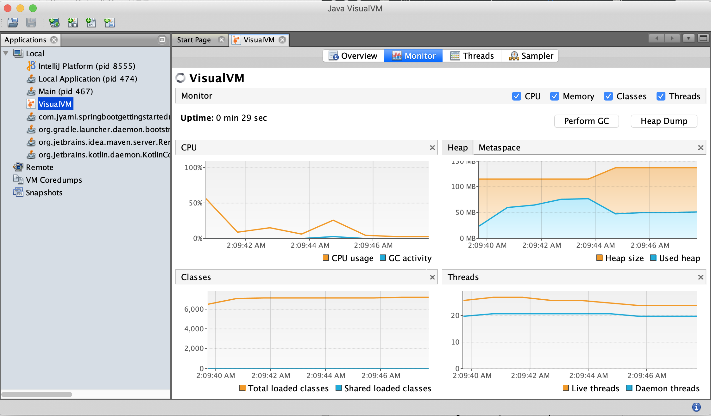

# 5. 스프링 부트 운영

스프링 부트는 애플리케이션 운영 환경에서 주시할 여러 정보를 제공하는  유용한 기능을 제공한다.

스프링 부트가 제공하는 엔드 포인트와 매트릭스 그 데이터를 활용하는 모니터링 기능에 대한 학습한다.

### 1. 스프링 부트 Actuator

#### 소개

https://docs.spring.io/spring-boot/docs/current/reference/htmlsingle/#production-ready-endpoints


##### 의존성 추가 

```xml
<dependency>
  <groupId>org.springframework.boot</groupId>
  <artifactId>spring-boot-starter-actuator</artifactId>
</dependency>
```


#####  애플리케이션의 각종 정보를 확인할 수 있는 Endpoints

- 다양한 Endpoints 제공.

- JMX 또는 HTTP를 통해 접근 가능 함.

- shutdown을 제외한 모든 Endpoint는 **기본적으로 활성화** 상태.

- 활성화 옵션 조정 

  - ``management.endpoints.enabled-by-default=false``
  - ``management.endpoint.info.enabled=true``

- 근데 안보이는 이유? exposing이 안되어있기 때문이다. 활성화 상태와 expose와는 별개 이다.

  문서에 보면 web에서는 info와 health만 있다.

엔드포인트를 제공해준다. 문서에 있는 ID에 해당하는 것들이!

- auditevent : 인증 정보들
- beans: 등록된 빈들
- Conditions : 어떤 자동 설정이 어떤 조건에 의해 적용이 되는지에 대한 정보들
- configprops : application.properties에 적용이 가능한 것들
- env: spring env 안에 있는 properties를 보여준다
- flyway: 마이그레이션 정보
- health: 잘 구동중인지 정보
- httptrace: 최근 100개의 요청과 응답을 보여준다.
- Info: application 관련 임의의 정보
- loggers: 어떤 로깅 레벨을 갖고있는지, 운영중에 로깅 레벨 수정\
- liquibase: 데이터베이스 마이그레이션
- metrics: 애플리케이션 핵심이 되는 정보들(cpu, memory) - 제3의 모니터링 애플리케이션에서 연동해서 모니터링이 가능함 (더 나아가서는 특정 수치가 넘으면 arlet가 발생할 수 있게 한다.)
- mappings: 컨트롤러 매핑정보
- scheduledtasks : 스케줄링
- Sessions : 세션과 관련
- shutdown : 끌 수 있다 (이것만 비활성화 되어있다.)
- threaddump
- heapdump
- jolokai : JMX 빈을 HTTP 에서도 볼 수 있게 한다.
- logfile : 로그파일 정보
- Prometheus : metrics를 promethues 서버에서 캡쳐할 수 있는 형태로 포맷을 변환


http://localhost:8080/actuator 로 접속한다.

```shell
{"_links":{"self":{"href":"http://localhost:8080/actuator","templated":false},"health":{"href":"http://localhost:8080/actuator/health","templated":false},"health-path":{"href":"http://localhost:8080/actuator/health/{*path}","templated":true},"info":{"href":"http://localhost:8080/actuator/info","templated":false}}}
```

**hateoas** 와 같은 형태로 현재 리소스와 연관된 링크정보들을 보여줌.

self, health 정보, health-path, info 정보 등등을 알려준다.

http 를 사용할 때는 health와 info 정보 밖에 없다 > 연결된 링크로 가볼 수 있다.


#### JXM와 HTTP

##### JConsole 사용하기

- https://docs.oracle.com/javase/tutorial/jmx/mbeans/

- https://docs.oracle.com/javase/7/docs/technotes/guides/management/jconsole.html

- console에 jconsole 입력

  

  

- application이 사용하는 heap memory, class, cpu, thread와 같은 정보를 보여준다. 여러 쓰레드 이름, stacktrace 등도 볼수 있다. 로딩된 클래스도 볼 수 있고,

- vmSummary는 : v프로세스 개수 등을 볼 수 있음

- MBean : Mbean으로 노출된 여러기능을 볼 수 있음. tomcat 기본 Mbean, 외에도 여러 operation을 볼 수 있기도 함.

  - Admin : attributes를 볼 수 있고, operations에 가면 shutdown도 할 수 있음
  - Endpoint : http보다 훨씬 많은 것들을 볼 수 있다!! 
    여러 정보를 가져온다. (근데 사람이 볼 수 없게ㅋㅋㅋㅋㅋㅋㅋㅋ)

> 이걸로 볼 수 있다는건 알지만, 더 쉽게 보는 방법이 필요하다.(JVX에 노출되는 정보를 다른곳에서)

##### VisualVM 사용하기 

java 10부터는 포함되어있지 않음

이전까지는 ㄱㅊ 

```shell
jvisualvm
```

- https://visualvm.github.io/download.html

훨씬 이쁘게 보여준다!! Mbean 보기 : **tool>plugins>Mbean**




##### HTTP 사용하기

- /actuator

- health와 info를 제외한 대부분의 Endpoint가 기본적으로 비공개 상태

- 공개 옵션 조정 : 웹에서 보고싶을 때! 모든 엔드포인트를 보겠다는 설정이다.

  > 근데 이것도 json 정보로 들어와서ㅋㅋㅋ 보기 어렵다..ㅎㅎ
  >
  > spring security 적용해서 어드민만 볼 수 있게 설정을 해두자.

  - ``management.endpoints.web.exposure.include=* ``
  - ``management.endpoints.web.exposure.exclude=env,beans``


#### Springboot Admin

https://github.com/codecentric/spring-boot-admin

스프링이 제공하는게 아니라 제3자가 제공하는 것이다! 스프링 부트 Actuator UI 제공

Admin 서버 역할을 할 다른 서버가 필요하다.

##### 어드민 서버 설정

```xml
<dependency>
  <groupId>de.codecentric</groupId>
  <artifactId>spring-boot-admin-starter-server</artifactId>
  <version>2.2.3</version>
</dependency>
```

``@EnableAdminServer`` 추가하기

```java
@SpringBootApplication
@EnableAdminServer
public class SpringAdminActuatorApplication {
   public static void main(String[] args) {
      SpringApplication.run(SpringAdminActuatorApplication.class, args);
   }
}
```

##### 클라이언트 설정

```xml
<dependency>
  <groupId>de.codecentric</groupId>
  <artifactId>spring-boot-admin-starter-client</artifactId>
  <version>2.2.3</version>
</dependency>
```

클라이언트 application이 접속할 어드민 서버의 주소를 설정

```properties
spring.boot.admin.client.url=http://localhost:10080
management.endpoints.web.exposure.include=*
```

그래서 이후 지정한 admin 서버인 10080 으로 가면 웹페이지가 로드되는걸 볼 수 있다.


