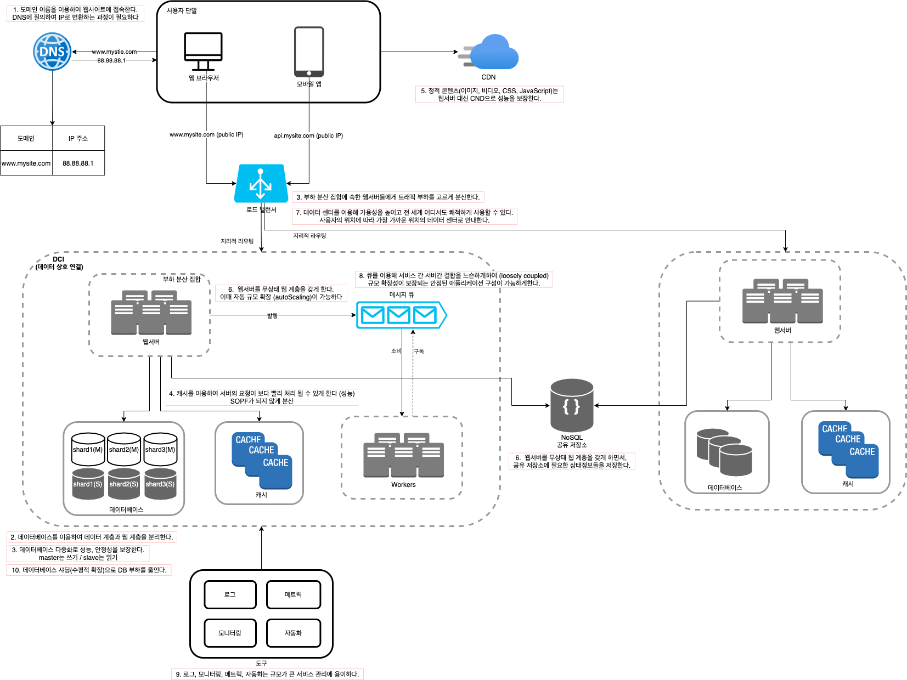

# 1. 사용자 수에 따른 규모 확장성

### 요약 (Summary)

### 단일 서버

사용자의 요청이 처리되는 과정 : 도메인이름을 dns로 질의 > ip주소 반환 > 해당 ip 주소로 http request 전달 > 요청을 받은 웹 서버는 html 페이지 혹은 json 형태의 응답을 반환

### 데이터베이스

웹/모바일 트래픽 처리 서버 (웹 계층) + 데이터베이스 서버 (데이터 계층) 분리 가능

- 관계형 데이터베이스 (RDBMS) : MySQL, 오라클, PostgreSQL

- 비관계형 데이터베이스 (NoSQL) : CouchDB, Neo4j, Cassandra, HBase, Amazon DynamoDB

  분류 : key-value store, graph store, column store, document store

  **적합한 경우**

  - 아주 낮은 응답 지연시간(latency) 요구될 때
  - 다루는 데이터가 비정형(unstructured)이라 관계형 데이터가 아닐 때
  - 데이터를 직렬화 하거나 역직렬화 할 수 있기만 하면 된다
  - 아주 많은 양의 데이터를 저장할 필요가 있음

### 수직적 규모 확장 vs 수평적 규모확장

- 수직적 규모 확장 = 스케일 업 (scale up) = vertical scaling : 서버에 고사양 자원을 추가하는 행위
- 수평적 규모 확장 = 스케일 아웃 (scale out) : 더 많은 서버를 추가하여 성능을 개선

##### 스케일업의 단점

- 한대의 서버에 CPU, Memory 무한대 증설 방법 없다
- 장애에 대한 자동 복구(failover)방안이나 다중화(redundancy) 방안을 제시하지 않는다. > 장애시 완전 중단

대규모 애플리케이션 지원 > 스케일 아웃이 적절하다.

### 로드 밸런서

##### 부하 분산 집합

부하 분산 집합(load balancing set)에 속한 웹 서버들에게 트래픽 부하를 고르게 분산하는 역할 (웹계층 문제 해결)

너무 많은 사용자가 접속하여 웹 서버가 한계상황에 도달할 수 있음 > 응답 속도가 느려지거나 서버 접속 안된다. 

로드밸런서는 public ip / 서버간 통신에는 사설 ip (private ip)

- availability : 서버가 죽어도 부하 분산 집합내 다른 서버로 트래픽이 전송된다
- no failover 극복 : 트래픽 감당 안되는 시점, 웹 서버 계층에 더 많은 서버를 추가하기만 하면된다. 로드밸런서가 자동적으로 트래픽 분산

##### 데이터베이스 다중화

주(master)-부(slave) 관계 설정하고, 데이터 원본은 master, 사본은 slave에 저장. 

- 더 나은 성능 : insert, delete, update (command)는 master에만 전달. select는 slave에 분산되어 병렬로 처리 될 수 있는 질의(query)의 수가 늘어남
- 안정성 (reliability) : 데이터베이스 서버 일부가 파괴되어도 데이터 보존 > 여러 지역에 다중화가 가능함
- 가용성 (availability) : 복제덕분에 하나의 데이터베이스 서버에 장애가 발생해도, 다른 서버에 있는 데이터로 복구가 가능함

주 DB 서버가 다운되면 

- 복구 스크립트 (recovery script) : 주에는 있는데 부에는 없는 것들 복구
- 다중 마스터(multi-master) 원형 다중화(circular replication) : 상황 대처에 도움 > 더 복잡하다

### 캐시

응답시간(latency)개선. 정적 콘텐츠를 콘텐츠 전송 네트워크(Content Delivery Network, CDN)으로 옮긴다.

애플리케이션 성능은 데이터베이스를 얼마나 자주 호출하느냐에 크게 좌우된다.

읽기 주도형 캐시 전략 (read-through caching strategy) : 데이터가 캐시에 있으면 캐시에서 없으면 DB에서 읽어서 캐시에 씀

##### 캐시 사용 시 유의할 점

- 상황 : 데이터 갱신은 자주 일어나지 않지만 참조가 빈번히 일어날 때
- 어떤 데이터 : 영속적 보관할 데이터는 X > persistent data store에 두어야 한다
- 만료(expire) : 만료기한은 적절히 (짧 - DB자주 읽음 / 길 - 원본과의 차이)
- 일관성(consistency) : 데이터 저장소의 원본과 캐시 내 사본이 같은가
- 장애 대처 : SPOF(single point of failure : 단일 장애지점)를 피하기 위해 캐시서버를 분산하자
- 메모리 : 너무 작으면 잦은 eviction으로 캐시 성능이 떨어진다. 캐시 메모리를 과할당 하는 것도 해결책(overprivision)
- eviction 정책 : 널리 쓰이는 것 LRU - least recently used

### 콘텐츠 전송 네트워크(CDN)

정적 콘텐츠를 전송하는데 쓰이는, 지리적으로 분산된 서버의 네트워크 : image, videa, CSS, JS 파일 등을 캐시할 수 있다.

동적 콘텐츠 캐싱 : request path, query string, cookie, request header 등의 정보에 기반하여 HTML 페이지를 캐시하는 것

##### CDN 사용시 고려사항

- 비용 : 주로 third-party provider에 의해 운영되며, 오가는 데이터 전송량에 따라 요금을 낸다
- 적절한 만료 시한 : time-sensitive 콘텐츠 조심하기
- CDN 장애 대처 방안 필요
- 콘텐츠 무효화(invalidation) 방법 : 만료되지 않아도 CDN에서 제거가 가능하다.

### 무상태(stateless) 웹 계층

웹 계층을 수평적으로 확장 : 상태정보(사용자 세션 데이터 등)를 웹 계층에서 제거해야한다.

로드밸런서의 고정 세션(sticky session) 기능 : 로드밸런서에 부담 / 뒷단 서버 추가 제거도 까다롭 / 서버 장애 처리도 복잡

##### 무상태 아키텍처

상태 정보가 필요할 대 공유 저장소(shared storage)로 부터 데이터를 가져온다 : 주로 NoSQL > 규모 확장이 간편

무상태 아키텍처의 웹계층에서는 자동 규모 확장(autoscaling)을 고려할 수 있 : 트래픽 양에 따라 웹 서버를 자동으로 추가하거나 삭제하는 기능

### 데이터 센터

지리적 라우팅 (geoDNS-routing, geo-routing) : 사용자의 위치에 따라 도메인 이름을 어떤 ip주소로 변환할지 결정할 수 있게 하는 DNS 서비스

- 트래픽 우회 : 올바른 데이터 센터로 트래픽을 보내는 효과적인 방법을 찾아야한다
- 데이터 동기화(synchronization) : 데이터 센터별로 DB를 두면 장애시 데이터 센터에 찾는 데이터가 없을 수 있다. > 데이터를 여러 데이터센터에 걸쳐 다중화한다

### 메시지 큐

메시지의 무손실(durability) : 메시지 큐에 일단 보관된 메시지는 소비자가 꺼낼 때 까지 안전히 보관된다는 특성 

비동기 통신(asynchronous communication)을 지원하는 컴포넌트. 

서버간 결합이 느슨해져서 규모 확장성이 보장되어야하는 안정적 애플리케이션을 구성하기 좋음 (소비자가 죽어도 생산자는 작동 가능 / 생산자가 죽어도 소비자 작동 가능)

### 로그, 메트릭 그리고 자동화

- 로그: 로그를 단일 시스템으로 모아주기

- 메트릭 : 사업 현황에 대한 유용한 정보, 시스템의 현재 상태

  호스트 단위 메트릭 : CPU, 메모리, 디스크 IO / 종합(aggregated) 메트릭 : DB 계층 성능, 캐시 계층 성능 / 핵심 비즈니스 메트릭 : 일별 능동 사용자(daily active user), 수익(revenue), 재방문(retention)

- 자동화 : 지속적 통합 (continuous integration)을 돕는 도구 등으로 빌드, 테스트, 배포 등의 절차 자동화하여 개발 생산성 향상

### 데이터베이스의 규모 확장

- 수직적 확장 = 스케일 업 : CPU, RAM, 디스크 등 자원 증설

  스택오버플로에서 한해 동안 방문한 천만명의 사용자 전부를 단 한대의 마스터 DB로 처리함

- 수평적 확장 = 샤딩(sharding) : 서버 증설

  DB를 샤드(shard)라고 부르는 작은 단위로 분할함

##### 샤딩 도입 시 문제점

- 데이터의 재 샤딩 (resharding) : 데이터가 너무 많아져 하나의 샤드로는 감당이 어려울 때 / 샤드간 데이터 분포가 균등하지 못하여 공간 소모 속도에 차이가 있을 때 (샤드소진 : shard exhaustion)
- 유명인사 (celebrity) 문제 : 핫스팟 키(hotspot key)문제 : 특정 샤드에 질의가 집중되어 서버에 과부하가 걸리는 문제
- 조인과 비정규화 (join and de-normalization) : 여러 샤드 서버로 쪼개면, 여러 샤드에 걸친 데이터 조인이 힘들어진다 > 수행 방법 디비 정규화로 하나의 테이블에서 질의가 수행되게 한다.

